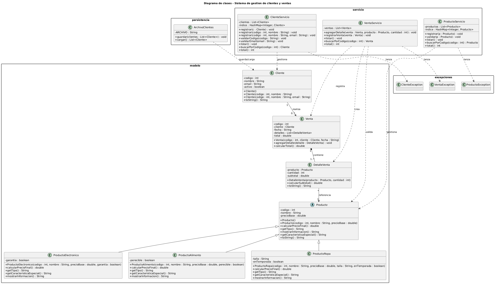
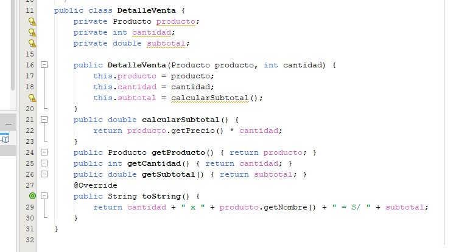
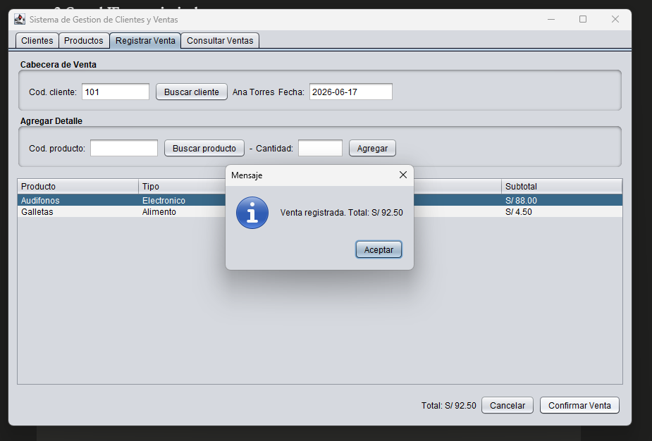
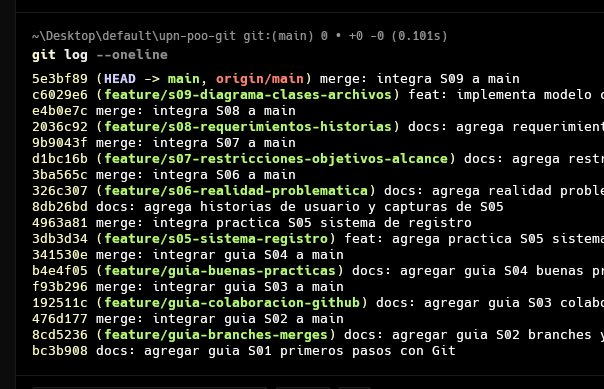

# Informe Final del Proyecto – Examen Final

## Portada

- **Universidad:** Universidad Privada del Norte (UPN)
- **Facultad:** Facultad de Ingeniería
- **Carrera:** Ingeniería de Sistemas Computacionales
- **Curso:** Técnicas de Programación Orientada a Objetos (Java)
- **Título del proyecto:** Sistema de gestión de clientes y ventas para una microempresa
- **Organización seleccionada:** Librería y Bazar "HAS"
- **Integrante:** Helaman Garcia Silva
- **Docente:** No especificado
- **Ciclo académico:** 2026-1
- **Fecha:** 29 de junio de 2026

---

## Índice General

1. Resumen Ejecutivo
2. Perfil de la Organización
3. Diagnóstico del Problema
4. Restricciones, Objetivos y Alcance
5. Análisis del Negocio AS-IS y TO-BE (BPMN)
6. Requerimientos del Sistema
7. Historias de Usuario
8. Criterios de Aceptación
9. Diseño Orientado a Objetos
10. Arquitectura de la Solución
11. Base de Datos SQL Server e Integración JDBC
12. Implementación del Proyecto
13. Programación Visual (Swing)
14. Informe de Práctica de Campo
15. Informe de Responsabilidad Social
16. Conclusiones
17. Recomendaciones
- Referencias Bibliográficas
- Anexos (A–J)

---

## 1. Resumen Ejecutivo

### 1.1 Descripción del proyecto

El proyecto consiste en el desarrollo de un sistema de información de escritorio, programado en Java bajo el paradigma orientado a objetos, para la gestión de clientes, productos y ventas de una microempresa del sector comercio. El sistema centraliza el registro de datos, valida las entradas, calcula automáticamente el total de cada venta y persiste toda la información en una base de datos SQL Server mediante JDBC, reemplazando el registro manual en cuadernos u hojas sueltas.

### 1.2 Problema identificado

Una gran parte de las micro y pequeñas empresas (MYPE) del sector comercio gestiona sus clientes y ventas de forma manual, lo que produce información dispersa, errores de cálculo, pérdida de datos y ausencia de un historial confiable, dificultando el control del negocio y la toma de decisiones.

### 1.3 Solución propuesta

Una aplicación de escritorio en Java que organiza la información en cuatro capas (modelo, servicio, persistencia DAO y presentación Swing), valida los datos mediante excepciones propias del dominio, aplica herencia y polimorfismo en el catálogo de productos, calcula de forma automática los subtotales y el total de cada venta, y persiste todos los datos en SQL Server a través de JDBC usando el patrón DAO. El desarrollo se versiona con Git siguiendo un flujo basado en Git Flow.

### 1.4 Beneficios esperados

Reducción de los errores de registro y cálculo, disminución de los tiempos de búsqueda y atención, centralización y trazabilidad de la información comercial, persistencia permanente de los datos en una base de datos relacional con integridad referencial, y una base tecnológica ordenada y mantenible sobre la cual la microempresa puede crecer.

---

## 2. Perfil de la Organización

La organización seleccionada es una microempresa comercial representativa del caso de estudio. Los datos se presentan de forma académica y mantienen coherencia con el alcance del proyecto.

### 2.1 Información general de la organización

- **Nombre:** Librería y Bazar "HAS"
- **Rubro:** Comercio minorista de útiles escolares, de escritorio y artículos de bazar
- **Ubicación:** San Juan de Lurigancho (SJL), Lima, Perú
- **Tamaño de la organización:** Microempresa (negocio familiar; 1 a 3 personas)

### 2.2 Historia de la organización

La librería es un negocio familiar atendido directamente por su propietaria, con varios años de servicio en su barrio. Su cartera está formada principalmente por clientes frecuentes del vecindario y registra picos de demanda en las campañas escolares. Su crecimiento se ha sostenido en la atención personalizada y en el conocimiento directo que la dueña tiene de sus clientes.

### 2.3 Misión

Ofrecer útiles escolares y de oficina de calidad a precios accesibles, con una atención cercana que contribuya a la educación y al trabajo diario de la comunidad.

### 2.4 Visión

Ser la librería de referencia del sector, reconocida por su buen servicio y por una gestión ordenada que le permita crecer de manera sostenible.

### 2.5 Valores institucionales

Honestidad, atención cercana al cliente, responsabilidad y mejora continua.

### 2.6 Organigrama


### 2.7 Productos o servicios principales

Cuadernos, lapiceros, mochilas, materiales de escritorio y artículos de bazar, además de la atención y venta personalizada al cliente.

### 2.8 Procesos principales del negocio

Registro de clientes frecuentes, registro de la venta y cobro, y control del inventario básico de productos.

---

## 3. Diagnóstico del Problema

El diagnóstico resume la situación actual del negocio y las principales causas que justifican la propuesta del sistema.

### 3.1 Realidad problemática

En el Perú, las MYPE del sector comercio crecen año tras año y, con ellas, el volumen de clientes, productos y operaciones que deben administrar diariamente. Sin embargo, una gran parte de estos negocios continúa gestionando sus ventas y su cartera de clientes de forma manual, apoyándose en cuadernos, hojas sueltas o archivos de Excel sin estructura. Esta práctica genera información dispersa, propensa a pérdidas y duplicidades, que dificulta consultar el historial de un cliente o conocer el estado real de las ventas. El registro manual introduce, además, errores humanos frecuentes —códigos mal ingresados, datos incompletos o montos calculados incorrectamente— y consume cada vez más tiempo a medida que el negocio crece, lo que retrasa la atención y reduce la productividad.

### 3.2 Formulación del problema

¿En qué medida la implementación de un sistema de información para la gestión de clientes y ventas mejora el registro, la validación y el control de la información comercial en una microempresa?

### 3.3 Diagrama de Ishikawa (causa-efecto)

**Problema central:** gestión deficiente de clientes y ventas en la microempresa.

| Categoría | Causas principales |
|---|---|
| Procesos / Métodos | Registro manual en papel, procesos no estandarizados, tareas repetitivas y lentas |
| Personas | Errores humanos al digitar, falta de capacitación, sobrecarga de trabajo |
| Información | Datos dispersos y duplicados, pérdida de documentos, sin historial confiable |
| Tecnología | Ausencia de software, uso de cuadernos o Excel, sin base de datos central |
| Control | Sin reportes de ventas, sin trazabilidad de cambios, decisiones sin datos |
| Entorno | Demanda creciente, mayor competencia, exigencia de rapidez en la atención |


### 3.4 Antecedentes

#### 3.4.1 Internacionales

Bravo Salvatierra (2012), en Ecuador, desarrolló una aplicación web para la gestión de ventas de la empresa Repuestos Automotrices Castro (UNIANDES). Identificó que el manejo manual de la información comercial provocaba demoras y errores, y propuso una solución que automatizó el proceso de ventas y mejoró el control de la información.

#### 3.4.2 Nacionales

Castillo Castro (2016), en Lima, implementó un sistema de ventas para la empresa Marecast S.R.L. (Universidad de Ciencias y Humanidades), desarrollado en Java con NetBeans y base de datos MySQL. Reportó que la solución eliminó la pérdida de información y redujo el tiempo de atención al cliente. Es especialmente cercano a este proyecto por compartir la tecnología base (Java con base de datos relacional).

#### 3.4.3 Locales

Loayza (2021), en Trujillo, propuso un sistema de gestión para el área de almacén con el fin de aumentar la rentabilidad de la empresa Repalsa S.A. (Universidad Privada del Norte). Mostró que la estandarización y el control de los procesos administrativos inciden positivamente en el desempeño de la empresa.

### 3.5 Referencias APA

Las referencias completas en formato APA 7 se presentan en la sección de Referencias Bibliográficas.

---

## 4. Restricciones, Objetivos y Alcance

Esta sección delimita las condiciones bajo las cuales se desarrolla la solución.

### 4.1 Restricciones del proyecto

| Tipo | Restricción |
|---|---|
| Técnicas | Aplicación de escritorio en Java (NetBeans) con persistencia en SQL Server vía JDBC; se priorizan técnicas vistas en el curso. |
| Económicas | Sin presupuesto para licencias; uso exclusivo de herramientas gratuitas o de código abierto (SQL Server Express, Maven, JDK 21). |
| Operativas | Sistema local y monousuario; los datos de prueba son representativos de una microempresa real. |
| Tiempo | El desarrollo debe completarse dentro de un ciclo académico, lo que limita el número de funcionalidades. |
| Recursos humanos | Equipo reducido en formación, con disponibilidad parcial (estudiante). |

### 4.2 Alternativas de solución

| Alternativa | Ventajas | Desventajas | Decisión |
|---|---|---|---|
| Aplicación de escritorio en Java con SQL Server | Tecnología vista en el curso, sin costo, datos persistentes y con integridad referencial | Instalación por equipo, sin acceso remoto | **Elegida** |
| Aplicación web | Acceso multiplataforma | Requiere servidor y conocimientos no cubiertos en el curso | Descartada |
| Aplicación móvil | Movilidad | Fuera del alcance técnico y de tiempo del curso | Descartada |
| Continuar con Excel/papel | Costo nulo | Mantiene el problema actual | Descartada |

### 4.3 Objetivo general

Desarrollar un sistema de información de escritorio que mejore la gestión de clientes, productos y ventas de una microempresa, centralizando los datos en una base de datos SQL Server, aplicando el paradigma orientado a objetos y reduciendo los errores del registro manual.

### 4.4 Objetivos específicos

1. Implementar el CRUD completo de clientes (registrar, consultar, actualizar y eliminar) con validación de datos de entrada y persistencia en SQL Server.
2. Implementar el CRUD completo de productos usando herencia y polimorfismo para los distintos tipos (electrónico, alimento, ropa).
3. Implementar el registro de ventas con detalle, cálculo automático del total y persistencia transaccional en SQL Server.
4. Integrar la capa de persistencia con SQL Server mediante JDBC, implementando el patrón DAO para las tres entidades principales.
5. Aplicar control de versiones (Git) con flujo Git Flow durante todo el desarrollo del proyecto.

### 4.5 Alcance del proyecto

**Incluye:** registro, validación y almacenamiento persistente en SQL Server de clientes, productos y ventas; operaciones CRUD completas (crear, leer, actualizar y eliminar) para clientes y productos; registro transaccional de ventas con su detalle y cálculo automático del total; consulta y listado; búsqueda por código; y manejo de errores con excepciones propias.

**No incluye:** módulos de contabilidad, tributación, acceso web o móvil, integración con pasarelas de pago, ni gestión de usuarios con roles y permisos.

### 4.6 Limitaciones

El sistema funciona en modo local y monousuario. La instancia de SQL Server debe estar disponible en la misma máquina (localhost). No contempla, por ahora, acceso concurrente ni sincronización en red.

---

## 5. Análisis del Negocio AS-IS y TO-BE (BPMN)

El análisis compara el proceso manual actual con el proceso propuesto mediante el sistema.

### 5.1 Proceso actual (AS-IS)

#### 5.1.1 Descripción del proceso actual

El cliente solicita los productos; la encargada los busca físicamente, anota la venta en un cuaderno, calcula el total de memoria o con calculadora y cobra. El registro de clientes frecuentes, cuando existe, se lleva en una libreta aparte.

#### 5.1.2 Diagrama BPMN AS-IS

El Anexo A presenta el diagrama BPMN AS-IS completo. La siguiente figura muestra el proceso manual actual.


#### 5.1.3 Problemas identificados

Cálculo manual propenso a errores, búsqueda lenta de información pasada, ausencia de validación de datos, datos de clientes dispersos o inexistentes y falta de historial consultable.

### 5.2 Proceso propuesto (TO-BE)

#### 5.2.1 Descripción del proceso mejorado

La encargada registra una sola vez a cada cliente y producto con datos validados y persistidos en SQL Server; al realizar una venta, selecciona el cliente y agrega los productos con su cantidad, y el sistema calcula automáticamente el subtotal de cada línea y el total. La información queda centralizada en la base de datos y es consultable en cualquier momento.

#### 5.2.2 Diagrama BPMN TO-BE

El Anexo B presenta el diagrama BPMN TO-BE completo. La siguiente figura muestra el proceso mejorado.


#### 5.2.3 Beneficios esperados

Reducción de errores de cálculo, registro y consulta inmediatos, trazabilidad completa en base de datos y mejor control del negocio.

### 5.3 Comparación AS-IS vs TO-BE

| Aspecto | AS-IS | TO-BE |
|---|---|---|
| Tiempo | Registro y búsqueda lentos | Registro y consulta inmediatos |
| Errores | Frecuentes (cálculo y digitación) | Reducidos por validación y cálculo automático |
| Persistencia | Cuadernos y hojas sueltas | Base de datos SQL Server (permanente y confiable) |
| Control | Sin reportes ni historial | Información centralizada y consultable |
| Productividad | Tareas repetitivas | Menos tareas manuales, más tiempo para el cliente |

---

## 6. Requerimientos del Sistema

Los requerimientos definen las funciones esperadas del sistema y las condiciones generales de operación.

### 6.1 Actores del sistema

| Actor | Descripción |
|---|---|
| Administrador / Encargado | Registra, consulta, actualiza y elimina clientes, productos y ventas; usuario principal del sistema. |

### 6.2 Requerimientos funcionales

| Código | Requerimiento |
|---|---|
| RF-01 | Registrar un cliente con código, nombre y email. |
| RF-02 | Validar que el código del cliente sea numérico. |
| RF-03 | Validar que el código del cliente no sea nulo ni vacío. |
| RF-04 | Validar que el email del cliente tenga un formato válido. |
| RF-05 | Impedir el registro de clientes con código duplicado. |
| RF-06 | Listar todos los clientes registrados. |
| RF-07 | Buscar un cliente por su código. |
| RF-08 | Actualizar los datos de un cliente existente. |
| RF-09 | Eliminar un cliente. |
| RF-10 | Mostrar un mensaje de confirmación al registrar un cliente. |
| RF-11 | Registrar un producto con código, nombre y precio. |
| RF-12 | Validar que el nombre del producto no esté vacío. |
| RF-13 | Validar que el precio del producto sea mayor que cero. |
| RF-14 | Validar que el precio sea un valor numérico. |
| RF-15 | Impedir el registro de productos con código duplicado. |
| RF-16 | Listar todos los productos registrados. |
| RF-17 | Buscar un producto por su código. |
| RF-18 | Actualizar los datos de un producto. |
| RF-19 | Eliminar un producto. |
| RF-20 | Mostrar el precio final del producto al consultarlo. |
| RF-21 | Registrar una venta asociada a un cliente. |
| RF-22 | Validar que el cliente de la venta exista. |
| RF-23 | Registrar la fecha de la venta. |
| RF-24 | Agregar uno o más detalles a una venta. |
| RF-25 | Validar que el producto de cada detalle exista. |
| RF-26 | Validar que la cantidad de cada detalle sea mayor que cero. |
| RF-27 | Calcular el subtotal de cada detalle (precio final × cantidad). |
| RF-28 | Calcular el total de la venta sumando los subtotales. |
| RF-29 | Validar que una venta tenga al menos un detalle. |
| RF-30 | Mostrar el total de la venta al confirmarla. |
| RF-31 | Listar todas las ventas registradas. |
| RF-32 | Buscar una venta por su código. |
| RF-33 | Consultar el detalle de una venta. |
| RF-34 | Listar las ventas de un cliente específico. |
| RF-35 | Presentar una interfaz para navegar entre los módulos. |
| RF-36 | Validar los campos obligatorios en cada formulario. |
| RF-37 | Mostrar mensajes de error claros ante datos inválidos. |
| RF-38 | Continuar operando sin cerrarse ante un error de validación. |
| RF-39 | Mostrar mensajes de confirmación tras cada operación exitosa. |
| RF-40 | Permitir salir de la aplicación de forma controlada. |

### 6.3 Requerimientos no funcionales

| Código | Requerimiento |
|---|---|
| RNF-01 | Usabilidad: interfaz intuitiva, operable con mínimo entrenamiento. |
| RNF-02 | Rendimiento: registro y consulta inmediatos para el volumen de una microempresa. |
| RNF-03 | Portabilidad: ejecutable en cualquier sistema con JVM y SQL Server Express. |
| RNF-04 | Mantenibilidad: código organizado en paquetes y clases bajo el paradigma OO. |
| RNF-05 | Confiabilidad: validaciones con excepciones propias e integridad transaccional en la BD. |
| RNF-06 | Disponibilidad: funcionamiento local, sin requerir internet. |

---

## 7. Historias de Usuario

Las historias de usuario expresan las necesidades principales desde la perspectiva del encargado del negocio.

| ID | Historia de Usuario | Prioridad |
|---|---|---|
| HU-01 | Como encargado, quiero registrar, actualizar y eliminar clientes, para mantener una cartera ordenada y sin duplicados. | Alta |
| HU-02 | Como encargado, quiero registrar, actualizar y eliminar productos, para contar con un catálogo confiable de precios. | Alta |
| HU-03 | Como encargado, quiero registrar ventas con su detalle, para calcular automáticamente el total y llevar el historial persistente. | Media |

Las historias completas y sus escenarios de aceptación se encuentran en el Anexo C.

---

## 8. Criterios de Aceptación

Los criterios de aceptación permiten comprobar si cada requerimiento implementado cumple con el comportamiento esperado. La tabla completa de evidencias se presenta en el Anexo E.

| Requerimiento | Historia de Usuario | Criterio de Aceptación |
|---|---|---|
| RF-01 Registrar cliente | HU-01 | Dado un cliente con datos válidos, el sistema lo agrega en la BD y lo muestra en el listado |
| RF-02 Validar código numérico | HU-01 | Si el código contiene caracteres no numéricos, el sistema rechaza el registro con mensaje |
| RF-03 Validar código no nulo | HU-01 | Si el campo código está vacío, el sistema rechaza el registro con mensaje |
| RF-04 Validar email | HU-01 | Si el email no contiene "@" y ".", el sistema lo rechaza con mensaje |
| RF-05 Código de cliente único | HU-01 | Si el código ya existe en la BD, el sistema no permite el duplicado |
| RF-07 Buscar cliente por código | HU-01 | Dado un código existente, el sistema retorna el cliente correspondiente |
| RF-08 Actualizar datos de cliente | HU-01 | El sistema actualiza nombre y email del cliente en la BD sin cambiar el código |
| RF-09 Eliminar cliente | HU-01 | El sistema elimina el registro de la BD; sus ventas se eliminan en cascada |
| RF-11 Registrar producto | HU-02 | Dado un producto válido, el sistema lo agrega al catálogo y lo persiste en la BD |
| RF-12 Validar nombre de producto | HU-02 | Si el nombre está vacío, el sistema rechaza el registro con mensaje |
| RF-13 Validar precio mayor que cero | HU-02 | Si el precio es cero o negativo, el sistema rechaza el registro con mensaje |
| RF-14 Validar precio numérico | HU-02 | Si el campo precio no es numérico, el sistema rechaza el registro con mensaje |
| RF-15 Código de producto único | HU-02 | Si el código ya existe en la BD, el sistema no permite el duplicado |
| RF-17 Buscar producto por código | HU-02 | Dado un código existente, el sistema retorna el producto con su precio final |
| RF-18 Actualizar datos de producto | HU-02 | El sistema actualiza nombre, precio y tipo en la BD usando el DAO correspondiente |
| RF-19 Eliminar producto | HU-02 | Si el producto tiene ventas: el sistema muestra error; si no: lo elimina de la BD |
| RF-21 Registrar venta | HU-03 | Dada una venta con cliente y al menos un detalle, el sistema la persiste transaccionalmente |
| RF-24 Agregar detalle a la venta | HU-03 | El sistema permite agregar productos con su cantidad a la venta en curso |
| RF-25 Validar que el producto exista | HU-03 | Si el código de producto no existe en la BD, el sistema rechaza el detalle |
| RF-26 Validar cantidad mayor que cero | HU-03 | Si la cantidad es cero o negativa, el sistema rechaza el detalle con mensaje |
| RF-27 Calcular subtotal | HU-03 | Cada detalle calcula su subtotal como precio final polimórfico × cantidad |
| RF-28 Calcular total de la venta | HU-03 | El total de la venta es la suma de los subtotales de todos sus detalles |
| RF-29 Validar venta con detalle | HU-03 | Si la venta no tiene al menos un detalle, el sistema la rechaza con mensaje |

---

## 9. Diseño Orientado a Objetos

El diseño orientado a objetos organiza el sistema en clases con responsabilidades definidas y relaciones simples, agrupadas en cuatro capas desacopladas.

### 9.1 Diagrama de clases UML

El diagrama de clases actualizado (Anexo F) muestra las entidades del dominio, la jerarquía de productos, la capa de servicios, los DAOs y las excepciones.



### 9.2 Justificación del diseño

La separación en cuatro capas (modelo, servicio, persistencia y presentación) favorece la mantenibilidad y permite que la lógica de negocio sea independiente tanto de la interfaz como del motor de base de datos. La jerarquía abstracta de productos permite tratar distintos tipos con reglas de precio propias sin duplicar código, aprovechando la herencia y el polimorfismo.

### 9.3 Aplicación de los cuatro pilares de la POO

**Abstracción.** La clase `Producto` es abstracta: define el contrato que todo producto debe cumplir mediante cuatro métodos abstractos, sin poder instanciarse directamente. Esto obliga a que cada subtipo concreto proporcione su propia implementación.

```java
// Producto.java – clase abstracta con contrato de comportamiento
public abstract class Producto {
    private int codigo;
    private String nombre;
    private double precioBase;

    public Producto(int codigo, String nombre, double precioBase) {
        setCodigo(codigo);
        setNombre(nombre);
        setPrecioBase(precioBase);
    }

    public abstract double calcularPrecioFinal();
    public abstract String getTipo();
    public abstract String mostrarInformacion();
    public abstract String getCaracteristicaEspecial();
}
```

**Encapsulamiento.** Todos los atributos son privados. Los setters validan la entrada antes de asignar el valor y lanzan `IllegalArgumentException` si el dato no cumple la regla de negocio, evitando que los objetos queden en un estado inconsistente.

```java
// Producto.java – setters con validación (encapsulamiento)
public void setNombre(String nombre) {
    if (nombre == null || nombre.trim().isEmpty())
        throw new IllegalArgumentException(
            "El nombre del producto no puede estar vacio");
    this.nombre = nombre;
}

public void setPrecioBase(double precioBase) {
    if (precioBase <= 0)
        throw new IllegalArgumentException(
            "El precio base debe ser mayor que cero");
    this.precioBase = precioBase;
}
```

**Herencia.** `ProductoElectronico`, `ProductoAlimento` y `ProductoRopa` heredan de `Producto`, reutilizando sus atributos y el constructor base mediante `super(...)`. Cada subtipo agrega únicamente el atributo que lo diferencia.

```java
// ProductoElectronico.java – herencia de Producto
public class ProductoElectronico extends Producto {
    private boolean garantia;

    public ProductoElectronico(int codigo, String nombre,
                               double precioBase, boolean garantia) {
        super(codigo, nombre, precioBase); // hereda constructor de Producto
        this.garantia = garantia;
    }

    public boolean isGarantia() { return garantia; }
    public void setGarantia(boolean garantia) { this.garantia = garantia; }
    ...
}
```

**Polimorfismo.** Cada subclase sobrescribe (`@Override`) el método `calcularPrecioFinal()`, de modo que un mismo mensaje produce un resultado distinto según el tipo real del objeto: +10 % si el electrónico tiene garantía, −10 % si el alimento es perecible y −20 % si la prenda está fuera de temporada.

```java
// ProductoElectronico – precio +10 % con garantía
@Override
public double calcularPrecioFinal() {
    return garantia ? getPrecioBase() * 1.10 : getPrecioBase();
}

// ProductoAlimento – precio −10 % si es perecible
@Override
public double calcularPrecioFinal() {
    return perecible ? getPrecioBase() * 0.90 : getPrecioBase();
}

// ProductoRopa – precio −20 % si no está en temporada
@Override
public double calcularPrecioFinal() {
    return enTemporada ? getPrecioBase() : getPrecioBase() * 0.80;
}
```

### 9.4 Excepciones propias del dominio

El sistema define tres excepciones propias que extienden `Exception`, una por cada entidad principal. Esto permite distinguir errores de negocio de errores técnicos y proporcionar mensajes claros al usuario.

```java
// ClienteException.java
public class ClienteException extends Exception {
    public ClienteException(String mensaje) {
        super(mensaje);
    }
}
// Idéntico patrón: ProductoException, VentaException
```

Las excepciones se lanzan desde la capa de servicio ante cualquier regla de negocio incumplida y son capturadas en la interfaz Swing para mostrar el mensaje correspondiente al usuario.

### 9.5 Composición y cálculo polimórfico en ventas

`DetalleVenta` contiene una referencia a `Producto` (composición) y calcula el subtotal llamando al método polimórfico `calcularPrecioFinal()`. `Venta` agrega los detalles y suma sus subtotales. Esto demuestra la interacción entre polimorfismo, composición y encapsulamiento.

```java
// DetalleVenta.java – subtotal usando calcularPrecioFinal() polimórfico
public class DetalleVenta {
    private Producto producto;
    private int cantidad;
    private double subtotal;

    public DetalleVenta(Producto producto, int cantidad) {
        this.producto = producto;
        this.cantidad = cantidad;
        this.subtotal = calcularSubtotal();
    }

    public double calcularSubtotal() {
        return producto.calcularPrecioFinal() * cantidad;
    }
}
```

```java
// Venta.java – total como suma de subtotales
public double calcularTotal() {
    double t = 0;
    for (DetalleVenta d : detalles)
        t += d.getSubtotal();
    return t;
}
```




### 9.6 Descripción de las principales clases

| Clase | Paquete | Responsabilidad |
|---|---|---|
| `Cliente` | modelo | Entidad con código, nombre, email y estado activo. |
| `Producto` (abstracta) | modelo | Define atributos comunes y el contrato de cálculo de precio. |
| `ProductoElectronico` | modelo | Precio final +10 % si tiene garantía. |
| `ProductoAlimento` | modelo | Precio final −10 % si es perecible. |
| `ProductoRopa` | modelo | Precio final −20 % si está fuera de temporada. |
| `DetalleVenta` | modelo | Línea de venta; calcula el subtotal con el precio final polimórfico del producto. |
| `Venta` | modelo | Cabecera; contiene la lista de detalles y calcula el total. |
| `ClienteServicio` | servicio | CRUD de clientes: validaciones, delegación al DAO y mantenimiento en memoria. |
| `ProductoServicio` | servicio | CRUD de productos: validaciones, delegación al DAO. |
| `VentaServicio` | servicio | Registro de ventas y delegación transaccional al VentaDAO. |
| `Conexion` | persistencia | Singleton de `java.sql.Connection` para SQL Server. |
| `ClienteDAO` | persistencia | INSERT, UPDATE, DELETE y SELECT sobre la tabla Cliente. |
| `ProductoDAO` | persistencia | CRUD SQL con soporte a herencia por tabla única. |
| `VentaDAO` | persistencia | INSERT transaccional de Venta y DetalleVenta; SELECT con reconstrucción de objetos. |
| `ClienteException` | excepciones | Error propio del dominio de clientes. |
| `ProductoException` | excepciones | Error propio del dominio de productos. |
| `VentaException` | excepciones | Error propio del dominio de ventas. |

### 9.7 Relaciones entre clases

| Relación | Tipo | Ejemplo en el sistema |
|---|---|---|
| Herencia | es-un | ProductoElectronico, ProductoAlimento, ProductoRopa extienden Producto |
| Asociación | 1 a * | Cliente – Venta (un cliente puede tener muchas ventas) |
| Agregación | referencia | DetalleVenta referencia a Producto (el producto existe de forma independiente) |
| Composición | 1 a 1..* | Venta – DetalleVenta (los detalles no existen sin su venta) |
| Dependencia | uso | Los servicios dependen de los modelos, excepciones y DAOs |

---

## 10. Arquitectura de la Solución

### 10.1 Arquitectura general

Aplicación de escritorio monolítica organizada en cuatro capas desacopladas, con persistencia en SQL Server vía JDBC. La lógica de negocio reside en la capa de servicios y es independiente tanto de la interfaz como del motor de base de datos.

### 10.2 Capas del sistema

- **Presentación:** interfaz gráfica en Swing, organizada por pestañas para clientes, productos, registro de ventas y consulta de ventas.
- **Lógica de negocio:** reglas de registro, validación, CRUD y cálculo en el paquete `servicio`. Lanza excepciones propias del dominio.
- **Dominio:** entidades en el paquete `modelo`, con jerarquía abstracta de `Producto`.
- **Persistencia:** patrón DAO sobre SQL Server mediante JDBC; paquete `persistencia` con `Conexion` (Singleton), `ClienteDAO`, `ProductoDAO` y `VentaDAO`.

### 10.3 Estructura de paquetes

```
SistemaRegistro/
├── schema.sql            (DDL: crea la BD y las 4 tablas con FK y CASCADE)
├── data.sql              (DML: inserta 5 clientes y 6 productos de prueba)
└── src/main/java/
    ├── com/mycompany/sistemaregistro/   (SistemaRegistroUI – interfaz Swing)
    ├── modelo/       Cliente, Producto (abstracta), ProductoElectronico,
    │                 ProductoAlimento, ProductoRopa, Venta, DetalleVenta
    ├── servicio/     ClienteServicio, ProductoServicio, VentaServicio
    ├── persistencia/ Conexion (Singleton), ClienteDAO, ProductoDAO, VentaDAO
    └── excepciones/  ClienteException, ProductoException, VentaException
```

### 10.4 Flujo de una operación típica

| Capa | Acción en "Registrar Cliente" |
|---|---|
| Presentación | El usuario completa el formulario y hace clic en "Registrar cliente" |
| Servicio | ClienteServicio.agregar() valida código, nombre, email y duplicados |
| Persistencia | ClienteDAO.insertar() ejecuta INSERT INTO Cliente con PreparedStatement |
| Base de datos | SQL Server almacena el registro y garantiza la restricción de clave primaria |
| Retorno | El servicio actualiza la colección en memoria; la interfaz muestra el mensaje de éxito |

---

## 11. Base de Datos SQL Server e Integración JDBC

Esta sección describe el diseño del esquema relacional, la conexión JDBC, el patrón DAO implementado y el manejo de transacciones.

### 11.1 Diseño de la base de datos

El script `schema.sql` (Anexo J) crea la base de datos `SistemaRegistroDB` y sus cuatro tablas normalizadas. La tabla `Producto` usa **herencia por tabla única**: los atributos exclusivos de cada subtipo se almacenan en la misma tabla con valor NULL cuando no aplican.

```sql
CREATE TABLE Cliente (
    codigo  INT            NOT NULL PRIMARY KEY,
    nombre  NVARCHAR(150)  NOT NULL,
    email   NVARCHAR(150)      NULL,
    activo  BIT            NOT NULL DEFAULT 1
);

CREATE TABLE Producto (
    codigo         INT            NOT NULL PRIMARY KEY,
    nombre         NVARCHAR(150)  NOT NULL,
    precio_base    FLOAT          NOT NULL,
    tipo           NVARCHAR(20)   NOT NULL,   -- 'Electronico','Alimento','Ropa'
    tiene_garantia BIT                NULL,   -- solo ProductoElectronico
    es_perecible   BIT                NULL,   -- solo ProductoAlimento
    talla          NVARCHAR(10)       NULL,   -- solo ProductoRopa
    en_temporada   BIT                NULL    -- solo ProductoRopa
);

CREATE TABLE Venta (
    codigo         INT            NOT NULL PRIMARY KEY,
    codigo_cliente INT            NOT NULL,
    fecha          NVARCHAR(20)   NOT NULL,
    total          FLOAT          NOT NULL DEFAULT 0,
    CONSTRAINT FK_Venta_Cliente
        FOREIGN KEY (codigo_cliente) REFERENCES Cliente(codigo)
        ON DELETE CASCADE
);

CREATE TABLE DetalleVenta (
    id              INT   IDENTITY(1,1) PRIMARY KEY,
    codigo_venta    INT   NOT NULL,
    codigo_producto INT   NOT NULL,
    cantidad        INT   NOT NULL,
    subtotal        FLOAT NOT NULL,
    CONSTRAINT FK_Detalle_Venta
        FOREIGN KEY (codigo_venta) REFERENCES Venta(codigo)
        ON DELETE CASCADE,
    CONSTRAINT FK_Detalle_Producto
        FOREIGN KEY (codigo_producto) REFERENCES Producto(codigo)
);
```

| Tabla | Columnas clave | FK y comportamiento |
|---|---|---|
| Cliente | codigo PK, nombre, email, activo BIT DEFAULT 1 | — |
| Producto | codigo PK, nombre, precio_base, tipo + 4 cols de subtipos | — |
| Venta | codigo PK, codigo_cliente FK, fecha, total | FK → Cliente ON DELETE CASCADE |
| DetalleVenta | id IDENTITY PK, codigo_venta FK, codigo_producto FK | FK → Venta CASCADE, FK → Producto |

La captura siguiente muestra el resultado de `SELECT * FROM Cliente` en SQL Server Management Studio después de ejecutar `schema.sql` y `data.sql`:


### 11.2 Conexión a la base de datos – Patrón Singleton

La clase `Conexion` implementa el **patrón Singleton** para garantizar que toda la aplicación reutilice una única instancia de `java.sql.Connection`, evitando el costo de múltiples conexiones. El constructor es privado para impedir instanciación directa.

```java
// Conexion.java – Singleton de la conexión JDBC a SQL Server
public class Conexion {
    private static final String URL =
        "jdbc:sqlserver://localhost"
        + ";databaseName=SistemaRegistroDB"
        + ";encrypt=false;trustServerCertificate=true";
    private static Connection conexion;

    private Conexion() { }  // constructor privado (Singleton)

    public static Connection obtener() throws SQLException {
        if (conexion == null || conexion.isClosed())
            conexion = DriverManager.getConnection(URL, "sa", "");
        return conexion;
    }

    public static void cerrar() {
        try {
            if (conexion != null && !conexion.isClosed())
                conexion.close();
        } catch (SQLException e) {
            System.err.println("Error al cerrar conexion: " + e.getMessage());
        }
    }
}
```

El driver se declara en `pom.xml` como dependencia Maven (`com.microsoft.sqlserver:mssql-jdbc:12.4.2.jre11`) y es descargado automáticamente al compilar.


### 11.3 Patrón DAO – ClienteDAO

`ClienteDAO` centraliza las cuatro operaciones SQL de la entidad `Cliente`. Todos los métodos son estáticos, obtienen la conexión Singleton y usan `PreparedStatement` para evitar inyección SQL.

```java
// ClienteDAO.java – INSERT con PreparedStatement
public static void insertar(Cliente c) throws SQLException {
    String sql = "INSERT INTO Cliente (codigo, nombre, email, activo)"
               + " VALUES (?, ?, ?, 1)";
    try (PreparedStatement stmt = Conexion.obtener().prepareStatement(sql)) {
        stmt.setInt(1, c.getCodigo());
        stmt.setString(2, c.getNombre());
        stmt.setString(3, c.getEmail());
        stmt.executeUpdate();
    }
}

// ClienteDAO.java – UPDATE
public static void actualizar(Cliente c) throws SQLException {
    String sql = "UPDATE Cliente SET nombre=?, email=?, activo=? WHERE codigo=?";
    try (PreparedStatement stmt = Conexion.obtener().prepareStatement(sql)) {
        stmt.setString(1, c.getNombre());
        stmt.setString(2, c.getEmail());
        stmt.setBoolean(3, c.isActivo());
        stmt.setInt(4, c.getCodigo());
        stmt.executeUpdate();
    }
}
```

### 11.4 Patrón DAO – ProductoDAO con herencia por tabla única

`ProductoDAO` usa el método auxiliar `setAtributosTipo(stmt, producto, offset)` para gestionar los atributos nulos de cada subtipo. El parámetro `offset` permite reutilizar el mismo método en INSERT (offset=5) y UPDATE (offset=4) sin duplicar lógica.

```java
// ProductoDAO.java – helper para atributos de subtipos
private static void setAtributosTipo(PreparedStatement stmt,
                                      Producto p, int offset) throws SQLException {
    if (p instanceof ProductoElectronico e) {
        stmt.setBoolean(offset,     e.isGarantia());
        stmt.setNull(offset + 1,    Types.BIT);
        stmt.setNull(offset + 2,    Types.NVARCHAR);
        stmt.setNull(offset + 3,    Types.BIT);
    } else if (p instanceof ProductoAlimento a) {
        stmt.setNull(offset,        Types.BIT);
        stmt.setBoolean(offset + 1, a.isPerecible());
        stmt.setNull(offset + 2,    Types.NVARCHAR);
        stmt.setNull(offset + 3,    Types.BIT);
    } else if (p instanceof ProductoRopa r) {
        stmt.setNull(offset,        Types.BIT);
        stmt.setNull(offset + 1,    Types.BIT);
        stmt.setString(offset + 2,  r.getTalla());
        stmt.setBoolean(offset + 3, r.isEnTemporada());
    }
}
```

### 11.5 Manejo de transacciones – VentaDAO

Registrar una venta involucra dos tablas (Venta + DetalleVenta) y debe ser atómico. `VentaDAO.insertar()` desactiva el auto-commit, ejecuta los INSERTs y confirma o revierte según el resultado.

```java
// VentaDAO.java – INSERT transaccional con commit/rollback
public static void insertar(Venta venta) throws SQLException {
    Connection conn = Conexion.obtener();
    boolean autoCommitOriginal = conn.getAutoCommit();
    conn.setAutoCommit(false);
    try {
        // 1. INSERT cabecera
        String sqlVenta = "INSERT INTO Venta"
                        + " (codigo, codigo_cliente, fecha, total) VALUES (?,?,?,?)";
        try (PreparedStatement stmt = conn.prepareStatement(sqlVenta)) {
            stmt.setInt(1, venta.getCodigo());
            stmt.setInt(2, venta.getCliente().getCodigo());
            stmt.setString(3, venta.getFecha());
            stmt.setDouble(4, venta.getTotal());
            stmt.executeUpdate();
        }
        // 2. INSERT batch de detalles
        String sqlDet = "INSERT INTO DetalleVenta"
                      + " (codigo_venta, codigo_producto, cantidad, subtotal)"
                      + " VALUES (?,?,?,?)";
        try (PreparedStatement stmt = conn.prepareStatement(sqlDet)) {
            for (DetalleVenta d : venta.getDetalles()) {
                stmt.setInt(1, venta.getCodigo());
                stmt.setInt(2, d.getProducto().getCodigo());
                stmt.setInt(3, d.getCantidad());
                stmt.setDouble(4, d.getSubtotal());
                stmt.addBatch();
            }
            stmt.executeBatch();
        }
        conn.commit();
    } catch (SQLException e) {
        conn.rollback();   // revierte todo si falla cualquier INSERT
        throw e;
    } finally {
        conn.setAutoCommit(autoCommitOriginal);
    }
}
```

El uso de `addBatch()` / `executeBatch()` optimiza el rendimiento al enviar todos los detalles en una sola llamada al servidor.

### 11.6 Integración servicio–DAO

Cada servicio carga los datos desde la BD en su constructor y delega cada operación de escritura al DAO antes de actualizar la memoria. Si el DAO lanza una excepción, el servicio revierte el cambio en memoria y relanza la excepción personalizada.

| Operación | Flujo en el sistema |
|---|---|
| Inicializar servicio | DAO.listarTodos() → carga colección en memoria + HashMap índice |
| Agregar entidad | DAO.insertar() → si OK: agrega a memoria; si falla: lanza excepción propia |
| Actualizar entidad | DAO.actualizar() → si OK: actualiza objeto en memoria |
| Eliminar entidad | DAO.eliminar() → si OK: quita de memoria; si FK violation: lanza ProductoException |
| Registrar venta | VentaDAO.insertar() con transacción → si OK: agrega a lista en memoria |

---

## 12. Implementación del Proyecto

### 12.1 Estado de implementación

Todos los requerimientos funcionales del sistema están implementados, incluyendo el CRUD completo de clientes y productos, el registro transaccional de ventas y la integración con SQL Server.

| Requerimiento | Estado |
|---|---|
| RF-01 Registrar cliente con código, nombre y email | Implementado |
| RF-02 Validar que el código del cliente sea numérico | Implementado |
| RF-03 Validar que el código del cliente no sea nulo ni vacío | Implementado |
| RF-04 Validar que el email tenga formato válido | Implementado |
| RF-05 Impedir duplicados de código de cliente | Implementado |
| RF-06 Listar todos los clientes | Implementado |
| RF-07 Buscar cliente por código | Implementado |
| RF-08 Actualizar datos de cliente existente | Implementado |
| RF-09 Eliminar cliente | Implementado |
| RF-10 Mensaje de confirmación al registrar cliente | Implementado |
| RF-11 Registrar producto con código, nombre y precio | Implementado |
| RF-12 Validar que el nombre del producto no esté vacío | Implementado |
| RF-13 Validar que el precio sea mayor que cero | Implementado |
| RF-14 Validar que el precio sea numérico | Implementado |
| RF-15 Impedir duplicados de código de producto | Implementado |
| RF-16 Listar todos los productos | Implementado |
| RF-17 Buscar producto por código | Implementado |
| RF-18 Actualizar datos de producto existente | Implementado |
| RF-19 Eliminar producto | Implementado |
| RF-20 Mostrar precio final del producto | Implementado |
| RF-21 Registrar venta asociada a un cliente | Implementado |
| RF-22 Validar que el cliente de la venta exista | Implementado |
| RF-23 Registrar fecha de la venta | Implementado |
| RF-24 Agregar uno o más detalles a una venta | Implementado |
| RF-25 Validar que el producto del detalle exista | Implementado |
| RF-26 Validar que la cantidad del detalle sea mayor que cero | Implementado |
| RF-27 Calcular subtotal de cada detalle | Implementado |
| RF-28 Calcular total de la venta | Implementado |
| RF-29 Validar que la venta tenga al menos un detalle | Implementado |
| RF-30 Mostrar total al confirmar la venta | Implementado |
| RF-31 Listar todas las ventas registradas | Implementado |
| RF-32 Buscar venta por código | Implementado |
| RF-33 Consultar detalle de una venta | Implementado |
| RF-34 Listar ventas de un cliente específico | Implementado |
| RF-35 Navegar entre módulos mediante pestañas | Implementado |
| RF-36 Validar campos obligatorios en cada formulario | Implementado |
| RF-37 Mostrar mensajes de error claros | Implementado |
| RF-38 Continuar operando ante error de validación | Implementado |
| RF-39 Mostrar mensajes de confirmación | Implementado |
| RF-40 Salir de la aplicación de forma controlada | Implementado |

### 12.2 Trazabilidad RF → Clase Java → Capa

| Requerimiento | HU | Clase Java | Capa |
|---|---|---|---|
| RF-01 Registrar cliente | HU-01 | ClienteServicio, Cliente, ClienteDAO | Servicio + DAO |
| RF-02 Validar código numérico | HU-01 | ClienteServicio.validarCodigo() | Servicio |
| RF-03 Validar código no nulo | HU-01 | ClienteServicio.validarCodigo() | Servicio |
| RF-04 Validar email | HU-01 | ClienteServicio.validarEmail() | Servicio |
| RF-05 Código de cliente único | HU-01 | ClienteServicio.agregar(), ClienteDAO | Servicio + DAO |
| RF-06 Listar clientes | HU-01 | ClienteServicio.getClientes() | Servicio |
| RF-07 Buscar cliente por código | HU-01 | ClienteServicio.buscarPorCodigo() | Servicio |
| RF-08 Actualizar cliente | HU-01 | ClienteServicio.actualizar(), ClienteDAO | Servicio + DAO |
| RF-09 Eliminar cliente | HU-01 | ClienteServicio.eliminar(), ClienteDAO | Servicio + DAO |
| RF-10 Confirmación registro cliente | HU-01 | SistemaRegistroUI (JOptionPane) | Presentación |
| RF-11 Registrar producto | HU-02 | ProductoServicio, Producto, ProductoDAO | Servicio + DAO |
| RF-12 Validar nombre producto | HU-02 | Producto.setNombre() (setter) | Modelo |
| RF-13 Validar precio mayor que cero | HU-02 | Producto.setPrecioBase() (setter) | Modelo |
| RF-14 Validar precio numérico | HU-02 | SistemaRegistroUI (parseDouble con try-catch) | Presentación |
| RF-15 Código de producto único | HU-02 | ProductoServicio.agregar(), ProductoDAO | Servicio + DAO |
| RF-16 Listar productos | HU-02 | ProductoServicio.getProductos() | Servicio |
| RF-17 Buscar producto por código | HU-02 | ProductoServicio.buscarPorCodigo() | Servicio |
| RF-18 Actualizar producto | HU-02 | ProductoServicio.actualizar(), ProductoDAO | Servicio + DAO |
| RF-19 Eliminar producto | HU-02 | ProductoServicio.eliminar(), ProductoDAO | Servicio + DAO |
| RF-20 Precio final del producto | HU-02 | Producto.calcularPrecioFinal() (polimórfico) | Modelo |
| RF-21 Registrar venta | HU-03 | VentaServicio.registrarVenta(), VentaDAO | Servicio + DAO |
| RF-22 Validar cliente de la venta | HU-03 | VentaServicio.registrarVenta() | Servicio |
| RF-23 Registrar fecha | HU-03 | Venta (constructor), SistemaRegistroUI | Modelo + Presentación |
| RF-24 Agregar detalle | HU-03 | VentaServicio.agregarDetalle(), DetalleVenta | Servicio + Modelo |
| RF-25 Validar producto del detalle | HU-03 | VentaServicio.agregarDetalle() | Servicio |
| RF-26 Validar cantidad del detalle | HU-03 | VentaServicio.agregarDetalle() | Servicio |
| RF-27 Calcular subtotal | HU-03 | DetalleVenta.calcularSubtotal() | Modelo |
| RF-28 Calcular total de la venta | HU-03 | Venta.calcularTotal() | Modelo |
| RF-29 Validar venta con detalle | HU-03 | VentaServicio.registrarVenta() | Servicio |
| RF-30 Mostrar total al confirmar | HU-03 | SistemaRegistroUI (JOptionPane) | Presentación |
| RF-31 a RF-34 Consultas de ventas | HU-03 | VentaServicio, SistemaRegistroUI | Servicio + Presentación |
| RF-35 a RF-40 Interfaz general | — | SistemaRegistroUI (Swing) | Presentación |

### 12.3 Implementación del servicio – validación y persistencia

`ClienteServicio.agregar()` muestra el patrón completo: validación en cadena, control de duplicados y delegación al DAO, con manejo de errores en cada nivel.

```java
// ClienteServicio.java – método agregar() completo
public void agregar(Cliente c) throws ClienteException {
    if (c == null) throw new ClienteException("El cliente no puede ser nulo");
    validarCodigo(String.valueOf(c.getCodigo())); // RF-02, RF-03
    validarNombre(c.getNombre());
    if (c.getEmail() != null && !c.getEmail().trim().isEmpty())
        validarEmail(c.getEmail());               // RF-04
    if (indice.containsKey(c.getCodigo()))
        throw new ClienteException("Ya existe un cliente con ese codigo"); // RF-05
    try {
        ClienteDAO.insertar(c);  // persiste en SQL Server
    } catch (SQLException e) {
        throw new ClienteException(
            "Error al guardar en base de datos: " + e.getMessage());
    }
    clientes.add(c);              // actualiza colección en memoria
    indice.put(c.getCodigo(), c); // actualiza índice
}
```

El mismo patrón aplica en `eliminar()`: primero retira el objeto de memoria, delega al DAO, y si falla lo restaura (reversión manual):

```java
// ClienteServicio.java – método eliminar() con reversión ante error
public void eliminar(int codigo) throws ClienteException {
    Cliente cliente = indice.remove(codigo);
    if (cliente == null)
        throw new ClienteException("No existe un cliente con ese codigo");
    clientes.remove(cliente);
    try {
        ClienteDAO.eliminar(codigo);
    } catch (SQLException e) {
        clientes.add(cliente);        // revierte en memoria si la BD falla
        indice.put(codigo, cliente);
        throw new ClienteException(
            "Error al eliminar en base de datos: " + e.getMessage());
    }
}
```

`VentaServicio.registrarVenta()` valida las reglas de negocio y luego delega la persistencia transaccional al DAO:

```java
// VentaServicio.java – registrarVenta() con delegación al VentaDAO
public void registrarVenta(Venta venta) throws VentaException {
    if (venta.getCliente() == null)
        throw new VentaException("La venta debe estar asociada a un cliente valido");
    if (venta.getDetalles().isEmpty())
        throw new VentaException("La venta debe tener al menos un detalle");
    try {
        VentaDAO.insertar(venta); // commit/rollback gestionado en el DAO
    } catch (SQLException e) {
        throw new VentaException(
            "Error al guardar la venta en base de datos: " + e.getMessage());
    }
    ventas.add(venta); // solo actualiza memoria si la BD confirmó el commit
}
```

### 12.4 Evidencias de implementación

La siguiente captura muestra la ejecución del sistema en consola (S09), con el registro de productos, el cálculo polimórfico de precios y el total de una venta.


---

## 13. Programación Visual (Swing)

La versión visual del sistema se implementa con Swing mediante una ventana principal con pestañas. La interfaz reutiliza la lógica de negocio de los servicios; los DAOs garantizan que los datos se lean desde SQL Server al iniciar la aplicación.

### 13.1 Diseño de interfaces

- **Clientes:** formulario para registrar, actualizar, eliminar y buscar clientes, con tabla de registros.
- **Productos:** formulario de registro con tipo de producto, precio final y característica especial; con opciones de actualizar y eliminar.
- **Registrar Venta:** cabecera de venta, búsqueda de cliente y producto, tabla de detalles, subtotal y total.
- **Consultar Ventas:** listado de ventas registradas y detalle de la venta seleccionada.

### 13.2 Diagrama de navegación

El Anexo G presenta el diagrama completo de navegación. La siguiente figura resume los módulos y sus transiciones.


### 13.3 Capturas del sistema en funcionamiento

Las capturas siguientes muestran el sistema funcionando con datos cargados desde SQL Server.





### 13.4 Eventos implementados

| Evento | Acción del sistema |
|---|---|
| Clic en Registrar cliente | Valida datos y llama a ClienteServicio (que persiste en la BD) |
| Clic en Actualizar cliente | Carga datos del cliente seleccionado, permite editarlos y persiste en BD |
| Clic en Eliminar cliente | Elimina de BD; si tiene ventas, muestra error de integridad |
| Clic en Buscar por código | Recupera el cliente desde la colección en memoria |
| Clic en Registrar Producto | Valida el producto y lo persiste en BD según su tipo específico |
| Clic en Buscar cliente / Buscar producto | Completa los datos para la venta en curso |
| Clic en Agregar | Agrega un producto con su cantidad al detalle de la venta |
| Clic en Confirmar Venta | Registra la venta transaccionalmente en BD, muestra total y confirmación |
| Clic en Actualizar lista | Refresca las tablas de la interfaz |

### 13.5 Validaciones implementadas en la interfaz

| Campo | Validación |
|---|---|
| Código de cliente | Numérico, no vacío (RF-02, RF-03) |
| Email de cliente | Debe contener "@" y "." (RF-04) |
| Código duplicado | Verificado en BD (RF-05, RF-15) |
| Nombre de producto | No vacío (RF-12) |
| Precio base de producto | Mayor que cero (RF-13) |
| Cantidad del detalle | Mayor que cero (RF-26) |
| Venta | Al menos un detalle y cliente válido (RF-22, RF-29) |
| Eliminación de producto | Bloqueada si tiene ventas (integridad FK en BD) |

---

## 14. Informe de Práctica de Campo

### 14.1 Actividades realizadas

- **Semana 6:** Se definió la realidad problemática del registro manual en las MYPE, se elaboró el diagrama de Ishikawa y se documentaron tres antecedentes en formato APA.
- **Semana 7:** Se establecieron las restricciones, se evaluaron alternativas de solución y se definieron el objetivo general, los específicos y el alcance del proyecto.
- **Semana 8:** Se especificaron 40 requerimientos funcionales y 6 no funcionales, junto con las historias de usuario de las entidades del sistema.
- **Semana 9:** Se implementó el modelo completo de entidades con la jerarquía abstracta de `Producto`, se elaboró el diagrama de clases y se verificó el polimorfismo en consola.
- **Semana 10:** Se construyó la matriz de trazabilidad que relaciona cada requerimiento con su criterio de aceptación y su archivo Java.
- **Semana 11:** Se realizó la actividad de responsabilidad social orientada a la propietaria de una librería del entorno.
- **Semana 12:** Se documentó la tabla de implementaciones y el flujo Git Flow del proyecto, con su correspondencia con el historial real de commits.
- **Semana 13:** Se amplió la documentación con la columna de criterios de aceptación y se consolidó la evidencia de cada semana.
- **Semana 14/EF:** Se integró SQL Server como capa de persistencia permanente: se creó el esquema relacional (`schema.sql`), los datos iniciales (`data.sql`), las clases `Conexion` (Singleton), `ClienteDAO`, `ProductoDAO` y `VentaDAO` (patrón DAO); se actualizaron los tres servicios para delegar en los DAOs; se implementó el CRUD completo de clientes y productos; y se creó el tag `v1.0` en el repositorio.

### 14.2 Aprendizajes obtenidos

Se afianzaron el control de versiones con Git y Git Flow, los pilares de la POO (herencia, polimorfismo y abstracción), el manejo de excepciones propias y colecciones, y la práctica de la ingeniería de requerimientos con trazabilidad. En la etapa final se adquirió conocimiento práctico de JDBC, el patrón DAO, el manejo de transacciones SQL con commit/rollback, el diseño de esquemas relacionales normalizados y la estrategia de herencia por tabla única.

### 14.3 Dificultades encontradas

La principal dificultad fue mantener alineada la documentación con el código real. Al integrar SQL Server, el reto principal fue coordinar la inicialización de los servicios (que cargan datos desde la BD en el constructor) con el contador de ventas, resuelto usando `VentaDAO.maxCodigo()`.

### 14.4 Soluciones aplicadas

Se implementó el patrón DAO para separar la lógica de negocio del acceso a datos; se usó herencia por tabla única para simplificar el esquema sin sacrificar el modelo OO; y se configuró el commit/rollback explícito en `VentaDAO` para garantizar la atomicidad del registro de ventas.

### 14.5 Evidencias




---

## 15. Informe de Responsabilidad Social

### 15.1 Problema social identificado

La brecha digital de las microempresas del sector comercio, que continúan administrando su información de forma manual, lo que limita su crecimiento y su competitividad.

### 15.2 Actividad realizada

Se identificó como beneficiaria a la dueña de una librería del entorno; se diagnosticó su forma de administrar la información; se le explicó la importancia de organizar y digitalizar sus registros; se le mostró el sistema desarrollado —incluyendo cómo la base de datos garantiza que la información no se pierda ante fallos del equipo— y se le brindaron recomendaciones prácticas para ordenar su información de manera progresiva.

### 15.3 Beneficiarios

La propietaria de la librería, como beneficiaria directa, y por extensión su negocio y sus clientes.

### 15.4 Resultados obtenidos

La propietaria reconoció las limitaciones de su método actual y mostró interés en llevar un registro más ordenado de sus clientes y ventas. Destacó que la persistencia en base de datos era especialmente relevante para evitar la pérdida de información.

### 15.5 Impacto generado

Una primera aproximación de la microempresa a las herramientas digitales aplicadas a su gestión, contribuyendo a reducir su brecha digital y mostrando de forma concreta cómo la tecnología puede resolver problemas reales del día a día.

### 15.6 Reflexión del equipo

La experiencia evidencia que el rol del ingeniero de sistemas no se limita a desarrollar software, sino que incluye poner el conocimiento técnico al servicio de quienes tienen menos acceso a la tecnología, aportando a la inclusión digital y al desarrollo de la comunidad.

---

## 16. Conclusiones

1. El registro manual de clientes y ventas en las MYPE genera información dispersa, errores de cálculo y ausencia de historial; el sistema aborda este problema centralizando y validando los datos con persistencia permanente en SQL Server.
2. La aplicación del paradigma orientado a objetos —abstracción, herencia, polimorfismo, encapsulamiento y composición— permitió un diseño modular y mantenible, en especial mediante la jerarquía abstracta de `Producto` con tres subtipos concretos.
3. La integración de SQL Server mediante JDBC y el patrón DAO garantiza la persistencia de datos entre sesiones, la integridad referencial mediante claves foráneas con `ON DELETE CASCADE` y la atomicidad de las operaciones complejas a través de transacciones con commit/rollback explícito.
4. El CRUD completo implementado (registrar, consultar, actualizar y eliminar) para clientes y productos, junto con el registro transaccional de ventas, cubre el ciclo de vida completo de la información.
5. El cálculo automático del subtotal y del total, basado en el método `calcularPrecioFinal()` polimórfico de cada subtipo, eliminó una de las principales fuentes de error del proces