# Informe Final del Proyecto – Examen Final

## Portada

- **Universidad:** Universidad Privada del Norte (UPN)
- **Facultad:** Facultad de Ingeniería
- **Carrera:** Ingeniería de Sistemas Computacionales
- **Curso:** Técnicas de Programación Orientada a Objetos (Java)
- **Título del proyecto:** Sistema de gestión de clientes y ventas
- **Organización:** Librería y Bazar "HAS"
- **Integrante:** Helaman Garcia Silva
- **Ciclo académico:** 2026-1

---

## Índice General

1. Resumen Ejecutivo
2. Perfil de la Organización
3. Diagnóstico del Problema
4. Restricciones, Objetivos y Alcance
5. Análisis del Negocio AS-IS y TO-BE (BPMN)
6. Requerimientos del Sistema
7. Historias de Usuario
8. Criterios de Aceptación y Evidencias de Cumplimiento
9. Diseño Orientado a Objetos
10. Arquitectura de la Solución
11. Diseño de Base de Datos y Persistencia
12. Implementación del Proyecto
13. Programación Visual (Swing)
14. Manual de Instalación y Ejecución
15. Manual de Usuario
16. Conclusiones
17. Recomendaciones
- Referencias Bibliográficas
- Anexos (A–I)

---

## 1. Resumen Ejecutivo

### 1.1 Descripción del proyecto

El proyecto consiste en el desarrollo de un sistema de información de escritorio, programado en Java bajo el paradigma orientado a objetos, para la gestión de clientes, productos y ventas de una microempresa del sector comercio. El sistema centraliza el registro de datos, valida las entradas, calcula automáticamente el total de cada venta y persiste toda la información en una base de datos SQL Server mediante JDBC, reemplazando el registro manual en cuadernos u hojas sueltas.

### 1.2 Problema identificado

Una gran parte de las micro y pequeñas empresas (MYPE) del sector comercio gestiona sus clientes y ventas de forma manual, lo que produce información dispersa, errores de cálculo, pérdida de datos y ausencia de un historial confiable, dificultando el control del negocio y la toma de decisiones.

### 1.3 Solución propuesta

Una aplicación de escritorio en Java que organiza la información en cuatro capas (modelo, servicio, persistencia DAO y presentación Swing), valida los datos mediante excepciones propias del dominio, aplica herencia y polimorfismo en el catálogo de productos, calcula de forma automática los subtotales y el total de cada venta, y persiste todos los datos en SQL Server a través de JDBC usando el patrón DAO. El desarrollo se versiona con Git siguiendo un flujo basado en Git Flow.

### 1.4 Objetivos alcanzados

Los cinco objetivos específicos planteados para el proyecto se cumplieron en su totalidad: se implementó el CRUD completo de clientes y de productos, se registró la venta con su detalle y el cálculo automático del total, se integró la persistencia con SQL Server mediante JDBC bajo el patrón DAO, y se aplicó control de versiones con Git siguiendo un flujo Git Flow durante todo el desarrollo.

### 1.5 Beneficios obtenidos

Reducción de los errores de registro y cálculo, disminución de los tiempos de búsqueda y atención, centralización y trazabilidad de la información comercial, persistencia permanente de los datos en una base de datos relacional con integridad referencial, y una base tecnológica ordenada y mantenible sobre la cual la microempresa puede crecer.

---

## 2. Perfil de la Organización

Esta sección presenta el perfil de la organización seleccionada para el desarrollo del proyecto: su información general, historia, misión, visión, valores y procesos principales.

### 2.1 Información general de la organización

- **Nombre:** Librería y Bazar "HAS"
- **Rubro:** Comercio minorista de útiles escolares, de escritorio y artículos de bazar
- **Ubicación:** San Juan de Lurigancho (SJL), Lima, Perú
- **Tamaño de la organización:** Microempresa (negocio familiar; 1 a 3 personas)

### 2.2 Historia de la organización

La librería es un negocio familiar atendido directamente por su propietaria, con varios años de servicio en su barrio. Su cartera está formada principalmente por clientes frecuentes del vecindario y registra picos de demanda en las campañas escolares. Su crecimiento se ha sostenido en la atención personalizada y en el conocimiento directo que la dueña tiene de sus clientes.

### 2.3 Misión

Ofrecer útiles escolares y de oficina de calidad a precios accesibles, con una atención cercana que contribuya a la educación y al trabajo diario de la comunidad.

### 2.4 Visión

Ser la librería de referencia del sector, reconocida por su buen servicio y por una gestión ordenada que le permita crecer de manera sostenible.

### 2.5 Valores institucionales

Honestidad, atención cercana al cliente, responsabilidad y mejora continua.

### 2.6 Organigrama

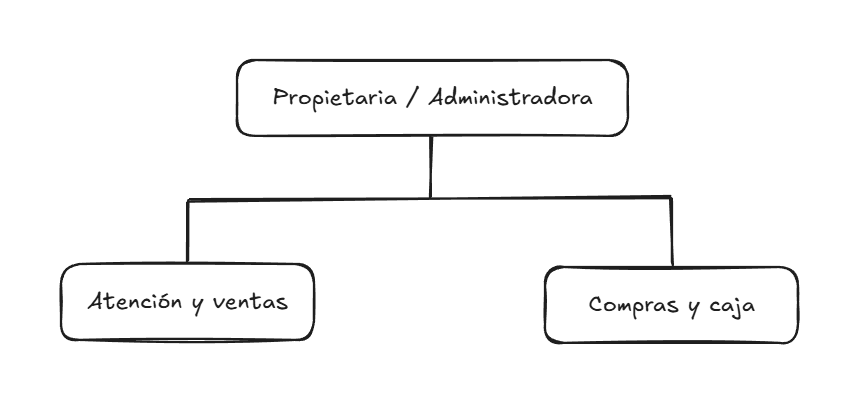

### 2.7 Productos o servicios principales

Cuadernos, lapiceros, mochilas, materiales de escritorio y artículos de bazar, además de la atención y venta personalizada al cliente.

### 2.8 Procesos principales del negocio

Registro de clientes frecuentes, registro de la venta y cobro, y control del inventario básico de productos.

---

## 3. Diagnóstico del Problema

El diagnóstico resume la situación actual del negocio y las principales causas que justifican la propuesta del sistema.

### 3.1 Realidad problemática

En el Perú, las MYPE del sector comercio crecen año tras año y, con ellas, el volumen de clientes, productos y operaciones que deben administrar diariamente. Sin embargo, una gran parte de estos negocios continúa gestionando sus ventas y su cartera de clientes de forma manual, apoyándose en cuadernos, hojas sueltas o archivos de Excel sin estructura. Esta práctica genera información dispersa, propensa a pérdidas y duplicidades, que dificulta consultar el historial de un cliente o conocer el estado real de las ventas. El registro manual introduce, además, errores humanos frecuentes —códigos mal ingresados, datos incompletos o montos calculados incorrectamente— y consume cada vez más tiempo a medida que el negocio crece, lo que retrasa la atención y reduce la productividad.

### 3.2 Formulación del problema

¿En qué medida la implementación de un sistema de información para la gestión de clientes y ventas mejora el registro, la validación y el control de la información comercial en una microempresa?

### 3.3 Diagrama de Ishikawa (causa-efecto)

**Problema central:** gestión deficiente de clientes y ventas en la microempresa.

| Categoría | Causas principales |
|---|---|
| Procesos / Métodos | Registro manual en papel, procesos no estandarizados, tareas repetitivas y lentas |
| Personas | Errores humanos al digitar, falta de capacitación, sobrecarga de trabajo |
| Información | Datos dispersos y duplicados, pérdida de documentos, sin historial confiable |
| Tecnología | Ausencia de software, uso de cuadernos o Excel, sin base de datos central |
| Control | Sin reportes de ventas, sin trazabilidad de cambios, decisiones sin datos |
| Entorno | Demanda creciente, mayor competencia, exigencia de rapidez en la atención |

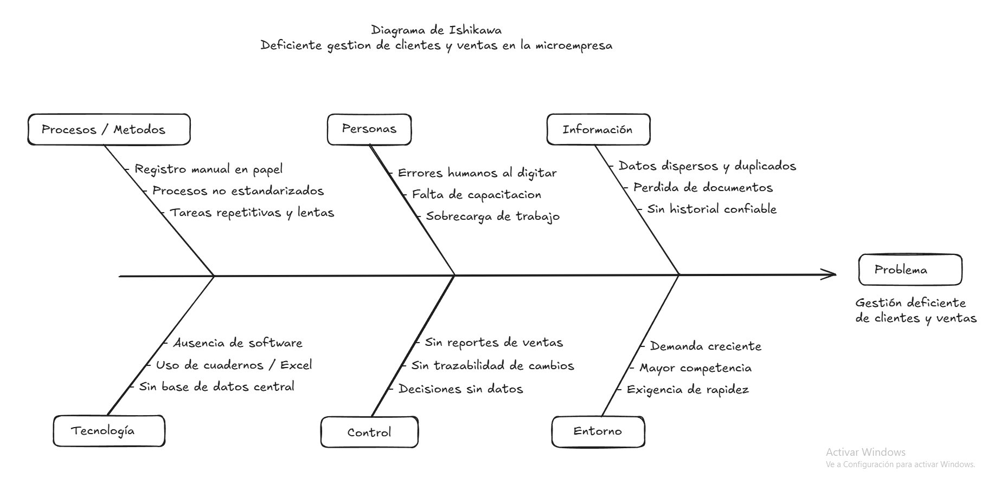

### 3.4 Antecedentes

#### 3.4.1 Internacionales

Bravo Salvatierra (2012), en Ecuador, desarrolló una aplicación web para la gestión de ventas de la empresa Repuestos Automotrices Castro (UNIANDES). Identificó que el manejo manual de la información comercial provocaba demoras y errores, y propuso una solución que automatizó el proceso de ventas y mejoró el control de la información.

#### 3.4.2 Nacionales

Castillo Castro (2016), en Lima, implementó un sistema de ventas para la empresa Marecast S.R.L. (Universidad de Ciencias y Humanidades), desarrollado en Java con NetBeans y base de datos MySQL. Reportó que la solución eliminó la pérdida de información y redujo el tiempo de atención al cliente. Es especialmente cercano a este proyecto por compartir la tecnología base (Java con base de datos relacional).

#### 3.4.3 Locales

Loayza (2021), en Trujillo, propuso un sistema de gestión para el área de almacén con el fin de aumentar la rentabilidad de la empresa Repalsa S.A. (Universidad Privada del Norte). Mostró que la estandarización y el control de los procesos administrativos inciden positivamente en el desempeño de la empresa.

### 3.5 Referencias APA

Las referencias completas en formato APA 7 se presentan en la sección de Referencias Bibliográficas.

---

## 4. Restricciones, Objetivos y Alcance

Esta sección delimita las condiciones bajo las cuales se desarrolla la solución.

### 4.1 Restricciones del proyecto

| Tipo | Restricción |
|---|---|
| Técnicas | Aplicación de escritorio en Java (NetBeans) con persistencia en SQL Server vía JDBC; se priorizan técnicas vistas en el curso. |
| Económicas | Sin presupuesto para licencias; uso exclusivo de herramientas gratuitas o de código abierto (SQL Server Express, Maven, JDK 25). |
| Operativas | Sistema local y monousuario; los datos de prueba son representativos de una microempresa real. |
| Tiempo | El desarrollo debe completarse dentro de un ciclo académico, lo que limita el número de funcionalidades. |
| Recursos humanos | Equipo reducido en formación, con disponibilidad parcial (estudiante). |

### 4.2 Alternativas de solución

| Alternativa | Ventajas | Desventajas | Decisión |
|---|---|---|---|
| Aplicación de escritorio en Java con SQL Server | Tecnología vista en el curso, sin costo, datos persistentes y con integridad referencial | Instalación por equipo, sin acceso remoto | **Elegida** |
| Aplicación web | Acceso multiplataforma | Requiere servidor y conocimientos no cubiertos en el curso | Descartada |
| Aplicación móvil | Movilidad | Fuera del alcance técnico y de tiempo del curso | Descartada |
| Continuar con Excel/papel | Costo nulo | Mantiene el problema actual | Descartada |

### 4.3 Objetivo general

Desarrollar un sistema de información de escritorio que mejore la gestión de clientes, productos y ventas de una microempresa, centralizando los datos en una base de datos SQL Server, aplicando el paradigma orientado a objetos y reduciendo los errores del registro manual.

### 4.4 Objetivos específicos

1. Implementar el CRUD completo de clientes (registrar, consultar, actualizar y eliminar) con validación de datos de entrada y persistencia en SQL Server.
2. Implementar el CRUD completo de productos usando herencia y polimorfismo para los distintos tipos (útiles escolares, papelería y bazar).
3. Implementar el registro de ventas con detalle, cálculo automático del total y persistencia transaccional en SQL Server.
4. Integrar la capa de persistencia con SQL Server mediante JDBC, implementando el patrón DAO para las tres entidades principales.
5. Aplicar control de versiones (Git) con flujo Git Flow durante todo el desarrollo del proyecto.

### 4.5 Alcance del proyecto

**Incluye:** registro, validación y almacenamiento persistente en SQL Server de clientes, productos y ventas; operaciones CRUD completas (crear, leer, actualizar y eliminar) para clientes y productos; registro transaccional de ventas con su detalle y cálculo automático del total; consulta y listado; búsqueda por código; y manejo de errores con excepciones propias.

**No incluye:** módulos de contabilidad, tributación, acceso web o móvil, integración con pasarelas de pago, ni gestión de usuarios con roles y permisos.

### 4.6 Limitaciones

El sistema funciona en modo local y monousuario. La instancia de SQL Server debe estar disponible en la misma máquina (localhost). No contempla, por ahora, acceso concurrente ni sincronización en red.

---

## 5. Análisis del Negocio AS-IS y TO-BE (BPMN)

El análisis compara el proceso manual actual con el proceso propuesto mediante el sistema.

### 5.1 Proceso actual (AS-IS)

#### 5.1.1 Descripción del proceso actual

El cliente solicita los productos; la encargada los busca físicamente, anota la venta en un cuaderno, calcula el total de memoria o con calculadora y cobra. El registro de clientes frecuentes, cuando existe, se lleva en una libreta aparte.

#### 5.1.2 Diagrama BPMN AS-IS

La siguiente figura muestra el proceso manual actual; el mismo diagrama se incluye en el Anexo A.

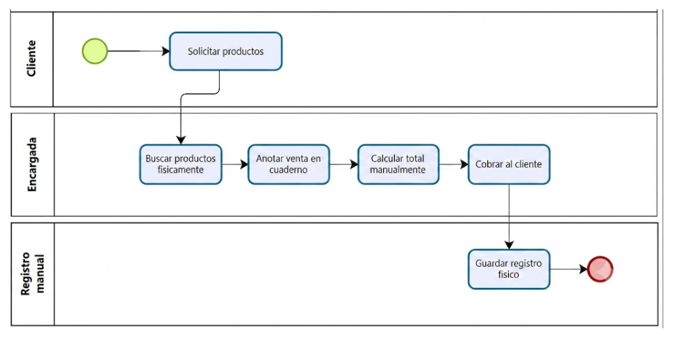

#### 5.1.3 Problemas identificados

Cálculo manual propenso a errores, búsqueda lenta de información pasada, ausencia de validación de datos, datos de clientes dispersos o inexistentes y falta de historial consultable.

### 5.2 Proceso propuesto (TO-BE)

#### 5.2.1 Descripción del proceso mejorado

La encargada registra una sola vez a cada cliente y producto con datos validados y persistidos en SQL Server; al realizar una venta, selecciona el cliente y agrega los productos con su cantidad, y el sistema calcula automáticamente el subtotal de cada línea y el total. La información queda centralizada en la base de datos y es consultable en cualquier momento.

#### 5.2.2 Diagrama BPMN TO-BE

La siguiente figura muestra el proceso mejorado; el mismo diagrama se incluye en el Anexo B.

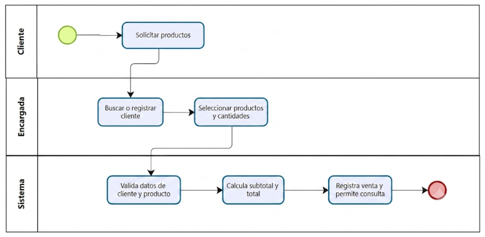

#### 5.2.3 Beneficios esperados

Reducción de errores de cálculo, registro y consulta inmediatos, trazabilidad completa en base de datos y mejor control del negocio.

### 5.3 Comparación AS-IS vs TO-BE

| Aspecto | AS-IS | TO-BE |
|---|---|---|
| Tiempo | Registro y búsqueda lentos | Registro y consulta inmediatos |
| Errores | Frecuentes (cálculo y digitación) | Reducidos por validación y cálculo automático |
| Persistencia | Cuadernos y hojas sueltas | Base de datos SQL Server (permanente y confiable) |
| Control | Sin reportes ni historial | Información centralizada y consultable |
| Productividad | Tareas repetitivas | Menos tareas manuales, más tiempo para el cliente |

---

## 6. Requerimientos del Sistema

Los requerimientos definen las funciones esperadas del sistema y las condiciones generales de operación.

### 6.1 Actores del sistema

| Actor | Descripción |
|---|---|
| Administrador / Encargado | Registra, consulta, actualiza y elimina clientes, productos y ventas; usuario principal del sistema. |

### 6.2 Requerimientos funcionales

| Código | Requerimiento | Estado |
|---|---|---|
| RF-01 | Registrar un cliente con código, nombre y email. | Implementado |
| RF-02 | Validar que el código del cliente sea numérico. | Implementado |
| RF-03 | Validar que el código del cliente no sea nulo ni vacío. | Implementado |
| RF-04 | Validar que el email del cliente tenga un formato válido. | Implementado |
| RF-05 | Impedir el registro de clientes con código duplicado. | Implementado |
| RF-06 | Listar todos los clientes registrados. | Implementado |
| RF-07 | Buscar un cliente por su código. | Implementado |
| RF-08 | Actualizar los datos de un cliente existente. | Implementado |
| RF-09 | Eliminar un cliente. | Implementado |
| RF-10 | Mostrar un mensaje de confirmación al registrar un cliente. | Implementado |
| RF-11 | Registrar un producto con código, nombre y precio. | Implementado |
| RF-12 | Validar que el nombre del producto no esté vacío. | Implementado |
| RF-13 | Validar que el precio del producto sea mayor que cero. | Implementado |
| RF-14 | Validar que el precio sea un valor numérico. | Implementado |
| RF-15 | Impedir el registro de productos con código duplicado. | Implementado |
| RF-16 | Listar todos los productos registrados. | Implementado |
| RF-17 | Buscar un producto por su código. | Implementado |
| RF-18 | Actualizar los datos de un producto. | Implementado |
| RF-19 | Eliminar un producto. | Implementado |
| RF-20 | Mostrar el precio final del producto al consultarlo. | Implementado |
| RF-21 | Registrar una venta asociada a un cliente. | Implementado |
| RF-22 | Validar que el cliente de la venta exista. | Implementado |
| RF-23 | Registrar la fecha de la venta. | Implementado |
| RF-24 | Agregar uno o más detalles a una venta. | Implementado |
| RF-25 | Validar que el producto de cada detalle exista. | Implementado |
| RF-26 | Validar que la cantidad de cada detalle sea mayor que cero. | Implementado |
| RF-27 | Calcular el subtotal de cada detalle (precio final × cantidad). | Implementado |
| RF-28 | Calcular el total de la venta sumando los subtotales. | Implementado |
| RF-29 | Validar que una venta tenga al menos un detalle. | Implementado |
| RF-30 | Mostrar el total de la venta al confirmarla. | Implementado |
| RF-31 | Listar todas las ventas registradas. | Implementado |
| RF-32 | Buscar una venta por su código. | Implementado |
| RF-33 | Consultar el detalle de una venta. | Implementado |
| RF-34 | Listar las ventas de un cliente específico. | Implementado |
| RF-35 | Presentar una interfaz para navegar entre los módulos. | Implementado |
| RF-36 | Validar los campos obligatorios en cada formulario. | Implementado |
| RF-37 | Mostrar mensajes de error claros ante datos inválidos. | Implementado |
| RF-38 | Continuar operando sin cerrarse ante un error de validación. | Implementado |
| RF-39 | Mostrar mensajes de confirmación tras cada operación exitosa. | Implementado |
| RF-40 | Permitir salir de la aplicación de forma controlada. | Implementado |

### 6.3 Requerimientos no funcionales

| Código | Requerimiento |
|---|---|
| RNF-01 | Usabilidad: interfaz intuitiva, operable con mínimo entrenamiento. |
| RNF-02 | Rendimiento: registro y consulta inmediatos para el volumen de una microempresa. |
| RNF-03 | Portabilidad: ejecutable en cualquier sistema con JVM y SQL Server Express. |
| RNF-04 | Mantenibilidad: código organizado en paquetes y clases bajo el paradigma OO. |
| RNF-05 | Confiabilidad: validaciones con excepciones propias e integridad transaccional en la BD. |
| RNF-06 | Disponibilidad: funcionamiento local, sin requerir internet. |

---

## 7. Historias de Usuario

Las historias de usuario expresan las necesidades principales desde la perspectiva del encargado del negocio.

| ID | Historia de Usuario | Prioridad |
|---|---|---|
| HU-01 | Como encargado, quiero registrar, actualizar y eliminar clientes, para mantener una cartera ordenada y sin duplicados. | Alta |
| HU-02 | Como encargado, quiero registrar, actualizar y eliminar productos, para contar con un catálogo confiable de precios. | Alta |
| HU-03 | Como encargado, quiero registrar ventas con su detalle, para calcular automáticamente el total y llevar el historial persistente. | Media |

Las historias completas y sus escenarios de aceptación se encuentran en el Anexo C.

---

## 8. Criterios de Aceptación y Evidencias de Cumplimiento

Los criterios de aceptación permiten comprobar si cada requerimiento implementado cumple con el comportamiento esperado. Cada uno se sustenta con evidencia (capturas y clases Java), detallada en el Anexo E.

**Módulo Clientes (RF-01 a RF-10):**

| RF | HU | Criterio de aceptación | Evidencia |
|---|---|---|---|
| RF-01 Registrar cliente | HU-01 | Dado un cliente con datos válidos, el sistema lo registra en BD y lo muestra en el listado | `ClienteServicio.agregar()` + `ClienteDAO.insertar()`; Figura 13-2 |
| RF-02 Validar código numérico | HU-01 | Si el código contiene caracteres no numéricos, el sistema rechaza el registro con mensaje | `ClienteServicio.validarCodigo()` |
| RF-03 Validar código no nulo | HU-01 | Si el campo código está vacío o nulo, el sistema rechaza el registro con mensaje | `ClienteServicio.validarCodigo()` |
| RF-04 Validar email | HU-01 | Si el email no contiene "@" y ".", el sistema lo rechaza con mensaje | `ClienteServicio.validarEmail()` |
| RF-05 Código de cliente único | HU-01 | Si el código de cliente ya existe en BD, el sistema impide el duplicado | `ClienteServicio.agregar()` + `ClienteDAO.buscarPorCodigo()` |
| RF-06 Listar clientes | HU-01 | El sistema muestra todos los clientes registrados en la tabla de la pestaña Clientes | `ClienteServicio.getClientes()`; Figura 13-2 |
| RF-07 Buscar cliente por código | HU-01 | Dado un código existente, el sistema retorna el cliente; si no existe, lo informa | `ClienteServicio.buscarPorCodigo()` |
| RF-08 Actualizar cliente | HU-01 | El sistema actualiza nombre y email del cliente en BD sin cambiar el código | `ClienteServicio.actualizar()` + `ClienteDAO.actualizar()` |
| RF-09 Eliminar cliente | HU-01 | El sistema elimina el cliente de BD; sus ventas se eliminan en cascada | `ClienteServicio.eliminar()` + `ClienteDAO.eliminar()`; Figura 13-11 |
| RF-10 Confirmación al registrar cliente | HU-01 | Tras registrar un cliente, el sistema muestra un mensaje de confirmación | `SistemaRegistroUI` (`JOptionPane`) |

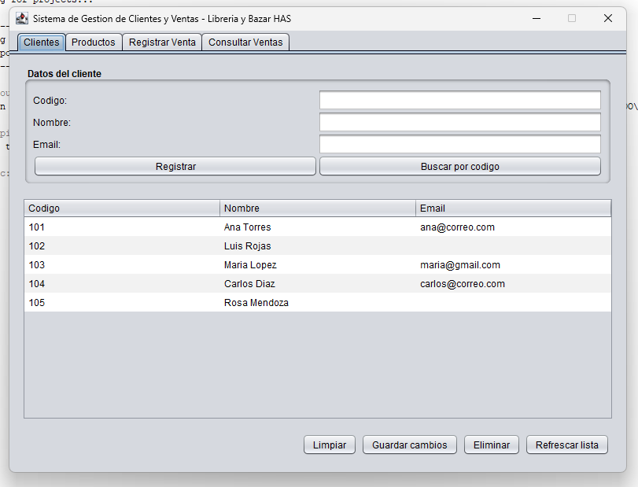

**Módulo Productos (RF-11 a RF-20):**

| RF | HU | Criterio de aceptación | Evidencia |
|---|---|---|---|
| RF-11 Registrar producto | HU-02 | Dado un producto válido, el sistema lo registra, valida y persiste en BD | `ProductoServicio.registrar()` + `ProductoDAO.insertar()`; Figura 13-3 |
| RF-12 Validar nombre de producto | HU-02 | Si el nombre del producto está vacío, el sistema rechaza el registro con mensaje | `Producto.setNombre()` |
| RF-13 Validar precio mayor que cero | HU-02 | Si el precio es cero o negativo, el sistema rechaza el registro con mensaje | `Producto.setPrecioBase()` |
| RF-14 Validar precio numérico | HU-02 | Si el precio no es numérico, el sistema rechaza el registro con mensaje | `SistemaRegistroUI` (`Double.parseDouble` con try-catch) |
| RF-15 Código de producto único | HU-02 | Si el código de producto ya existe en BD, el sistema impide el duplicado | `ProductoServicio.registrar()` + `ProductoDAO.buscarPorCodigo()` |
| RF-16 Listar productos | HU-02 | El sistema muestra todos los productos registrados con su precio final calculado | `ProductoServicio.getProductos()`; Figura 13-3 |
| RF-17 Buscar producto por código | HU-02 | Dado un código existente, el sistema retorna el producto con su precio final | `ProductoServicio.buscarPorCodigo()` |
| RF-18 Actualizar producto | HU-02 | El sistema actualiza nombre, precio y tipo del producto en BD mediante el DAO | `ProductoServicio.actualizar()` + `ProductoDAO.actualizar()` |
| RF-19 Eliminar producto | HU-02 | Si el producto tiene ventas, el sistema muestra error; si no, lo elimina de BD | `ProductoServicio.eliminar()` + `ProductoDAO.tieneVentasAsociadas()`; Figura 13-13 |
| RF-20 Mostrar precio final | HU-02 | Al consultar un producto, el sistema muestra su precio final calculado polimórficamente | `Producto.calcularPrecioFinal()`; Figura 13-3 |

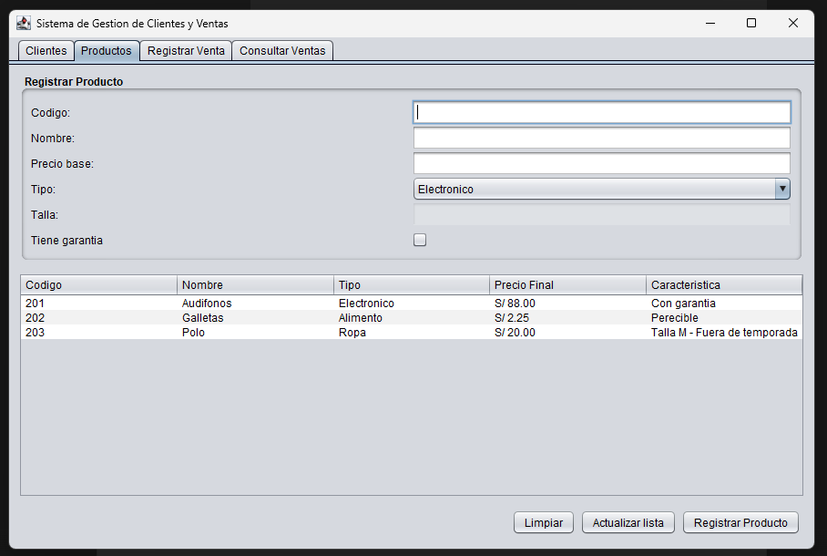

**Módulo Registrar Venta (RF-21 a RF-30):**

| RF | HU | Criterio de aceptación | Evidencia |
|---|---|---|---|
| RF-21 Registrar venta | HU-03 | Dada una venta con cliente y al menos un detalle, el sistema la persiste transaccionalmente | `VentaServicio.registrarVenta()` + `VentaDAO.insertar()`; Figura 13-4 |
| RF-22 Validar cliente de la venta | HU-03 | Si el cliente de la venta no existe, el sistema rechaza el registro de la venta | `VentaServicio.registrarVenta()` |
| RF-23 Registrar fecha de la venta | HU-03 | El sistema registra la fecha de la venta (fecha actual del sistema) | `Venta` (constructor) + `SistemaRegistroUI` (`LocalDate.now()`) |
| RF-24 Agregar detalle a la venta | HU-03 | El sistema permite agregar uno o más productos con su cantidad a la venta en curso | `VentaServicio.agregarDetalle()` + `DetalleVenta`; Figura 13-4 |
| RF-25 Validar producto del detalle | HU-03 | Si el código de producto del detalle no existe, el sistema rechaza el detalle | `VentaServicio.agregarDetalle()` |
| RF-26 Validar cantidad del detalle | HU-03 | Si la cantidad del detalle es cero o negativa, el sistema rechaza el detalle con mensaje | `VentaServicio.agregarDetalle()` |
| RF-27 Calcular subtotal | HU-03 | Cada detalle calcula su subtotal como precio final polimórfico × cantidad | `DetalleVenta.calcularSubtotal()` |
| RF-28 Calcular total de la venta | HU-03 | El total de la venta es la suma de los subtotales de todos sus detalles | `Venta.calcularTotal()` |
| RF-29 Validar venta con detalle | HU-03 | Si la venta no tiene al menos un detalle, el sistema la rechaza con mensaje | `VentaServicio.registrarVenta()` |
| RF-30 Mostrar total al confirmar | HU-03 | Al confirmar la venta, el sistema muestra el total en un mensaje | `SistemaRegistroUI` (`JOptionPane` con total) |

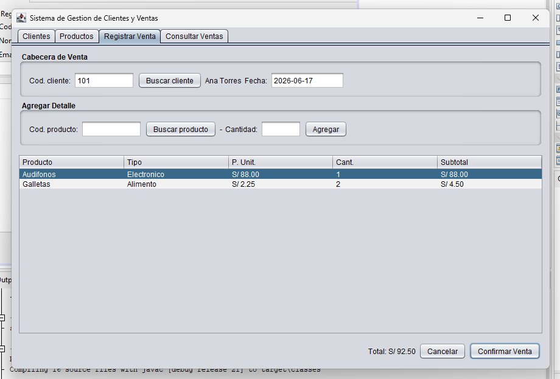

**Módulo Consultar Ventas (RF-31 a RF-34):**

| RF | HU | Criterio de aceptación | Evidencia |
|---|---|---|---|
| RF-31 Listar ventas | HU-03 | El sistema lista todas las ventas registradas con su código, cliente, fecha y total | `VentaServicio.getVentas()`; Figura 13-5 |
| RF-32 Buscar venta por código | HU-03 | Dado un código de venta, el sistema localiza la venta correspondiente | `VentaServicio.buscarPorCodigo()` |
| RF-33 Consultar detalle de venta | HU-03 | Al seleccionar una venta, el sistema muestra su detalle (productos, cantidades y subtotales) | `SistemaRegistroUI.tablaVentasValueChanged()`; Figura 13-6 |
| RF-34 Listar ventas de un cliente | HU-03 | Dado un código de cliente, el sistema muestra solo sus ventas mediante una consulta con INNER JOIN; si no tiene, informa que no hay registros | `VentaServicio.listarPorCliente()` + `VentaDAO.listarPorCliente()` (INNER JOIN); Figura 13-7 |

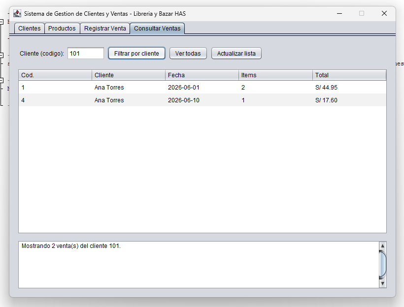

**Interfaz general (RF-35 a RF-40):**

| RF | HU | Criterio de aceptación | Evidencia |
|---|---|---|---|
| RF-35 Navegar entre módulos | — | El sistema presenta una interfaz con pestañas para navegar entre los módulos | `SistemaRegistroUI` (`JTabbedPane`); Figura 13-1 |
| RF-36 Validar campos obligatorios | — | El sistema valida los campos obligatorios de cada formulario antes de procesar | `SistemaRegistroUI` (validación en handlers); Figura 13-12 |
| RF-37 Mensajes de error claros | — | Ante datos inválidos, el sistema muestra mensajes de error claros al usuario | `SistemaRegistroUI.mostrarError()` |
| RF-38 Continuar ante error de validación | — | Ante un error de validación, el sistema continúa operando sin cerrarse | `SistemaRegistroUI` (try-catch en handlers) |
| RF-39 Confirmación tras operación exitosa | — | Tras cada operación exitosa, el sistema muestra un mensaje de confirmación | `SistemaRegistroUI` (`JOptionPane`) |
| RF-40 Salir de forma controlada | — | El sistema permite salir de la aplicación de forma controlada | `SistemaRegistroUI` (cierre controlado de la ventana) |

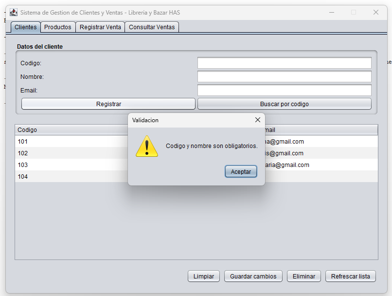

**Evidencias:**
- **Casos de prueba:** los datos de prueba de `schema.sql` (Anexo H) ejercitan los tres módulos (clientes, productos, ventas) con casos válidos e inválidos.
- **Capturas de ejecución:** las mostradas arriba para cada módulo, y el consolidado en el Anexo I.
- **Validaciones realizadas:** secciones 13.4 y 13.5.
- **Resultado esperado vs. resultado obtenido:** el resultado esperado es el criterio de aceptación de cada RF; el resultado obtenido, verificado contra las capturas anteriores y el detalle técnico del Anexo E, coincide en los 40 requerimientos.

---

## 9. Diseño Orientado a Objetos

El diseño orientado a objetos organiza el sistema en clases con responsabilidades definidas y relaciones simples, agrupadas en cuatro capas desacopladas.

### 9.1 Diagrama de clases UML

El diagrama de clases actualizado (Anexo F) muestra las entidades del dominio, la jerarquía de productos, la capa de servicios, los DAOs y las excepciones.

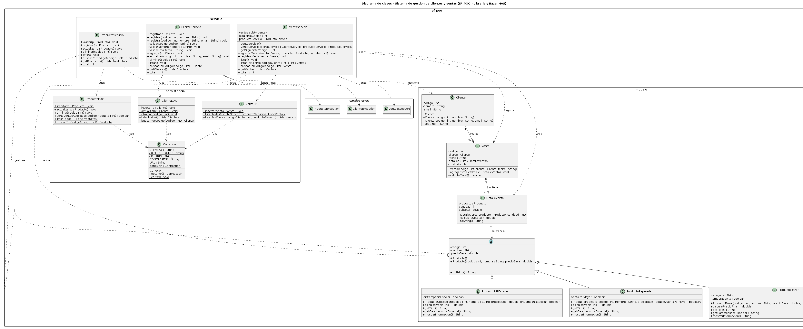

### 9.2 Justificación del diseño

La separación en cuatro capas (modelo, servicio, persistencia y presentación) favorece la mantenibilidad y permite que la lógica de negocio sea independiente tanto de la interfaz como del motor de base de datos. La jerarquía abstracta de productos permite tratar distintos tipos con reglas de precio propias sin duplicar código, aprovechando la herencia y el polimorfismo.

### 9.3 Aplicación de los Principios de POO

**Encapsulamiento.** Todos los atributos son privados. Los setters validan la entrada antes de asignar el valor y lanzan `IllegalArgumentException` si el dato no cumple la regla de negocio, evitando que los objetos queden en un estado inconsistente.

```java
// Producto.java – setters con validación (encapsulamiento)
public void setNombre(String nombre) {
    if (nombre == null || nombre.trim().isEmpty())
        throw new IllegalArgumentException(
            "El nombre del producto no puede estar vacio");
    this.nombre = nombre;
}

public void setPrecioBase(double precioBase) {
    if (precioBase <= 0)
        throw new IllegalArgumentException(
            "El precio base debe ser mayor que cero");
    this.precioBase = precioBase;
}
```

**Herencia.** `ProductoUtilEscolar`, `ProductoPapeleria` y `ProductoBazar` heredan de `Producto`, reutilizando sus atributos y el constructor base mediante `super(...)`. Cada subtipo agrega únicamente el atributo que lo diferencia, elegido para corresponder al catálogo real de una librería y bazar escolar.

```java
// ProductoUtilEscolar.java – herencia de Producto
public class ProductoUtilEscolar extends Producto {
    private boolean enCampaniaEscolar;

    public ProductoUtilEscolar(int codigo, String nombre,
                               double precioBase, boolean enCampaniaEscolar) {
        super(codigo, nombre, precioBase); // hereda constructor de Producto
        this.enCampaniaEscolar = enCampaniaEscolar;
    }

    public boolean isEnCampaniaEscolar() { return enCampaniaEscolar; }
    public void setEnCampaniaEscolar(boolean v) { this.enCampaniaEscolar = v; }
    ...
}
```

**Polimorfismo.** Cada subclase sobrescribe (`@Override`) el método `calcularPrecioFinal()`, de modo que un mismo mensaje produce un resultado distinto según el tipo real del objeto: −10 % si el útil escolar está en campaña escolar, −12 % si el artículo de papelería se vende por mayor, y −20 % si el artículo de bazar está fuera de temporada alta.

```java
// ProductoUtilEscolar – precio -10% en campania escolar
@Override
public double calcularPrecioFinal() {
    if (enCampaniaEscolar) {
        return getPrecioBase() * 0.90;
    }
    return getPrecioBase();
}

// ProductoPapeleria – precio -12% por venta al por mayor
@Override
public double calcularPrecioFinal() {
    if (ventaPorMayor) {
        return getPrecioBase() * 0.88;
    }
    return getPrecioBase();
}

// ProductoBazar – precio -20% fuera de temporada alta
@Override
public double calcularPrecioFinal() {
    if (!temporadaAlta) {
        return getPrecioBase() * 0.80;
    }
    return getPrecioBase();
}
```

El catálogo de productos se diseñó para corresponder directamente al rubro de la organización de estudio: útiles escolares con descuento en campaña escolar, artículos de papelería con descuento por venta al por mayor, y artículos de bazar con descuento fuera de temporada alta.

**Abstracción.** La clase `Producto` es abstracta: define el contrato que todo producto debe cumplir mediante cuatro métodos abstractos, sin poder instanciarse directamente. Esto obliga a que cada subtipo concreto proporcione su propia implementación.

```java
// Producto.java – clase abstracta con contrato de comportamiento
public abstract class Producto {
    private int codigo;
    private String nombre;
    private double precioBase;

    public Producto(int codigo, String nombre, double precioBase) {
        setCodigo(codigo);
        setNombre(nombre);
        setPrecioBase(precioBase);
    }

    public abstract double calcularPrecioFinal();
    public abstract String getTipo();
    public abstract String mostrarInformacion();
    public abstract String getCaracteristicaEspecial();
}
```

### 9.4 Relaciones entre clases

| Relación | Tipo | Ejemplo en el sistema |
|---|---|---|
| Herencia | es-un | ProductoUtilEscolar, ProductoPapeleria, ProductoBazar extienden Producto |
| Asociación | 1 a * | Cliente – Venta (un cliente puede tener muchas ventas) |
| Agregación | referencia | DetalleVenta referencia a Producto (el producto existe de forma independiente) |
| Composición | 1 a 1..* | Venta – DetalleVenta (los detalles no existen sin su venta) |
| Dependencia | uso | Los servicios dependen de los modelos, excepciones y DAOs |

### 9.5 Aplicación de Buenas Prácticas

**Cohesión.** Cada clase tiene una única responsabilidad clara dentro de su capa: las clases de `modelo` solo representan datos y sus invariantes; las de `servicio` solo reglas de negocio; las de `persistencia` solo acceso a datos; las de `excepciones` solo errores de dominio. Ninguna clase mezcla, por ejemplo, SQL con lógica de validación.

```java
// ClienteServicio.java – solo reglas de negocio, delega la persistencia
public void agregar(Cliente c) throws ClienteException {
    validarCodigo(String.valueOf(c.getCodigo()));
    validarNombre(c.getNombre());
    ClienteDAO.insertar(c);
}

// ClienteDAO.java – solo acceso a datos, sin ninguna regla de negocio
public static void insertar(Cliente c) throws SQLException {
    String sql = "INSERT INTO Cliente (codigo, nombre, email) VALUES (?, ?, ?)";
    try (PreparedStatement stmt = Conexion.obtener().prepareStatement(sql)) {
        stmt.setInt(1, c.getCodigo());
        stmt.setString(2, c.getNombre());
        stmt.setString(3, c.getEmail());
        stmt.executeUpdate();
    }
}
```

**Bajo acoplamiento.** La capa de presentación (`SistemaRegistroUI`) no ejecuta SQL ni conoce JDBC: solo llama a los servicios. Los servicios, a su vez, no arman consultas SQL directamente ni gestionan la conexión: delegan siempre en el DAO correspondiente. La mayor parte del acceso a datos se concentra en la capa DAO, lo que reduce el impacto de cambios en persistencia.

```java
// SistemaRegistroUI.java – la vista solo llama al servicio, nunca a SQL o al DAO
private void btnClienteRegistrarActionPerformed(java.awt.event.ActionEvent evt) {
    String codigo = txtClienteCodigo.getText().trim();
    String nombre = txtClienteNombre.getText().trim();
    String email = txtClienteEmail.getText().trim();
    if (codigo.isEmpty() || nombre.isEmpty()) {
        mostrarError("Codigo y nombre son obligatorios.");
        return;
    }
    try {
        int codigoCliente = Integer.parseInt(codigo);
        if (email.isEmpty()) {
            clienteServicio.registrar(codigoCliente, nombre);
        } else {
            clienteServicio.registrar(codigoCliente, nombre, email);
        }
        txtClienteCodigo.setText("");
        txtClienteNombre.setText("");
        txtClienteEmail.setText("");
        refrescarClientes();
        JOptionPane.showMessageDialog(this, "Cliente registrado correctamente.");
    } catch (NumberFormatException ex) {
        mostrarError("El codigo debe ser numerico.");
    } catch (ClienteException ex) {
        mostrarError(ex.getMessage());
    }
}
```

**Reutilización.** La clase abstracta `Producto` centraliza el atributo común y el contrato de comportamiento, reutilizado por sus tres subtipos sin duplicar código (ver fragmento en la sección 9.3). `Cliente` reutiliza el mismo patrón de validación en el constructor que ya usa `Producto`. `ClienteServicio` y `ProductoServicio` comparten la misma estructura de métodos (`agregar`/`registrar`, `actualizar`, `eliminar`, `buscarPorCodigo`, `listar`), lo que facilita entender uno a partir del otro.

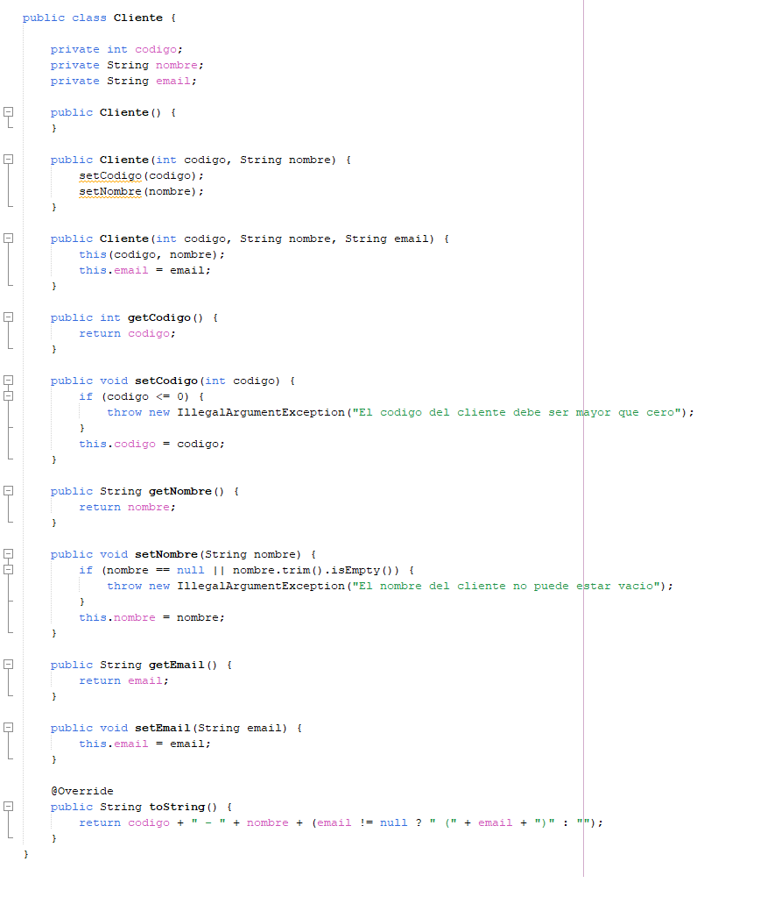

**Responsabilidad única.** Cada clase tiene un solo motivo para cambiar: `Conexion` solo cambia si cambia la forma de conectarse a la base de datos (sección 11.4); `ClienteDAO` solo cambia si cambia el acceso a datos de `Cliente`; `ClienteServicio` solo cambia si cambian las reglas de negocio de `Cliente`. `ClienteException` es el ejemplo más simple: su único motivo para existir es representar un error de negocio del dominio de `Cliente`, sin ninguna otra responsabilidad.

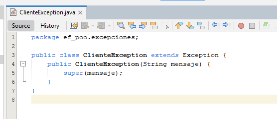

Esta separación es la misma que sustenta la arquitectura de cuatro capas descrita en la sección 10.

### 9.6 Excepciones propias del dominio

El sistema define tres excepciones propias que extienden `Exception`, una por cada entidad principal. Esto permite distinguir errores de negocio de errores técnicos y proporcionar mensajes claros al usuario.

```java
// ClienteException.java
public class ClienteException extends Exception {
    public ClienteException(String mensaje) {
        super(mensaje);
    }
}
// Idéntico patrón: ProductoException, VentaException
```

Las excepciones se lanzan desde la capa de servicio ante cualquier regla de negocio incumplida y son capturadas en la interfaz Swing para mostrar el mensaje correspondiente al usuario.

### 9.7 Composición y cálculo polimórfico en ventas

`DetalleVenta` contiene una referencia a `Producto` (composición) y calcula el subtotal llamando al método polimórfico `calcularPrecioFinal()`. `Venta` agrega los detalles y suma sus subtotales. Esto demuestra la interacción entre polimorfismo, composición y encapsulamiento.

```java
// DetalleVenta.java – subtotal usando calcularPrecioFinal() polimórfico
public class DetalleVenta {
    private Producto producto;
    private int cantidad;
    private double subtotal;

    public DetalleVenta(Producto producto, int cantidad) {
        this.producto = producto;
        this.cantidad = cantidad;
        this.subtotal = calcularSubtotal();
    }

    public double calcularSubtotal() {
        return producto.calcularPrecioFinal() * cantidad;
    }
}
```

```java
// Venta.java – total como suma de subtotales
public double calcularTotal() {
    double t = 0;
    for (DetalleVenta d : detalles)
        t += d.getSubtotal();
    return t;
}
```

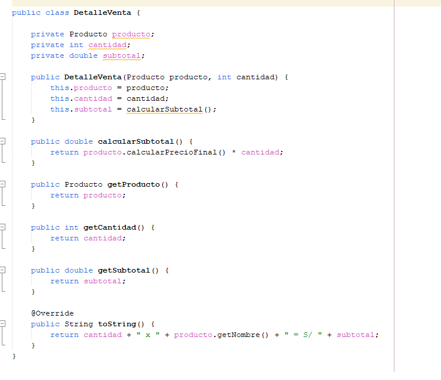

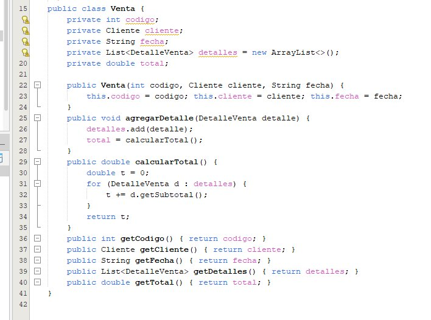

### 9.8 Descripción de las principales clases

| Clase | Paquete | Responsabilidad |
|---|---|---|
| `Cliente` | modelo | Entidad con código, nombre y email; setters con validación propia (mismo patrón que `Producto`). |
| `Producto` (abstracta) | modelo | Define atributos comunes y el contrato de cálculo de precio. |
| `ProductoUtilEscolar` | modelo | Precio final −10 % si está en campaña escolar. |
| `ProductoPapeleria` | modelo | Precio final −12 % si se vende por mayor. |
| `ProductoBazar` | modelo | Precio final −20 % si está fuera de temporada alta. |
| `DetalleVenta` | modelo | Línea de venta; calcula el subtotal con el precio final polimórfico del producto. |
| `Venta` | modelo | Cabecera; contiene la lista de detalles y calcula el total. |
| `ClienteServicio` | servicio | CRUD de clientes: validaciones y delegación directa al DAO (sin colección en memoria). |
| `ProductoServicio` | servicio | CRUD de productos: validaciones, delegación al DAO. |
| `VentaServicio` | servicio | Registro de ventas y delegación transaccional al VentaDAO. |
| `Conexion` | persistencia | Singleton de `java.sql.Connection` para SQL Server (login de SQL Server dedicado, sin autenticación de Windows). |
| `ClienteDAO` | persistencia | INSERT, UPDATE, DELETE y SELECT sobre la tabla Cliente. |
| `ProductoDAO` | persistencia | CRUD SQL con soporte a herencia por tabla única. |
| `VentaDAO` | persistencia | INSERT transaccional de Venta y DetalleVenta; SELECT con reconstrucción de objetos. |
| `ClienteException` | excepciones | Error propio del dominio de clientes. |
| `ProductoException` | excepciones | Error propio del dominio de productos. |
| `VentaException` | excepciones | Error propio del dominio de ventas. |

---

## 10. Arquitectura de la Solución

### 10.1 Arquitectura general

Aplicación de escritorio monolítica organizada en cuatro capas desacopladas, con persistencia en SQL Server vía JDBC. La lógica de negocio reside en la capa de servicios y es independiente tanto de la interfaz como del motor de base de datos.

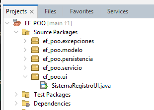

### 10.2 Arquitectura por Capas

- **Presentación:** interfaz gráfica en Swing, organizada por pestañas para clientes, productos, registro de ventas y consulta de ventas.
- **Lógica de Negocio:** reglas de registro, validación, CRUD y cálculo en el paquete `servicio`, sobre las entidades del paquete `modelo` (con la jerarquía abstracta de `Producto`). Lanza excepciones propias del dominio.
- **Persistencia de Datos:** patrón DAO sobre SQL Server mediante JDBC; paquete `persistencia` con `Conexion` (Singleton), `ClienteDAO`, `ProductoDAO` y `VentaDAO`.

### 10.3 Estructura de paquetes

El proyecto se organiza como un proyecto Maven (`EF_POO`) con un único paquete raíz `ef_poo`, sin prefijo de organización, para mantener la estructura simple:

```
EF_POO/
├── pom.xml               (dependencia mssql-jdbc 13.4.0.jre11 vía Maven Central)
├── schema.sql            (DDL: crea la BD LibreriaBazarDB y las 4 tablas con FK y CASCADE,
│                          con datos de prueba para las 4 tablas)
└── src/main/java/ef_poo/
    ├── ui/           SistemaRegistroUI (interfaz Swing, con su .form del GUI Builder)
    ├── modelo/       Cliente, Producto (abstracta), ProductoUtilEscolar,
    │                 ProductoPapeleria, ProductoBazar, Venta, DetalleVenta
    ├── servicio/     ClienteServicio, ProductoServicio, VentaServicio
    ├── persistencia/ Conexion (Singleton), ClienteDAO, ProductoDAO, VentaDAO
    └── excepciones/  ClienteException, ProductoException, VentaException
```

### 10.4 Patrón de Diseño Utilizado

- **DAO:** aplicado en las tres entidades principales (`ClienteDAO`, `ProductoDAO`, `VentaDAO`), separando el acceso a datos SQL de la lógica de negocio de los servicios.
- **Singleton:** aplicado en `Conexion`, que garantiza una única instancia de `java.sql.Connection` reutilizada por todos los DAO (detalle en la sección 11.4).

### 10.5 Flujo de una operación típica

| Capa | Acción en "Registrar Cliente" |
|---|---|
| Presentación | El usuario completa el formulario y hace clic en "Registrar cliente" |
| Servicio | ClienteServicio.agregar() valida código, nombre, email y duplicados |
| Persistencia | ClienteDAO.insertar() ejecuta INSERT INTO Cliente con PreparedStatement |
| Base de datos | SQL Server almacena el registro y garantiza la restricción de clave primaria |
| Retorno | La interfaz refresca la tabla consultando de nuevo `ClienteDAO.listarTodos()` y muestra el mensaje de éxito |

---

## 11. Diseño de Base de Datos y Persistencia

Esta sección describe el modelo entidad-relación, el diccionario de datos, el script de creación, la conexión JDBC, el patrón DAO implementado y el manejo de transacciones sobre SQL Server.

### 11.1 Modelo Entidad Relación

El modelo tiene cuatro entidades: `Cliente`, `Producto`, `Venta` y `DetalleVenta`. Un cliente puede tener muchas ventas (1 a N); una venta tiene uno o más detalles (1 a N, composición: el detalle no existe sin su venta); cada detalle referencia exactamente un producto (N a 1). La tabla `Producto` usa **herencia por tabla única**: los atributos exclusivos de cada subtipo (`ProductoUtilEscolar`, `ProductoPapeleria`, `ProductoBazar`) se almacenan en la misma tabla con valor NULL cuando no aplican, en vez de usar una tabla por subtipo.

| Relación | Cardinalidad | Regla |
|---|---|---|
| Cliente → Venta | 1 a N | Un cliente puede tener 0 o más ventas; al eliminar el cliente, sus ventas se eliminan en cascada |
| Venta → DetalleVenta | 1 a N | Una venta tiene 1 o más detalles; al eliminar la venta, sus detalles se eliminan en cascada |
| Producto → DetalleVenta | 1 a N | Un producto puede aparecer en 0 o más detalles de venta; un producto con ventas asociadas no puede eliminarse |

### 11.2 Diccionario de Datos

| Tabla | Columna | Tipo | Descripción / restricción |
|---|---|---|---|
| Cliente | codigo | INT | Clave primaria |
| Cliente | nombre | NVARCHAR(150) | Obligatorio |
| Cliente | email | NVARCHAR(150) | Opcional |
| Producto | codigo | INT | Clave primaria |
| Producto | nombre | NVARCHAR(150) | Obligatorio |
| Producto | precio_base | DECIMAL(10,2) | Obligatorio; `CHECK > 0` |
| Producto | tipo | NVARCHAR(20) | Discriminador: `UtilEscolar` \| `Papeleria` \| `Bazar` |
| Producto | en_campania_escolar | BIT | Solo aplica a `ProductoUtilEscolar` |
| Producto | venta_por_mayor | BIT | Solo aplica a `ProductoPapeleria` |
| Producto | categoria | NVARCHAR(30) | Solo aplica a `ProductoBazar` |
| Producto | temporada_alta | BIT | Solo aplica a `ProductoBazar` |
| Venta | codigo | INT | Clave primaria |
| Venta | codigo_cliente | INT | Clave foránea → Cliente, `ON DELETE CASCADE` |
| Venta | fecha | NVARCHAR(20) | Obligatorio |
| Venta | total | DECIMAL(10,2) | Suma de los subtotales de sus detalles |
| DetalleVenta | id | INT (IDENTITY) | Clave primaria autogenerada |
| DetalleVenta | codigo_venta | INT | Clave foránea → Venta, `ON DELETE CASCADE` |
| DetalleVenta | codigo_producto | INT | Clave foránea → Producto |
| DetalleVenta | cantidad | INT | `CHECK > 0` |
| DetalleVenta | subtotal | DECIMAL(10,2) | `precio_final × cantidad` |

### 11.3 Script de Creación de Base de Datos

El script `schema.sql` (adjunto, ver Anexo H) crea la base de datos `LibreriaBazarDB` y sus cuatro tablas normalizadas, junto con datos de prueba para las cuatro tablas.

```sql
CREATE TABLE Cliente (
    codigo  INT            NOT NULL PRIMARY KEY,
    nombre  NVARCHAR(150)  NOT NULL,
    email   NVARCHAR(150)      NULL
);

-- tipo: 'UtilEscolar' | 'Papeleria' | 'Bazar'
CREATE TABLE Producto (
    codigo               INT            NOT NULL PRIMARY KEY,
    nombre               NVARCHAR(150)  NOT NULL,
    precio_base          DECIMAL(10,2)  NOT NULL,
    tipo                 NVARCHAR(20)   NOT NULL,
    en_campania_escolar  BIT                NULL,   -- solo ProductoUtilEscolar
    venta_por_mayor      BIT                NULL,   -- solo ProductoPapeleria
    categoria            NVARCHAR(30)       NULL,   -- solo ProductoBazar
    temporada_alta       BIT                NULL,   -- solo ProductoBazar
    CONSTRAINT CK_Producto_Precio CHECK (precio_base > 0)
);

CREATE TABLE Venta (
    codigo         INT             NOT NULL PRIMARY KEY,
    codigo_cliente INT             NOT NULL,
    fecha          NVARCHAR(20)    NOT NULL,
    total          DECIMAL(10,2)   NOT NULL DEFAULT 0,
    CONSTRAINT FK_Venta_Cliente
        FOREIGN KEY (codigo_cliente) REFERENCES Cliente(codigo)
        ON DELETE CASCADE
);

CREATE TABLE DetalleVenta (
    id              INT             IDENTITY(1,1) PRIMARY KEY,
    codigo_venta    INT             NOT NULL,
    codigo_producto INT             NOT NULL,
    cantidad        INT             NOT NULL,
    subtotal        DECIMAL(10,2)   NOT NULL,
    CONSTRAINT FK_Detalle_Venta
        FOREIGN KEY (codigo_venta) REFERENCES Venta(codigo)
        ON DELETE CASCADE,
    CONSTRAINT FK_Detalle_Producto
        FOREIGN KEY (codigo_producto) REFERENCES Producto(codigo),
    CONSTRAINT CK_Detalle_Cantidad CHECK (cantidad > 0)
);
```

| Tabla | Columnas clave | FK y comportamiento |
|---|---|---|
| Cliente | codigo PK, nombre, email | — |
| Producto | codigo PK, nombre, precio_base DECIMAL(10,2), tipo + 4 cols de subtipos | CHECK precio_base > 0 |
| Venta | codigo PK, codigo_cliente FK, fecha, total DECIMAL(10,2) | FK → Cliente ON DELETE CASCADE |
| DetalleVenta | id IDENTITY PK, codigo_venta FK, codigo_producto FK, subtotal DECIMAL(10,2) | FK → Venta CASCADE, FK → Producto; CHECK cantidad > 0 |

La captura siguiente confirma en SSMS que `schema.sql` se ejecutó correctamente: la base `LibreriaBazarDB` existe con sus cuatro tablas (`Cliente`, `Producto`, `Venta`, `DetalleVenta`).

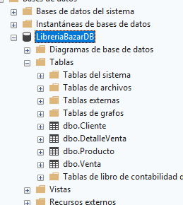

Y el resultado de `SELECT * FROM Cliente` con los 5 clientes de prueba:

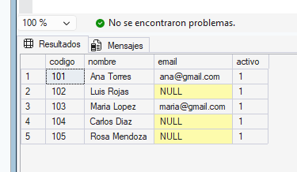

### 11.4 Implementación JDBC

**Clase de conexión.** La clase `Conexion` implementa el **patrón Singleton** para garantizar que toda la aplicación reutilice una única instancia de `java.sql.Connection`, evitando el costo de múltiples conexiones. El constructor es privado para impedir instanciación directa.

**Configuración de conexión.** La conexión usa un **login dedicado de SQL Server** (autenticación SQL, no de Windows), priorizando la simplicidad de configuración: no requiere modo de autenticación mixto adicional en el servidor ni una librería nativa (DLL) para autenticación integrada, a costa de mantener el usuario y la contraseña como constantes en el código fuente.

**Manejo de excepciones.** `obtener()` propaga `SQLException` hacia el DAO que la invoca (que a su vez la traduce a la excepción propia del servicio, ver sección 12); si el driver no está en el classpath, `ClassNotFoundException` se envuelve en una `SQLException` para no exponer dos jerarquías de error distintas.

```java
// Conexion.java – Singleton de la conexión JDBC a SQL Server
public class Conexion {

    private static String SERVIDOR = "localhost";
    private static String BASE_DE_DATOS = "LibreriaBazarDB";
    private static String USUARIO = "efpoo";
    private static String CONTRASENA = "Efpoo123!";

    private static String URL = "jdbc:sqlserver://" + SERVIDOR
            + ";databaseName=" + BASE_DE_DATOS
            + ";encrypt=false;trustServerCertificate=true;";

    private static Connection conexion;

    private Conexion() {
    }  // constructor privado (Singleton)

    public static Connection obtener() throws SQLException {
        if (conexion == null || conexion.isClosed()) {
            try {
                Class.forName("com.microsoft.sqlserver.jdbc.SQLServerDriver");
            } catch (ClassNotFoundException e) {
                throw new SQLException(e);
            }
            conexion = DriverManager.getConnection(URL, USUARIO, CONTRASENA);
        }
        return conexion;
    }

    public static void cerrar() {
        try {
            if (conexion != null && !conexion.isClosed()) {
                conexion.close();
            }
        } catch (SQLException e) {
            System.err.println("Error al cerrar la conexion: " + e.getMessage());
        }
    }
}
```

El driver JDBC se declara en `pom.xml` como una dependencia Maven ordinaria, sin configuración adicional:

```xml
<dependency>
    <groupId>com.microsoft.sqlserver</groupId>
    <artifactId>mssql-jdbc</artifactId>
    <version>13.4.0.jre11</version>
</dependency>
```

La versión 13.4.0.jre11 está publicada en Maven Central y se resuelve automáticamente; no requiere `scope=system` ni copiar manualmente un `.jar` al proyecto.

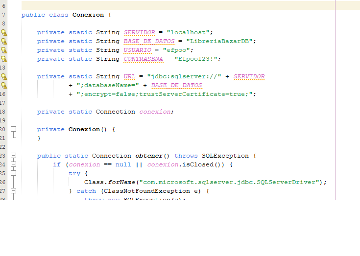

### 11.5 Operaciones CRUD Implementadas

| Entidad | Crear | Listar | Actualizar | Eliminar |
|---|---|---|---|---|
| Cliente | `ClienteDAO.insertar()` | `ClienteDAO.listarTodos()` | `ClienteDAO.actualizar()` | `ClienteDAO.eliminar()` |
| Producto | `ProductoDAO.insertar()` | `ProductoDAO.listarTodos()` | `ProductoDAO.actualizar()` | `ProductoDAO.eliminar()` |
| Venta | `VentaDAO.insertar()` (transaccional, con su detalle) | `VentaDAO.listarTodas()` | No aplica (una venta registrada no se modifica; fuera del alcance del proyecto) | No implementado (fuera del alcance del proyecto; ver Recomendaciones) |

### 11.6 Consultas adicionales implementadas

- **Búsquedas:** `buscarPorCodigo(codigo)` en `ClienteDAO`, `ProductoDAO` y `VentaServicio`, usadas para verificar duplicados, cargar un registro a editar y localizar una venta.
- **Filtros:** `VentaDAO.listarPorCliente(codigoCliente)` filtra las ventas de un cliente específico mediante una consulta con `INNER JOIN` (detalle en la sección 11.10).
- **Reportes:** no implementados en el alcance actual del proyecto (queda como recomendación agregar reportes exportables, sección 17).

### 11.7 Patrón DAO – ClienteDAO

`ClienteDAO` centraliza las operaciones SQL de `Cliente` con métodos estáticos que usan `PreparedStatement` para evitar inyección SQL. El método `insertar()` ya se citó en la sección 9.5 (Cohesión); aquí se muestra `actualizar()`, con la misma estructura:

```java
// ClienteDAO.java – UPDATE
public static void actualizar(Cliente c) throws SQLException {
    String sql = "UPDATE Cliente SET nombre=?, email=? WHERE codigo=?";
    try (PreparedStatement stmt = Conexion.obtener().prepareStatement(sql)) {
        stmt.setString(1, c.getNombre());
        stmt.setString(2, c.getEmail());
        stmt.setInt(3, c.getCodigo());
        stmt.executeUpdate();
    }
}
```

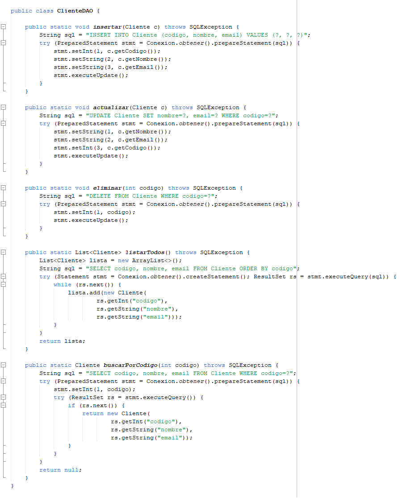

### 11.8 Patrón DAO – ProductoDAO con herencia por tabla única

`ProductoDAO` centraliza las operaciones SQL de `Producto` con soporte a herencia por tabla única, usando `PreparedStatement` en todos sus métodos. Cada operación (`insertar`, `actualizar`) resuelve con su propio `switch` sobre `getTipo()` qué columnas de subtipo asignar con `setBoolean`/`setString`, dejando el resto en `setNull`:

```java
// ProductoDAO.java – INSERT con switch explícito por subtipo
public static void insertar(Producto p) throws SQLException {
    String sql = "INSERT INTO Producto "
            + "(codigo, nombre, precio_base, tipo, en_campania_escolar, venta_por_mayor, categoria, temporada_alta) "
            + "VALUES (?, ?, ?, ?, ?, ?, ?, ?)";
    try (PreparedStatement stmt = Conexion.obtener().prepareStatement(sql)) {
        stmt.setInt(1, p.getCodigo());
        stmt.setString(2, p.getNombre());
        stmt.setDouble(3, p.getPrecioBase());
        stmt.setString(4, p.getTipo());
        switch (p.getTipo()) {
            case "UtilEscolar" -> {
                stmt.setBoolean(5, ((ProductoUtilEscolar) p).isEnCampaniaEscolar());
                stmt.setNull(6, Types.BIT);
                stmt.setString(7, null);
                stmt.setNull(8, Types.BIT);
            }
            case "Papeleria" -> {
                stmt.setNull(5, Types.BIT);
                stmt.setBoolean(6, ((ProductoPapeleria) p).isVentaPorMayor());
                stmt.setString(7, null);
                stmt.setNull(8, Types.BIT);
            }
            case "Bazar" -> {
                ProductoBazar bazar = (ProductoBazar) p;
                stmt.setNull(5, Types.BIT);
                stmt.setNull(6, Types.BIT);
                stmt.setString(7, bazar.getCategoria());
                stmt.setBoolean(8, bazar.isTemporadaAlta());
            }
            default ->
                throw new SQLException("Tipo de producto no soportado: " + p.getTipo());
        }
        stmt.executeUpdate();
    }
}
```

`actualizar()` sigue la misma lógica sobre las columnas 4 a 7 (el código va en el parámetro 8, del `WHERE`). `construirProducto(ResultSet)` hace el proceso inverso al leer, y `tieneVentasAsociadas(codigo)` —consulta que `ProductoServicio.eliminar()` invoca antes del `DELETE`— evita depender solo de la restricción de clave foránea (error 547).

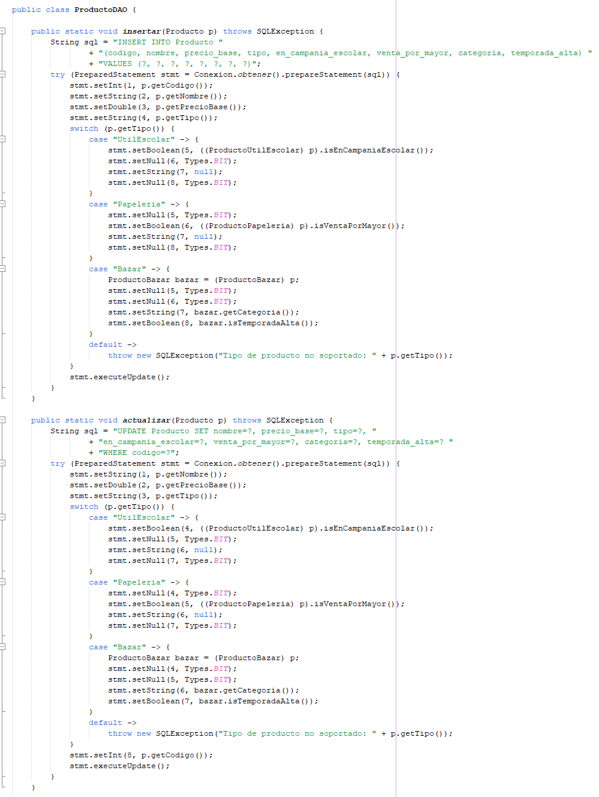

### 11.9 Manejo de transacciones – VentaDAO

`VentaDAO` centraliza las operaciones SQL de `Venta` y su detalle. Como una venta involucra dos tablas, `insertar()` desactiva el auto-commit y confirma o revierte ambos INSERT como una sola transacción atómica.

```java
// VentaDAO.java – INSERT transaccional con commit/rollback
public static void insertar(Venta venta) throws SQLException {
    Connection conn = Conexion.obtener();
    conn.setAutoCommit(false);
    try {
        String sqlVenta = "INSERT INTO Venta (codigo, codigo_cliente, fecha, total) VALUES (?, ?, ?, ?)";
        try (PreparedStatement stmt = conn.prepareStatement(sqlVenta)) {
            stmt.setInt(1, venta.getCodigo());
            stmt.setInt(2, venta.getCliente().getCodigo());
            stmt.setString(3, venta.getFecha());
            stmt.setDouble(4, venta.getTotal());
            stmt.executeUpdate();
        }

        String sqlDetalle = "INSERT INTO DetalleVenta (codigo_venta, codigo_producto, cantidad, subtotal) "
                + "VALUES (?, ?, ?, ?)";
        try (PreparedStatement stmt = conn.prepareStatement(sqlDetalle)) {
            for (DetalleVenta d : venta.getDetalles()) {
                stmt.setInt(1, venta.getCodigo());
                stmt.setInt(2, d.getProducto().getCodigo());
                stmt.setInt(3, d.getCantidad());
                stmt.setDouble(4, d.getSubtotal());
                stmt.executeUpdate();
            }
        }
        conn.commit();
    } catch (SQLException e) {
        conn.rollback();   // revierte todo si falla cualquier INSERT
        throw e;
    } finally {
        conn.setAutoCommit(true);
    }
}
```

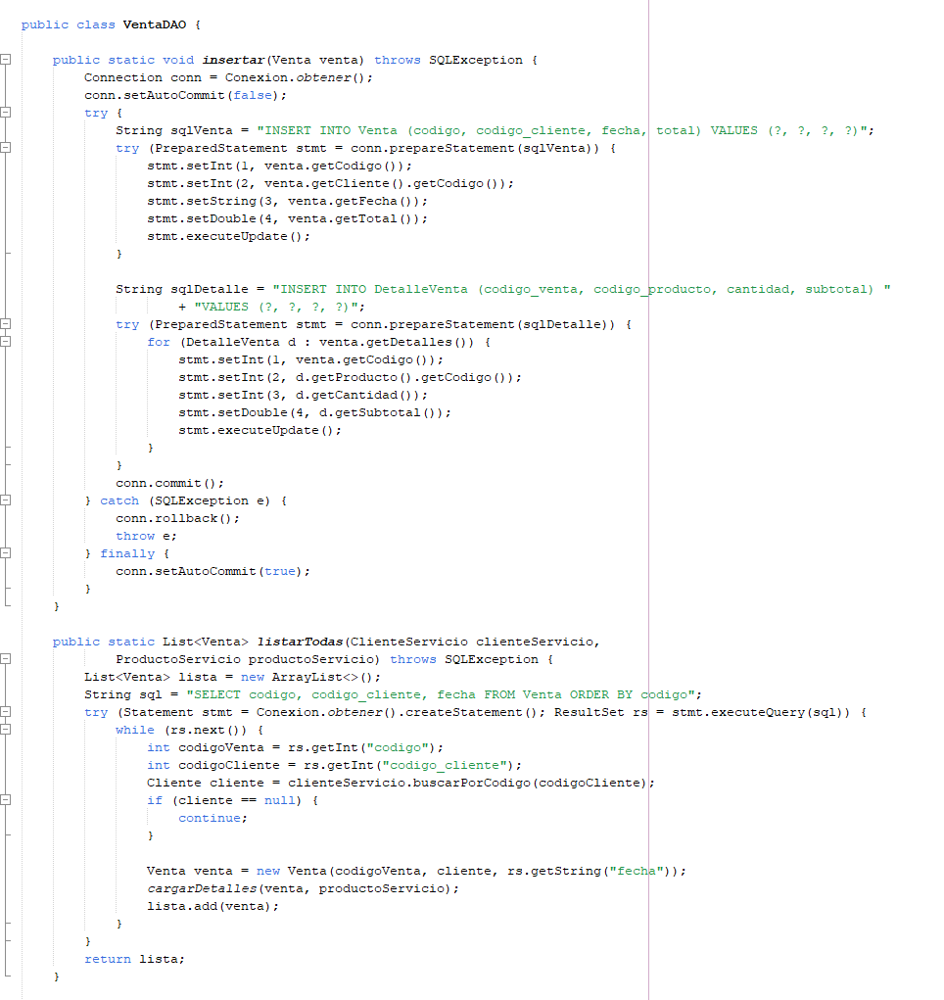

### 11.10 Integración servicio–DAO

Los tres servicios (`ClienteServicio`, `ProductoServicio`, `VentaServicio`) se integran con su DAO correspondiente. `ClienteServicio` y `ProductoServicio` no mantienen colección en memoria: cada operación consulta o modifica la BD directamente a través del DAO. `VentaServicio` sí mantiene una lista en memoria de las ventas cargadas, usada como respaldo si falla la consulta a la BD (ver más abajo).

| Operación | Flujo en el sistema (Cliente / Producto) |
|---|---|
| Agregar entidad | DAO.buscarPorCodigo() verifica duplicado → DAO.insertar(); si falla, lanza la excepción propia |
| Actualizar entidad | DAO.buscarPorCodigo() trae el registro actual → se modifica → DAO.actualizar() |
| Eliminar entidad | DAO.buscarPorCodigo() verifica existencia → DAO.eliminar(); si FK violation, lanza la excepción propia |
| Listar / buscar | DAO.listarTodos() / DAO.buscarPorCodigo() se consultan en cada llamada, sin caché |
| Registrar venta | VentaDAO.insertar() con transacción → si OK, se agrega también a la lista en memoria de `VentaServicio` |

#### Consulta con INNER JOIN (RF-34)

Para listar las ventas de un cliente específico, `VentaDAO.listarPorCliente()` ejecuta una consulta con `INNER JOIN` entre las tablas `Venta` y `Cliente`, filtrando por el código de cliente con un parámetro de `PreparedStatement`:

```sql
SELECT v.codigo, v.fecha, c.codigo AS cli_codigo,
       c.nombre AS cli_nombre, c.email AS cli_email
FROM Venta v
INNER JOIN Cliente c ON v.codigo_cliente = c.codigo
WHERE v.codigo_cliente = ?
ORDER BY v.codigo;
```

`VentaServicio.listarPorCliente()` delega en este DAO, con un filtrado en memoria como respaldo si la BD falla. La pestaña "Consultar Ventas" expone esta consulta mediante el código de cliente y los botones "Filtrar por cliente" / "Ver todas".

---

## 12. Implementación del Proyecto

### 12.1 Avance de Requerimientos

Todos los requerimientos funcionales del sistema están implementados, incluyendo el CRUD completo de clientes y productos, el registro transaccional de ventas y la integración con SQL Server.

| RF | Estado | Evidencia |
|---|---|---|
| RF-01 Registrar cliente con código, nombre y email | Implementado | Anexo E |
| RF-02 Validar que el código del cliente sea numérico | Implementado | Anexo E |
| RF-03 Validar que el código del cliente no sea nulo ni vacío | Implementado | Anexo E |
| RF-04 Validar que el email tenga formato válido | Implementado | Anexo E |
| RF-05 Impedir duplicados de código de cliente | Implementado | Anexo E |
| RF-06 Listar todos los clientes | Implementado | Anexo E |
| RF-07 Buscar cliente por código | Implementado | Anexo E |
| RF-08 Actualizar datos de cliente existente | Implementado | Anexo E |
| RF-09 Eliminar cliente | Implementado | Anexo E |
| RF-10 Mensaje de confirmación al registrar cliente | Implementado | Anexo E |
| RF-11 Registrar producto con código, nombre y precio | Implementado | Anexo E |
| RF-12 Validar que el nombre del producto no esté vacío | Implementado | Anexo E |
| RF-13 Validar que el precio sea mayor que cero | Implementado | Anexo E |
| RF-14 Validar que el precio sea numérico | Implementado | Anexo E |
| RF-15 Impedir duplicados de código de producto | Implementado | Anexo E |
| RF-16 Listar todos los productos | Implementado | Anexo E |
| RF-17 Buscar producto por código | Implementado | Anexo E |
| RF-18 Actualizar datos de producto existente | Implementado | Anexo E |
| RF-19 Eliminar producto | Implementado | Anexo E |
| RF-20 Mostrar precio final del producto | Implementado | Anexo E |
| RF-21 Registrar venta asociada a un cliente | Implementado | Anexo E |
| RF-22 Validar que el cliente de la venta exista | Implementado | Anexo E |
| RF-23 Registrar fecha de la venta | Implementado | Anexo E |
| RF-24 Agregar uno o más detalles a una venta | Implementado | Anexo E |
| RF-25 Validar que el producto del detalle exista | Implementado | Anexo E |
| RF-26 Validar que la cantidad del detalle sea mayor que cero | Implementado | Anexo E |
| RF-27 Calcular subtotal de cada detalle | Implementado | Anexo E |
| RF-28 Calcular total de la venta | Implementado | Anexo E |
| RF-29 Validar que la venta tenga al menos un detalle | Implementado | Anexo E |
| RF-30 Mostrar total al confirmar la venta | Implementado | Anexo E |
| RF-31 Listar todas las ventas registradas | Implementado | Anexo E |
| RF-32 Buscar venta por código | Implementado | Anexo E |
| RF-33 Consultar detalle de una venta | Implementado | Anexo E |
| RF-34 Listar ventas de un cliente específico | Implementado | Anexo E |
| RF-35 Navegar entre módulos mediante pestañas | Implementado | Anexo E |
| RF-36 Validar campos obligatorios en cada formulario | Implementado | Anexo E |
| RF-37 Mostrar mensajes de error claros | Implementado | Anexo E |
| RF-38 Continuar operando ante error de validación | Implementado | Anexo E |
| RF-39 Mostrar mensajes de confirmación | Implementado | Anexo E |
| RF-40 Salir de la aplicación de forma controlada | Implementado | Anexo E |

### 12.2 Trazabilidad RF → Clase Java → Capa

| RF | HU | Clase Java | Formulario | Estado | Capa |
|---|---|---|---|---|---|
| RF-01 Registrar cliente | HU-01 | ClienteServicio, Cliente, ClienteDAO | Clientes | Implementado | Servicio + DAO |
| RF-02 Validar código numérico | HU-01 | ClienteServicio.validarCodigo() | Clientes | Implementado | Servicio |
| RF-03 Validar código no nulo | HU-01 | ClienteServicio.validarCodigo() | Clientes | Implementado | Servicio |
| RF-04 Validar email | HU-01 | ClienteServicio.validarEmail() | Clientes | Implementado | Servicio |
| RF-05 Código de cliente único | HU-01 | ClienteServicio.agregar(), ClienteDAO | Clientes | Implementado | Servicio + DAO |
| RF-06 Listar clientes | HU-01 | ClienteServicio.getClientes() | Clientes | Implementado | Servicio |
| RF-07 Buscar cliente por código | HU-01 | ClienteServicio.buscarPorCodigo() | Clientes | Implementado | Servicio |
| RF-08 Actualizar cliente | HU-01 | ClienteServicio.actualizar(), ClienteDAO | Clientes | Implementado | Servicio + DAO |
| RF-09 Eliminar cliente | HU-01 | ClienteServicio.eliminar(), ClienteDAO | Clientes | Implementado | Servicio + DAO |
| RF-10 Confirmación registro cliente | HU-01 | SistemaRegistroUI (JOptionPane) | Clientes | Implementado | Presentación |
| RF-11 Registrar producto | HU-02 | ProductoServicio, Producto, ProductoDAO | Productos | Implementado | Servicio + DAO |
| RF-12 Validar nombre producto | HU-02 | Producto.setNombre() (setter) | Productos | Implementado | Modelo |
| RF-13 Validar precio mayor que cero | HU-02 | Producto.setPrecioBase() (setter) | Productos | Implementado | Modelo |
| RF-14 Validar precio numérico | HU-02 | SistemaRegistroUI (parseDouble con try-catch) | Productos | Implementado | Presentación |
| RF-15 Código de producto único | HU-02 | ProductoServicio.agregar(), ProductoDAO | Productos | Implementado | Servicio + DAO |
| RF-16 Listar productos | HU-02 | ProductoServicio.getProductos() | Productos | Implementado | Servicio |
| RF-17 Buscar producto por código | HU-02 | ProductoServicio.buscarPorCodigo() | Productos | Implementado | Servicio |
| RF-18 Actualizar producto | HU-02 | ProductoServicio.actualizar(), ProductoDAO | Productos | Implementado | Servicio + DAO |
| RF-19 Eliminar producto | HU-02 | ProductoServicio.eliminar(), ProductoDAO | Productos | Implementado | Servicio + DAO |
| RF-20 Precio final del producto | HU-02 | Producto.calcularPrecioFinal() (polimórfico) | Productos | Implementado | Modelo |
| RF-21 Registrar venta | HU-03 | VentaServicio.registrarVenta(), VentaDAO | Registrar Venta | Implementado | Servicio + DAO |
| RF-22 Validar cliente de la venta | HU-03 | VentaServicio.registrarVenta() | Registrar Venta | Implementado | Servicio |
| RF-23 Registrar fecha | HU-03 | Venta (constructor), SistemaRegistroUI | Registrar Venta | Implementado | Modelo + Presentación |
| RF-24 Agregar detalle | HU-03 | VentaServicio.agregarDetalle(), DetalleVenta | Registrar Venta | Implementado | Servicio + Modelo |
| RF-25 Validar producto del detalle | HU-03 | VentaServicio.agregarDetalle() | Registrar Venta | Implementado | Servicio |
| RF-26 Validar cantidad del detalle | HU-03 | VentaServicio.agregarDetalle() | Registrar Venta | Implementado | Servicio |
| RF-27 Calcular subtotal | HU-03 | DetalleVenta.calcularSubtotal() | Registrar Venta | Implementado | Modelo |
| RF-28 Calcular total de la venta | HU-03 | Venta.calcularTotal() | Registrar Venta | Implementado | Modelo |
| RF-29 Validar venta con detalle | HU-03 | VentaServicio.registrarVenta() | Registrar Venta | Implementado | Servicio |
| RF-30 Mostrar total al confirmar | HU-03 | SistemaRegistroUI (JOptionPane) | Registrar Venta | Implementado | Presentación |
| RF-31 Listar ventas | HU-03 | VentaServicio.getVentas(), SistemaRegistroUI | Consultar Ventas | Implementado | Servicio + Presentación |
| RF-32 Buscar venta por código | HU-03 | VentaServicio.buscarPorCodigo() | Consultar Ventas | Implementado | Servicio |
| RF-33 Consultar detalle de venta | HU-03 | SistemaRegistroUI.tablaVentasValueChanged() | Consultar Ventas | Implementado | Presentación |
| RF-34 Listar ventas de un cliente | HU-03 | VentaServicio.listarPorCliente(), VentaDAO.listarPorCliente() (INNER JOIN) | Consultar Ventas | Implementado | Servicio + DAO + Presentación |
| RF-35 Navegar entre módulos | — | SistemaRegistroUI (JTabbedPane) | General | Implementado | Presentación |
| RF-36 Validar campos obligatorios | — | SistemaRegistroUI (handlers) | General | Implementado | Presentación |
| RF-37 Mensajes de error claros | — | SistemaRegistroUI.mostrarError() | General | Implementado | Presentación |
| RF-38 Continuar ante error | — | SistemaRegistroUI (try-catch en handlers) | General | Implementado | Presentación |
| RF-39 Confirmación tras operación | — | SistemaRegistroUI (JOptionPane) | General | Implementado | Presentación |
| RF-40 Salir de forma controlada | — | SistemaRegistroUI (cierre de ventana) | General | Implementado | Presentación |

### 12.3 Evidencias de Implementación

- **Código fuente:** el código completo del proyecto se adjunta como archivo aparte (Anexo G); los fragmentos más representativos de cada capa se citan a lo largo de las secciones 9, 11 y 12.
- **Ejecución:** Figuras 13-2 a 13-6 (módulos de clientes, productos, registro y consulta de ventas en funcionamiento) y Figura 12-1 (ejecución en consola durante el desarrollo del modelo).
- **Validaciones:** sección 13.4 (Validaciones Implementadas) y sección 13.5 (Evidencias de Funcionamiento), con capturas de los mensajes de error y confirmación.
- **Persistencia en BD:** Figuras 11-1 y 11-2 (SSMS mostrando `LibreriaBazarDB` y sus tablas con datos reales tras ejecutar el sistema).

### 12.4 Flujo End-to-End del Sistema

Caso de uso completo, verificado sobre `EF_POO` contra `LibreriaBazarDB`:

1. **Registro:** se registra un cliente nuevo (pestaña Clientes) y un producto nuevo (pestaña Productos); ambos quedan persistidos en SQL Server y visibles en sus respectivas tablas (Figuras 13-2 y 13-3).
2. **Consulta:** se busca el cliente y el producto recién registrados por su código, y se listan todos los registros de cada tabla para confirmar que aparecen (RF-06, RF-07, RF-16, RF-17).
3. **Modificación:** se actualiza el nombre del cliente y el precio del producto; el cambio se refleja de inmediato en la tabla de la interfaz y en `LibreriaBazarDB` (RF-08, RF-18).
4. **Eliminación:** se elimina un producto sin ventas asociadas (se elimina directamente) y se intenta eliminar uno con ventas asociadas, bloqueado con un mensaje (RF-19, Figura 13-13); se elimina un cliente y sus ventas se eliminan en cascada (RF-09), con una confirmación previa que advierte explícitamente esa consecuencia (Figura 13-11).
5. **Generación de resultados:** se registra una venta con dos o más detalles y se confirma; el sistema muestra el total calculado (RF-30) y la venta aparece en la pestaña Consultar Ventas con su detalle completo (RF-31 a RF-34).

El siguiente fragmento resume, con las llamadas reales a los servicios, el mismo flujo de los cinco pasos anteriores:

```java
// 1. Registro
clienteServicio.registrar(codigo, nombre, email);
productoServicio.registrar(nuevoProducto);

// 2. Consulta
Cliente c = clienteServicio.buscarPorCodigo(codigo);
Producto p = productoServicio.buscarPorCodigo(codigo);

// 3. Modificación
clienteServicio.actualizar(codigo, nuevoNombre, nuevoEmail);
productoServicio.actualizar(productoModificado);

// 4. Eliminación
clienteServicio.eliminar(codigo);   // sus ventas se eliminan en cascada (RF-09)
productoServicio.eliminar(codigo);  // bloqueado si tieneVentasAsociadas() (RF-19)

// 5. Generación de resultados
Venta venta = new Venta(ventaServicio.getSiguienteCodigo(), c, fecha);
ventaServicio.agregarDetalle(venta, p, cantidad);
ventaServicio.registrarVenta(venta);   // venta.getTotal() ya calculado (RF-30)
```

### 12.5 Implementación del servicio – validación y persistencia

`ClienteServicio.agregar()` muestra el patrón completo: validación en cadena, control de duplicados contra la base de datos y delegación al DAO, con manejo de errores en cada nivel. El servicio no mantiene colección propia en memoria; la base de datos es la única fuente de verdad.

```java
// ClienteServicio.java – método agregar() completo
public void agregar(Cliente c) throws ClienteException {
    if (c == null) throw new ClienteException("El cliente no puede ser nulo");
    validarCodigo(String.valueOf(c.getCodigo())); // RF-02, RF-03
    validarNombre(c.getNombre());
    if (c.getEmail() != null && !c.getEmail().trim().isEmpty())
        validarEmail(c.getEmail());               // RF-04
    try {
        if (ClienteDAO.buscarPorCodigo(c.getCodigo()) != null)
            throw new ClienteException("Ya existe un cliente con ese codigo"); // RF-05
        ClienteDAO.insertar(c);  // persiste en SQL Server
    } catch (SQLException e) {
        throw new ClienteException(
            "Error al guardar en base de datos: " + e.getMessage());
    }
}
```

El mismo enfoque aplica en `eliminar()`: al no haber estado en memoria, no hace falta ninguna reversión manual si el DAO falla.

```java
// ClienteServicio.java – método eliminar(), sin estado en memoria que revertir
public void eliminar(int codigo) throws ClienteException {
    try {
        if (ClienteDAO.buscarPorCodigo(codigo) == null)
            throw new ClienteException("No existe un cliente con ese codigo");
        ClienteDAO.eliminar(codigo);
    } catch (SQLException e) {
        throw new ClienteException(
            "Error al eliminar en base de datos: " + e.getMessage());
    }
}
```

`ClienteServicio` y `ProductoServicio` no mantienen ninguna colección en memoria: cada operación (`agregar`, `actualizar`, `eliminar`, `buscarPorCodigo`, `listar`) consulta la base de datos directamente a través del DAO correspondiente, lo que evita tener que sincronizar o revertir un estado local.

`VentaServicio.registrarVenta()` valida las reglas de negocio y luego delega la persistencia transaccional al DAO:

```java
// VentaServicio.java – registrarVenta() con delegación al VentaDAO
public void registrarVenta(Venta venta) throws VentaException {
    if (venta.getCliente() == null)
        throw new VentaException("La venta debe estar asociada a un cliente valido");
    if (venta.getDetalles().isEmpty())
        throw new VentaException("La venta debe tener al menos un detalle");
    try {
        VentaDAO.insertar(venta); // commit/rollback gestionado en el DAO
    } catch (SQLException e) {
        if (e.getErrorCode() == 2627 || e.getErrorCode() == 2601) {
            throw new VentaException("El codigo de venta generado ya existia en la base de datos. "
                    + "Intente registrar la venta nuevamente.");
        }
        throw new VentaException(
            "Error al guardar la venta en base de datos: " + e.getMessage());
    }
    ventas.add(venta); // solo actualiza memoria si la BD confirmó el commit
}
```

El código de venta se genera con un contador en memoria (`VentaServicio.getSiguienteCodigo()`), adecuado para el entorno monousuario del sistema. Ante una eventual colisión con la base de datos, el sistema informa el error y el contador se corrige en el siguiente intento.

### 12.6 Ejecución del modelo en consola

La siguiente captura muestra la ejecución del sistema en consola (S09), con el registro de productos, el cálculo polimórfico de precios y el total de una venta.

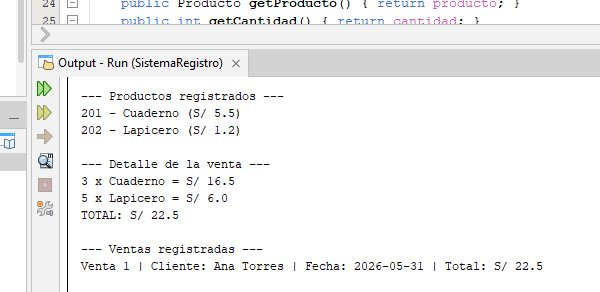

---

## 13. Programación Visual (Swing)

La versión visual del sistema se implementa con Swing mediante una ventana principal con pestañas. La interfaz reutiliza la lógica de negocio de los servicios; los DAOs garantizan que los datos se lean desde SQL Server al iniciar la aplicación.

### 13.1 Diseño de interfaces

**Pantalla principal.** Una única ventana (`SistemaRegistroUI`, `JFrame`) con un `JTabbedPane` que organiza cuatro pestañas:

- **Clientes:** formulario para registrar, actualizar, eliminar y buscar clientes, con tabla de registros.
- **Productos:** formulario de registro con tipo de producto, precio final y característica especial; con opciones de actualizar y eliminar.
- **Registrar Venta:** cabecera de venta, búsqueda de cliente y producto, tabla de detalles, subtotal y total.
- **Consultar Ventas:** listado de ventas registradas y detalle de la venta seleccionada.

**Pantallas secundarias.** El sistema no abre ventanas (`JFrame`/`JDialog`) adicionales a la principal; las interacciones secundarias se resuelven con cuadros de diálogo modales (`JOptionPane`) de confirmación, error y validación (ver Figuras 13-8 a 13-13, sección 13.5).

### 13.2 Diagrama de navegación

La siguiente figura resume los módulos del sistema y sus transiciones.

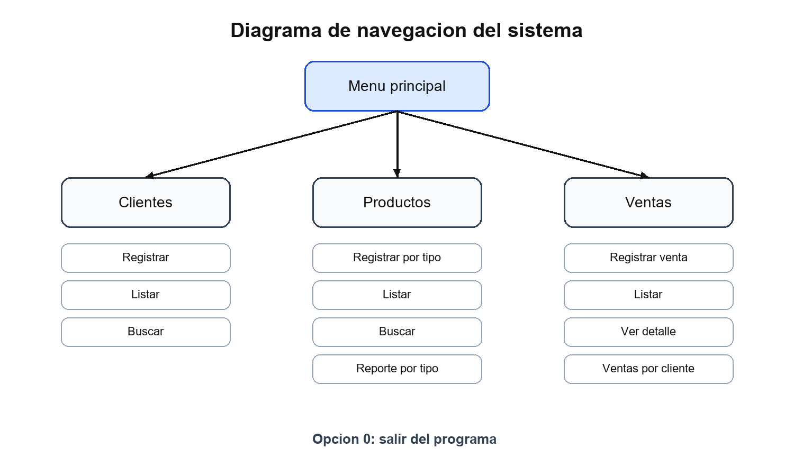

### 13.3 Eventos Implementados

| Evento | Descripción |
|---|---|
| Clic en Registrar cliente | Valida datos y llama a ClienteServicio (que persiste en la BD) |
| Clic en Actualizar cliente | Carga datos del cliente seleccionado, permite editarlos y persiste en BD |
| Clic en Eliminar cliente | Solicita confirmación, advirtiendo que las ventas del cliente también se eliminarán en cascada |
| Clic en Buscar por código | Consulta el cliente directamente en la base de datos |
| Clic en Registrar Producto | Valida el producto y lo persiste en BD según su tipo específico |
| Clic en Buscar cliente / Buscar producto | Completa los datos para la venta en curso |
| Clic en Agregar | Agrega un producto con su cantidad al detalle de la venta |
| Clic en Confirmar Venta | Registra la venta transaccionalmente en BD, muestra total y confirmación |
| Clic en Actualizar lista | Refresca las tablas de la interfaz |

### 13.4 Validaciones Implementadas

| Campo | Validación |
|---|---|
| Código de cliente | Numérico, no vacío (RF-02, RF-03) |
| Email de cliente | Debe contener "@" y "." (RF-04) |
| Código duplicado | Verificado en BD (RF-05, RF-15) |
| Nombre de producto | No vacío (RF-12) |
| Precio base de producto | Mayor que cero (RF-13) |
| Cantidad del detalle | Mayor que cero (RF-26) |
| Venta | Al menos un detalle y cliente válido (RF-22, RF-29) |
| Eliminación de producto | Bloqueada si tiene ventas: validación explícita en Java (`ProductoDAO.tieneVentasAsociadas`) respaldada por la integridad FK en BD |

### 13.5 Evidencias de Funcionamiento

Capturas de la ejecución real de `EF_POO` contra `LibreriaBazarDB`, con el catálogo `UtilEscolar`/`Papeleria`/`Bazar`.

**Menús:** ver Figura 13-1 (sección 13.2), navegación por pestañas Clientes, Productos, Registrar Venta y Consultar Ventas.

**Formularios:**


**Búsquedas:**

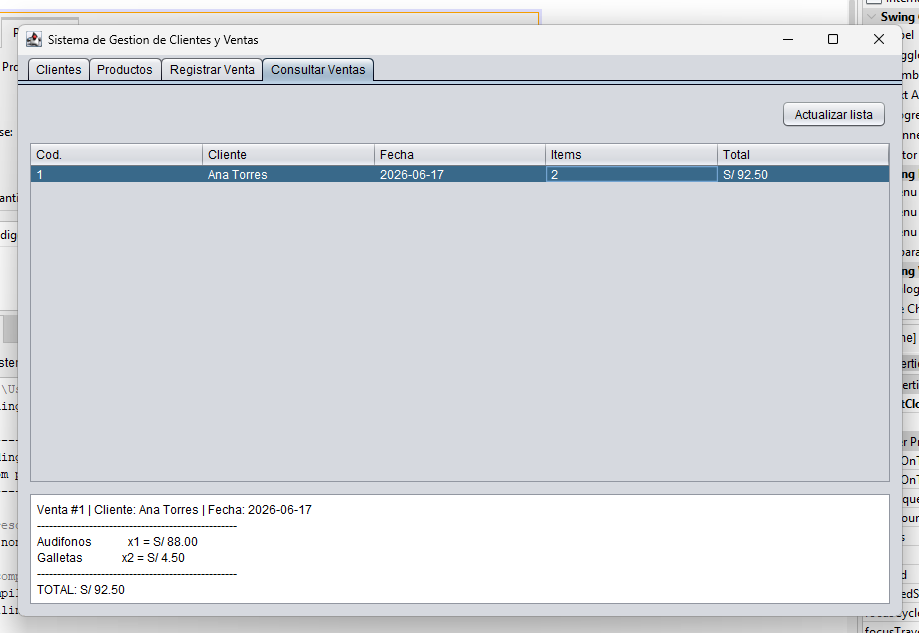

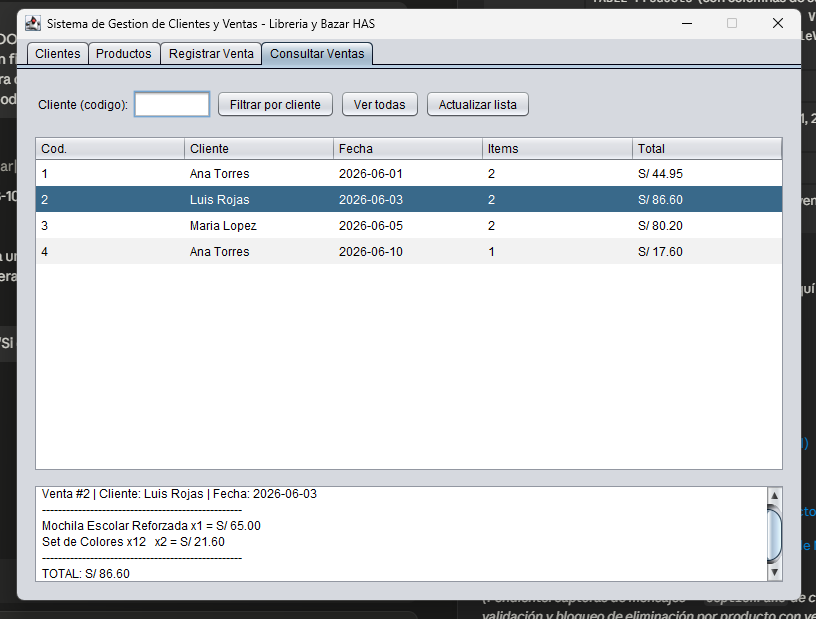


**Mensajes:**

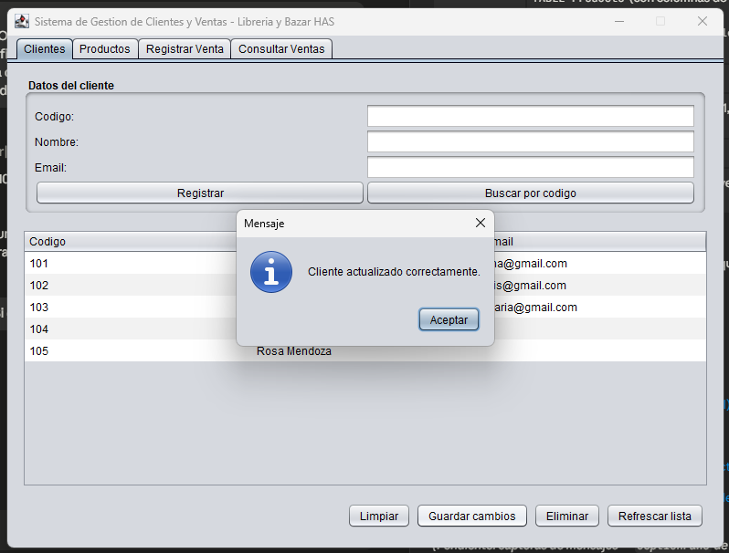

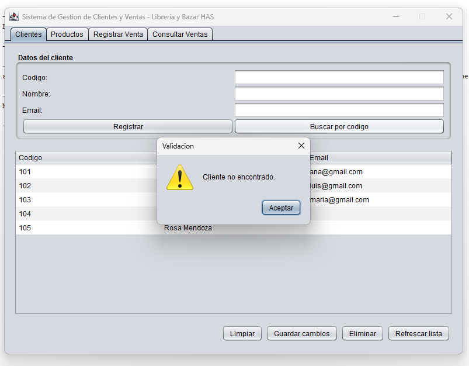

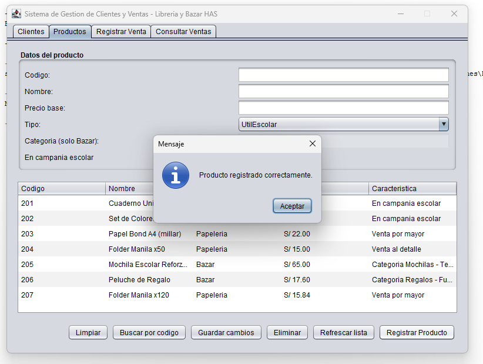

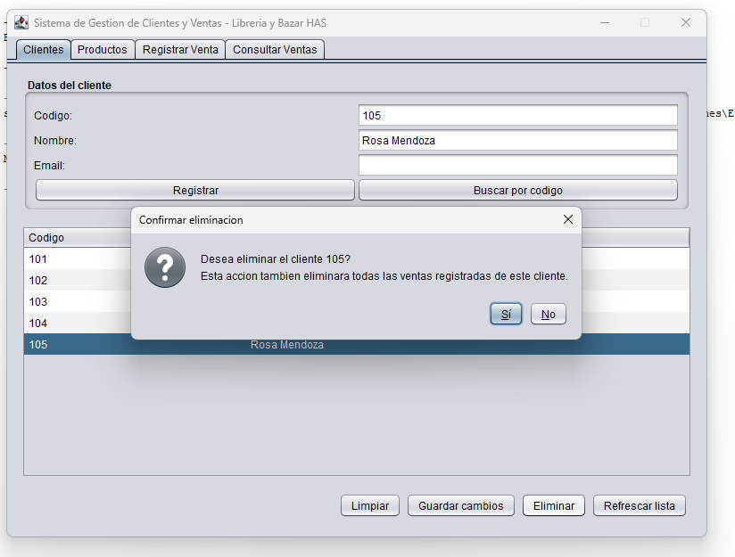

**Validaciones:**


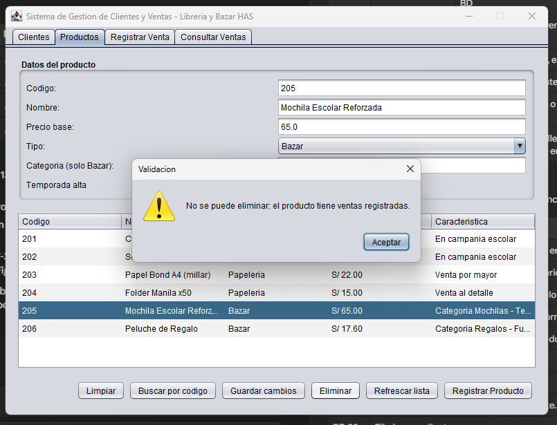

---

## 14. Manual de Instalación y Ejecución

### 14.1 Requisitos de software

- JDK 25.
- Maven (integrado en NetBeans, o Maven 3.x independiente).
- SQL Server 2019 o superior (Express es suficiente) con SQL Server Management Studio (SSMS) para administración.
- Conexión a internet la primera vez, para que Maven resuelva la dependencia `mssql-jdbc` desde Maven Central.

### 14.2 Instalación de SQL Server

1. Instalar SQL Server (Express o superior) habilitando la **autenticación en modo mixto** (SQL Server and Windows Authentication), ya que `Conexion.java` usa un login SQL dedicado, no autenticación de Windows.
2. Crear el login `efpoo` con la contraseña `Efpoo123!` (o los valores que se configuren en `Conexion.java`), con permisos de propietario (`db_owner`) sobre la base de datos `LibreriaBazarDB`.
3. Verificar que el servicio de SQL Server esté activo y escuchando en `localhost` (puerto por defecto 1433).

### 14.3 Configuración del proyecto

1. Abrir el proyecto `EF_POO` (proyecto Maven) en NetBeans, o compilarlo por línea de comandos con `mvn clean install`.
2. La dependencia `mssql-jdbc:13.4.0.jre11` está declarada en `pom.xml` y se resuelve automáticamente desde Maven Central; no requiere ningún paso manual.
3. Si el servidor, la base de datos, el usuario o la contraseña difieren del entorno de desarrollo, ajustar las constantes correspondientes en `Conexion.java` (sección 11.4).

### 14.4 Creación de la base de datos

Ejecutar el script `schema.sql` (adjunto, Anexo H) en SSMS o `sqlcmd` conectado al servidor configurado. El script crea la base de datos `LibreriaBazarDB`, sus cuatro tablas normalizadas y los datos de prueba (5 clientes, 6 productos, 4 ventas con su detalle).

### 14.5 Ejecución del sistema

- Desde NetBeans: clic derecho sobre el proyecto `EF_POO` → **Run**, que ejecuta `ef_poo.ui.SistemaRegistroUI` (la clase con el método `main`).
- Desde línea de comandos: compilar con Maven y ejecutar el `.jar` generado, o `mvn compile exec:java` si se configura el `exec-maven-plugin`.

### 14.6 Credenciales de prueba

| Recurso | Valor |
|---|---|
| Servidor SQL Server | `localhost` |
| Base de datos | `LibreriaBazarDB` |
| Usuario | `efpoo` |
| Contraseña | `Efpoo123!` |

Estas credenciales son las mismas que declara `Conexion.java` (sección 11.4); ver la observación sobre almacenarlas como constantes en el código fuente en la sección de Recomendaciones.

---

## 15. Manual de Usuario

### 15.1 Registro de información

- **Clientes:** completar código, nombre y email (opcional) en la pestaña Clientes, y presionar "Registrar cliente".
- **Productos:** en la pestaña Productos, seleccionar el tipo (`UtilEscolar`, `Papeleria` o `Bazar`), completar los campos según el tipo elegido, y presionar "Registrar producto".
- **Ventas:** en la pestaña Registrar Venta, buscar al cliente por código, agregar uno o más productos con su cantidad a la tabla de detalle, y presionar "Confirmar Venta".

### 15.2 Consultas

- Buscar un cliente o un producto por su código, en su pestaña correspondiente.
- En la pestaña Consultar Ventas, listar todas las ventas registradas o filtrar por código de cliente; al seleccionar una venta se muestra su detalle completo.

### 15.3 Actualización de datos

Buscar el cliente o producto por código, modificar los campos habilitados y presionar "Actualizar". El código no puede modificarse una vez registrado.

### 15.4 Eliminación de registros

Buscar el cliente o producto por código y presionar "Eliminar". El sistema pide confirmación antes de eliminar. Un producto con ventas asociadas no puede eliminarse (RF-19); al eliminar un cliente, sus ventas se eliminan en cascada junto con él (RF-09).

### 15.5 Casos de uso principales

| Caso de uso | Actor | Resultado |
|---|---|---|
| Registrar cliente | Encargado | Cliente persistido en `LibreriaBazarDB`, visible en el listado |
| Registrar producto | Encargado | Producto persistido con su tipo y precio final calculado |
| Registrar venta | Encargado | Venta con uno o más detalles, persistida transaccionalmente, con total calculado |
| Consultar ventas de un cliente | Encargado | Listado filtrado mediante `INNER JOIN` (sección 11.6) |
| Actualizar cliente o producto | Encargado | Datos modificados en BD sin cambiar el código |
| Eliminar cliente o producto | Encargado | Registro eliminado, con las validaciones de integridad de las secciones 8 y 12.4 |

---

## 16. Conclusiones

1. El registro manual de clientes y ventas en las MYPE genera información dispersa, errores de cálculo y ausencia de historial; el sistema aborda este problema centralizando y validando los datos con persistencia permanente en SQL Server.
2. La aplicación del paradigma orientado a objetos —abstracción, herencia, polimorfismo, encapsulamiento y composición— permitió un diseño modular y mantenible, en especial mediante la jerarquía abstracta de `Producto` con tres subtipos concretos.
3. La integración de SQL Server mediante JDBC y el patrón DAO garantiza la persistencia de datos entre sesiones, la integridad referencial mediante claves foráneas con `ON DELETE CASCADE` y la atomicidad de las operaciones complejas a través de transacciones con commit/rollback explícito.
4. El CRUD completo implementado (registrar, consultar, actualizar y eliminar) para clientes y productos, junto con el registro transaccional de ventas, cubre el ciclo de vida completo de la información.
5. El cálculo automático del subtotal y del total, basado en el método `calcularPrecioFinal()` polimórfico de cada subtipo, eliminó una de las principales fuentes de error del proceso manual.

## 17. Recomendaciones

1. Externalizar el usuario y la contraseña de `Conexion.java` a una propiedad de sistema o variable de entorno, en vez de mantenerlos como constantes en el código fuente, para no exponer credenciales en el repositorio.
2. Agregar una pantalla de configuración de la conexión a la base de datos, para que el usuario pueda cambiar el servidor o las credenciales sin modificar el código fuente.
3. Incorporar el módulo de eliminación de ventas desde la interfaz gráfica, con confirmación y control de integridad.
4. Implementar pruebas automatizadas (JUnit) sobre las validaciones de los servicios y el cálculo del total para asegurar la confiabilidad ante futuros cambios.
5. Explorar la migración a una arquitectura web (Spring Boot) que permita el acceso multiusuario y desde múltiples equipos, manteniendo la misma base de datos SQL Server.
6. Agregar reportes exportables (Excel o PDF) del listado de ventas por período para apoyar la toma de decisiones de la microempresa.
7. Mantener actualizados el diagrama de clases y el README del repositorio cuando se agreguen nuevas entidades, servicios o funcionalidades.
8. Reforzar `ClienteServicio.validarEmail()` más allá de `contains("@")`/`contains(".")`, que hoy acepta formatos límite inválidos (p. ej. "a@.").

---

## Referencias Bibliográficas

Bravo Salvatierra, J. X. (2012). *Aplicación web para la gestión de ventas de la empresa Repuestos Automotrices Castro* [Tesis de grado, Universidad Regional Autónoma de los Andes]. Repositorio Digital UNIANDES. https://dspace.uniandes.edu.ec/handle/123456789/3787

Castillo Castro, A. M. (2016). *Implementación de un sistema de ventas para mejorar la gestión comercial en la empresa Marecast S.R.L., Los Olivos* [Tesis de pregrado, Universidad de Ciencias y Humanidades]. Repositorio Institucional UCH. https://repositorio.uch.edu.pe/handle/20.500.12872/90

Loayza, A. C. (2021). *Propuesta de un sistema de gestión en el área de almacén para aumentar la rentabilidad en la empresa Repalsa S.A. en la ciudad de Trujillo en el año 2021* [Tesis de licenciatura, Universidad Privada del Norte]. Repositorio Institucional UPN. https://hdl.handle.net/11537/28709

---

## Anexos

### Anexo A. BPMN AS-IS

El siguiente diagrama representa el proceso actual de venta realizado de forma manual en la Librería y Bazar "HAS".


### Anexo B. BPMN TO-BE

El siguiente diagrama representa el proceso propuesto, incorporando el sistema para validar datos, calcular totales y registrar la venta con persistencia en SQL Server.


### Anexo C. Historias de usuario completas

| ID | Rol | Funcionalidad | Resultado esperado | Prioridad |
|---|---|---|---|---|
| HU-01 | Encargado | Registrar, actualizar y eliminar clientes | Cartera ordenada, sin duplicados y persistente en BD | Alta |
| HU-02 | Encargado | Registrar, actualizar y eliminar productos | Catálogo confiable de precios, con tipos diferenciados | Alta |
| HU-03 | Encargado | Registrar ventas con detalle | Total calculado automáticamente e historial persistente | Media |

| Historia | Escenario | Criterio |
|---|---|---|
| HU-01 | Código numérico | Si el código contiene caracteres no numéricos, el sistema rechaza el registro |
| HU-01 | Código no nulo | Si el código está vacío, el sistema rechaza el registro |
| HU-01 | Email válido | Si el email no contiene "@" y ".", el sistema lo rechaza |
| HU-01 | Registro exitoso | Si los datos son válidos, el cliente se agrega al listado y se persiste en BD |
| HU-01 | Actualización | El sistema actualiza nombre y email del cliente en BD |
| HU-01 | Eliminación | El sistema elimina el cliente de BD; sus ventas se eliminan en cascada |
| HU-02 | Nombre obligatorio | Si el nombre está vacío, el sistema rechaza el registro |
| HU-02 | Precio válido | Si el precio es cero o negativo, el sistema rechaza el registro |
| HU-02 | Código único | Si el código ya existe en BD, el sistema no permite el duplicado |
| HU-02 | Registro exitoso | Si los datos son válidos, el producto se agrega y persiste en BD |
| HU-02 | Eliminación con FK | Si el producto tiene ventas, el sistema impide la eliminación con mensaje claro |
| HU-03 | Cliente existente | Si el cliente no existe, el sistema rechaza la venta |
| HU-03 | Producto válido | Si el producto no existe, el sistema rechaza el detalle |
| HU-03 | Cantidad válida | Si la cantidad es cero o negativa, el sistema rechaza el detalle |
| HU-03 | Cálculo del total | Si la venta tiene detalles válidos, el sistema suma los subtotales y persiste en BD |

### Anexo D. Requerimientos completos

Estado de implementación de cada requerimiento funcional (RF) y no funcional (RNF).

| Código | Requerimiento | Estado |
|---|---|---|
| RF-01 | Registrar un cliente con código, nombre y email. | Implementado |
| RF-02 | Validar que el código del cliente sea numérico. | Implementado |
| RF-03 | Validar que el código del cliente no sea nulo ni vacío. | Implementado |
| RF-04 | Validar que el email del cliente tenga un formato válido. | Implementado |
| RF-05 | Impedir el registro de clientes con código duplicado. | Implementado |
| RF-06 | Listar todos los clientes registrados. | Implementado |
| RF-07 | Buscar un cliente por su código. | Implementado |
| RF-08 | Actualizar los datos de un cliente existente. | Implementado |
| RF-09 | Eliminar un cliente. | Implementado |
| RF-10 | Mostrar un mensaje de confirmación al registrar un cliente. | Implementado |
| RF-11 | Registrar un producto con código, nombre y precio. | Implementado |
| RF-12 | Validar que el nombre del producto no esté vacío. | Implementado |
| RF-13 | Validar que el precio del producto sea mayor que cero. | Implementado |
| RF-14 | Validar que el precio sea un valor numérico. | Implementado |
| RF-15 | Impedir el registro de productos con código duplicado. | Implementado |
| RF-16 | Listar todos los productos registrados. | Implementado |
| RF-17 | Buscar un producto por su código. | Implementado |
| RF-18 | Actualizar los datos de un producto. | Implementado |
| RF-19 | Eliminar un producto. | Implementado |
| RF-20 | Mostrar el precio final del producto al consultarlo. | Implementado |
| RF-21 | Registrar una venta asociada a un cliente. | Implementado |
| RF-22 | Validar que el cliente de la venta exista. | Implementado |
| RF-23 | Registrar la fecha de la venta. | Implementado |
| RF-24 | Agregar uno o más detalles a una venta. | Implementado |
| RF-25 | Validar que el producto de cada detalle exista. | Implementado |
| RF-26 | Validar que la cantidad de cada detalle sea mayor que cero. | Implementado |
| RF-27 | Calcular el subtotal de cada detalle (precio final × cantidad). | Implementado |
| RF-28 | Calcular el total de la venta sumando los subtotales. | Implementado |
| RF-29 | Validar que una venta tenga al menos un detalle. | Implementado |
| RF-30 | Mostrar el total de la venta al confirmarla. | Implementado |
| RF-31 | Listar todas las ventas registradas. | Implementado |
| RF-32 | Buscar una venta por su código. | Implementado |
| RF-33 | Consultar el detalle de una venta. | Implementado |
| RF-34 | Listar las ventas de un cliente específico. | Implementado |
| RF-35 | Presentar una interfaz para navegar entre los módulos. | Implementado |
| RF-36 | Validar los campos obligatorios en cada formulario. | Implementado |
| RF-37 | Mostrar mensajes de error claros ante datos inválidos. | Implementado |
| RF-38 | Continuar operando sin cerrarse ante un error de validación. | Implementado |
| RF-39 | Mostrar mensajes de confirmación tras cada operación exitosa. | Implementado |
| RF-40 | Permitir salir de la aplicación de forma controlada. | Implementado |
| RNF-01 | Usabilidad: interfaz intuitiva, operable con mínimo entrenamiento. | Cumplido |
| RNF-02 | Rendimiento: registro y consulta inmediatos para el volumen de una microempresa. | Cumplido |
| RNF-03 | Portabilidad: ejecutable en cualquier sistema con JVM y SQL Server Express. | Cumplido |
| RNF-04 | Mantenibilidad: código organizado en paquetes y clases bajo el paradigma OO. | Cumplido |
| RNF-05 | Confiabilidad: validaciones con excepciones propias e integridad transaccional en la BD. | Cumplido |
| RNF-06 | Disponibilidad: funcionamiento local, sin requerir internet. | Cumplido |

### Anexo E. Casos de prueba y criterios de aceptación

Evidencia de cada requerimiento funcional: criterio de aceptación y respaldo (clase Java, sección o figura).

| Requerimiento | Criterio de aceptación | Evidencia (sección / captura) |
|---|---|---|
| RF-01 Registrar cliente | Dado un cliente con datos válidos, el sistema lo registra en BD y lo muestra en el listado | ClienteServicio + ClienteDAO; Figura 13-2 (gui-clientes) |
| RF-02 Validar código numérico | Si el código contiene caracteres no numéricos, el sistema rechaza el registro con mensaje | ClienteServicio.validarCodigo() |
| RF-03 Validar código no nulo | Si el campo código está vacío o nulo, el sistema rechaza el registro con mensaje | ClienteServicio.validarCodigo() |
| RF-04 Validar email | Si el email no contiene "@" y ".", el sistema lo rechaza con mensaje | ClienteServicio.validarEmail() |
| RF-05 Código de cliente único | Si el código de cliente ya existe en BD, el sistema impide el duplicado | ClienteServicio.agregar() + ClienteDAO |
| RF-06 Listar clientes | El sistema muestra todos los clientes registrados en la tabla de la pestaña Clientes | ClienteServicio.getClientes(); Figura 13-2 (gui-clientes) |
| RF-07 Buscar cliente por código | Dado un código existente, el sistema retorna el cliente; si no existe, lo informa | ClienteServicio.buscarPorCodigo() |
| RF-08 Actualizar cliente | El sistema actualiza nombre y email del cliente en BD sin cambiar el código | ClienteServicio.actualizar() + ClienteDAO.actualizar() |
| RF-09 Eliminar cliente | El sistema elimina el cliente de BD; sus ventas se eliminan en cascada | ClienteServicio.eliminar() + ClienteDAO.eliminar() (cascade); Figura 13-11 (confirmación con advertencia) |
| RF-10 Confirmación al registrar cliente | Tras registrar un cliente, el sistema muestra un mensaje de confirmación | SistemaRegistroUI (JOptionPane de confirmación) |
| RF-11 Registrar producto | Dado un producto válido, el sistema lo registra, valida y persiste en BD | ProductoServicio + ProductoDAO; Figura 13-3 (gui-productos) |
| RF-12 Validar nombre de producto | Si el nombre del producto está vacío, el sistema rechaza el registro con mensaje | Producto.setNombre() |
| RF-13 Validar precio mayor que cero | Si el precio es cero o negativo, el sistema rechaza el registro con mensaje | Producto.setPrecioBase() |
| RF-14 Validar precio numérico | Si el precio no es numérico, el sistema rechaza el registro con mensaje | SistemaRegistroUI (parseDouble con try-catch) |
| RF-15 Código de producto único | Si el código de producto ya existe en BD, el sistema impide el duplicado | ProductoServicio.registrar() + ProductoDAO |
| RF-16 Listar productos | El sistema muestra todos los productos registrados con su precio final calculado | ProductoServicio.getProductos(); Figura 13-3 (gui-productos) |
| RF-17 Buscar producto por código | Dado un código existente, el sistema retorna el producto con su precio final | ProductoServicio.buscarPorCodigo() |
| RF-18 Actualizar producto | El sistema actualiza nombre, precio y tipo del producto en BD mediante el DAO | ProductoServicio.actualizar() + ProductoDAO.actualizar() |
| RF-19 Eliminar producto | Si el producto tiene ventas, el sistema muestra error; si no, lo elimina de BD | ProductoServicio.eliminar() valida explícitamente con ProductoDAO.tieneVentasAsociadas() antes del DELETE; la restricción FK (error 547) se conserva como red de seguridad; Figura 13-13 |
| RF-20 Mostrar precio final | Al consultar un producto, el sistema muestra su precio final calculado polimórficamente | Producto.calcularPrecioFinal() (polimórfico); Figura 13-3 (gui-productos) |
| RF-21 Registrar venta | Dada una venta con cliente y al menos un detalle, el sistema la persiste transaccionalmente | VentaServicio.registrarVenta() + VentaDAO.insertar() (Sección 11.9); Figura 13-4 (gui-registrar-venta) |
| RF-22 Validar cliente de la venta | Si el cliente de la venta no existe, el sistema rechaza el registro de la venta | VentaServicio.registrarVenta() |
| RF-23 Registrar fecha de la venta | El sistema registra la fecha de la venta (fecha actual del sistema) | Venta (constructor) + SistemaRegistroUI (LocalDate.now()) |
| RF-24 Agregar detalle a la venta | El sistema permite agregar uno o más productos con su cantidad a la venta en curso | VentaServicio.agregarDetalle() + DetalleVenta; Figura 13-4 (gui-registrar-venta) |
| RF-25 Validar producto del detalle | Si el código de producto del detalle no existe, el sistema rechaza el detalle | VentaServicio.agregarDetalle() |
| RF-26 Validar cantidad del detalle | Si la cantidad del detalle es cero o negativa, el sistema rechaza el detalle con mensaje | VentaServicio.agregarDetalle() |
| RF-27 Calcular subtotal | Cada detalle calcula su subtotal como precio final polimórfico × cantidad | DetalleVenta.calcularSubtotal() |
| RF-28 Calcular total de la venta | El total de la venta es la suma de los subtotales de todos sus detalles | Venta.calcularTotal() |
| RF-29 Validar venta con detalle | Si la venta no tiene al menos un detalle, el sistema la rechaza con mensaje | VentaServicio.registrarVenta() |
| RF-30 Mostrar total al confirmar | Al confirmar la venta, el sistema muestra el total en un mensaje | SistemaRegistroUI (JOptionPane con total) |
| RF-31 Listar ventas | El sistema lista todas las ventas registradas con su código, cliente, fecha y total | VentaServicio.getVentas(); Figura 13-5 (gui-consultar-ventas) |
| RF-32 Buscar venta por código | Dado un código de venta, el sistema localiza la venta correspondiente | VentaServicio.buscarPorCodigo() |
| RF-33 Consultar detalle de venta | Al seleccionar una venta, el sistema muestra su detalle (productos, cantidades y subtotales) | SistemaRegistroUI.tablaVentasValueChanged(); Figura 13-6 (gui-detalle-venta-seleccionada) |
| RF-34 Listar ventas de un cliente | Dado un código de cliente, el sistema muestra solo sus ventas mediante una consulta con INNER JOIN; si no tiene, informa que no hay registros | VentaServicio.listarPorCliente() + VentaDAO.listarPorCliente() (INNER JOIN); Figura 13-7 |
| RF-35 Navegar entre módulos | El sistema presenta una interfaz con pestañas para navegar entre los módulos | SistemaRegistroUI (JTabbedPane); Figura 13-1 (diagrama de navegación) |
| RF-36 Validar campos obligatorios | El sistema valida los campos obligatorios de cada formulario antes de procesar | SistemaRegistroUI (validación de campos en handlers); Figura 13-12 |
| RF-37 Mensajes de error claros | Ante datos inválidos, el sistema muestra mensajes de error claros al usuario | SistemaRegistroUI.mostrarError() |
| RF-38 Continuar ante error de validación | Ante un error de validación, el sistema continúa operando sin cerrarse | SistemaRegistroUI (manejo de excepciones en handlers) |
| RF-39 Confirmación tras operación exitosa | Tras cada operación exitosa, el sistema muestra un mensaje de confirmación | SistemaRegistroUI (JOptionPane de confirmación) |
| RF-40 Salir de forma controlada | El sistema permite salir de la aplicación de forma controlada | SistemaRegistroUI (cierre controlado de la ventana) |

### Anexo F. Diagrama UML completo

El diagrama muestra las cuatro capas: modelo (con jerarquía de Producto), servicio, persistencia (DAOs + Conexion) y excepciones, con `ProductoUtilEscolar`, `ProductoPapeleria` y `ProductoBazar` como subtipos de `Producto`.


Código fuente del diagrama: `diagrama-clases.puml`.

### Anexo G. Código fuente principal

El código fuente completo del proyecto `EF_POO` se adjunta como archivo aparte (carpeta `src/main/java/ef_poo/`), no se reproduce íntegro en este documento.

### Anexo H. Script de Base de Datos

El archivo `schema.sql` se adjunta aparte (raíz del proyecto Maven `EF_POO/`) e incluye tanto el DDL como los datos de prueba de las cuatro tablas; debe ejecutarse una sola vez en SQL Server Management Studio antes del primer arranque (sección 14.4).

| Contenido | Detalle |
|---|---|
| DDL | `CREATE DATABASE LibreriaBazarDB`; `CREATE TABLE Cliente`; `CREATE TABLE Producto` (con columnas de subtipos en NULL y `CHECK precio_base > 0`); `CREATE TABLE Venta` (FK Cliente ON DELETE CASCADE); `CREATE TABLE DetalleVenta` (FK Venta CASCADE, FK Producto, `CHECK cantidad > 0`) |
| Datos: Cliente | 5 clientes (101–105) |
| Datos: Producto | 6 productos: 2 útiles escolares (201, 202), 2 de papelería (203, 204), 2 de bazar (205, 206) |
| Datos: Venta | 4 ventas (códigos 1–4) |
| Datos: DetalleVenta | 7 líneas de detalle asociadas a las ventas anteriores |

### Anexo I. Capturas del sistema funcionando

Las mismas capturas de la sección 13.5, agrupadas aquí como evidencia consolidada de la ejecución real de `EF_POO`.


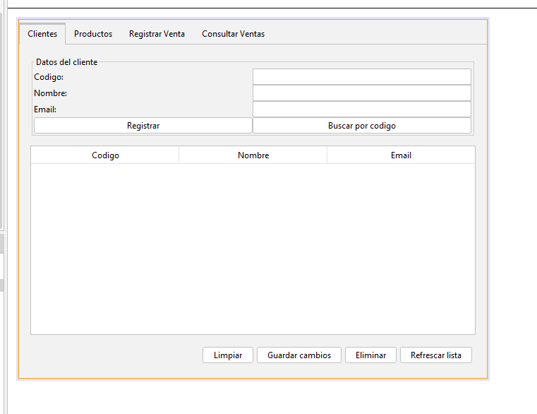


