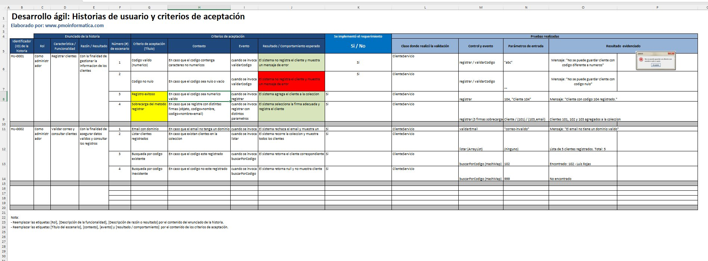
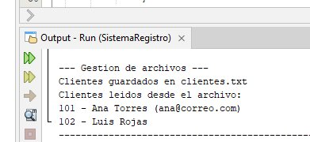

# Informe Final del Proyecto (T3)

## Portada

- **Universidad:** Universidad Privada del Norte (UPN)
- **Facultad:** Facultad de Ingeniería
- **Carrera:** Ingeniería de Sistemas Computacionales
- **Curso:** Técnicas de Programación Orientada a Objetos (Java)
- **Título del proyecto:** Sistema de gestión de clientes y ventas para una microempresa
- **Organización seleccionada:** Librería y Bazar "HAS"
- **Integrantes:** Helaman (byhelaman)
- **Docente:** No especificado
- **Ciclo académico:** 2026-1
- **Fecha:** 16 de junio de 2026

---

## Índice General

1. Resumen Ejecutivo
2. Perfil de la Organización
3. Diagnóstico del Problema
4. Restricciones, Objetivos y Alcance
5. Análisis del Negocio AS-IS y TO-BE (BPMN)
6. Requerimientos del Sistema
7. Historias de Usuario
8. Criterios de Aceptación
9. Diseño Orientado a Objetos
10. Arquitectura de la Solución
11. Implementación del Proyecto
12. Programación Visual (Swing)
13. Informe de Práctica de Campo
14. Informe de Responsabilidad Social
15. Conclusiones
16. Recomendaciones
- Referencias Bibliográficas
- Anexos

---

## 1. Resumen Ejecutivo

### 1.1 Descripción del proyecto

El proyecto consiste en el desarrollo de un sistema de información de escritorio, programado en Java bajo el paradigma orientado a objetos, para la gestión de clientes y ventas de una microempresa del sector comercio. El sistema centraliza el registro de clientes, productos y ventas, valida los datos de entrada y calcula automáticamente el total de cada venta, reemplazando el registro manual en cuadernos u hojas sueltas.

### 1.2 Problema identificado

Una gran parte de las micro y pequeñas empresas (MYPE) del sector comercio gestiona sus clientes y ventas de forma manual, lo que produce información dispersa, errores de cálculo, pérdida de datos y ausencia de un historial confiable, dificultando el control del negocio y la toma de decisiones.

### 1.3 Solución propuesta

Una aplicación de escritorio en Java que organiza la información en capas (modelo, servicio, persistencia), valida los datos mediante excepciones propias, aplica herencia y polimorfismo en el catálogo de productos y calcula de forma automática los subtotales y el total de cada venta. El desarrollo se versiona con Git siguiendo un flujo basado en Git Flow.

### 1.4 Beneficios esperados

Reducción de los errores de registro y cálculo, disminución de los tiempos de búsqueda y atención, centralización y trazabilidad de la información comercial, y una base tecnológica ordenada y mantenible sobre la cual la microempresa puede crecer.

---

## 2. Perfil de la Organización

La organización seleccionada es una microempresa comercial representativa del caso de estudio. Los datos se presentan de forma académica y mantienen coherencia con el alcance del proyecto.

### 2.1 Información general de la organización

- **Nombre:** Librería y Bazar "HAS"
- **Rubro:** Comercio minorista de útiles escolares, de escritorio y artículos de bazar
- **Ubicación:** San Juan de Lurigancho (SJL), Lima, Perú
- **Tamaño de la organización:** Microempresa (negocio familiar; 1 a 3 personas)

### 2.2 Historia de la organización

La librería es un negocio familiar atendido directamente por su propietaria, con varios años de servicio en su barrio. Su cartera está formada principalmente por clientes frecuentes del vecindario y registra picos de demanda en las campañas escolares. Su crecimiento se ha sostenido en la atención personalizada y en el conocimiento directo que la dueña tiene de sus clientes.

### 2.3 Misión

Ofrecer útiles escolares y de oficina de calidad a precios accesibles, con una atención cercana que contribuya a la educación y al trabajo diario de la comunidad.

### 2.4 Visión

Ser la librería de referencia del sector, reconocida por su buen servicio y por una gestión ordenada que le permita crecer de manera sostenible.

### 2.5 Valores institucionales

Honestidad, atención cercana al cliente, responsabilidad y mejora continua.

### 2.6 Organigrama


### 2.7 Productos o servicios principales

Cuadernos, lapiceros, mochilas, materiales de escritorio y artículos de bazar, además de la atención y venta personalizada al cliente.

### 2.8 Procesos principales del negocio

Registro de clientes frecuentes, registro de la venta y cobro, y control del inventario básico de productos.

---

## 3. Diagnóstico del Problema

El diagnóstico resume la situación actual del negocio y las principales causas que justifican la propuesta del sistema.

### 3.1 Realidad problemática

En el Perú, las MYPE del sector comercio crecen año tras año y, con ellas, el volumen de clientes, productos y operaciones que deben administrar diariamente. Sin embargo, una gran parte de estos negocios continúa gestionando sus ventas y su cartera de clientes de forma manual, apoyándose en cuadernos, hojas sueltas o archivos de Excel sin estructura. Esta práctica genera información dispersa, propensa a pérdidas y duplicidades, que dificulta consultar el historial de un cliente o conocer el estado real de las ventas. El registro manual introduce, además, errores humanos frecuentes —códigos mal ingresados, datos incompletos o montos calculados incorrectamente— y consume cada vez más tiempo a medida que el negocio crece, lo que retrasa la atención y reduce la productividad.

### 3.2 Formulación del problema

¿En qué medida la implementación de un sistema de información para la gestión de clientes y ventas mejora el registro, la validación y el control de la información comercial en una microempresa?

### 3.3 Diagrama de Ishikawa (causa-efecto)

**Problema central:** gestión deficiente de clientes y ventas en la microempresa.

| Categoría | Causas principales |
|---|---|
| Procesos / Métodos | Registro manual en papel, procesos no estandarizados, tareas repetitivas y lentas |
| Personas | Errores humanos al digitar, falta de capacitación, sobrecarga de trabajo |
| Información | Datos dispersos y duplicados, pérdida de documentos, sin historial confiable |
| Tecnología | Ausencia de software, uso de cuadernos o Excel, sin base de datos central |
| Control | Sin reportes de ventas, sin trazabilidad de cambios, decisiones sin datos |
| Entorno | Demanda creciente, mayor competencia, exigencia de rapidez en la atención |


### 3.4 Antecedentes

#### 3.4.1 Internacionales

Bravo Salvatierra (2012), en Ecuador, desarrolló una aplicación web para la gestión de ventas de la empresa Repuestos Automotrices Castro (UNIANDES). Identificó que el manejo manual de la información comercial provocaba demoras y errores, y propuso una solución que automatizó el proceso de ventas y mejoró el control de la información.

#### 3.4.2 Nacionales

Castillo Castro (2016), en Lima, implementó un sistema de ventas para la empresa Marecast S.R.L. (Universidad de Ciencias y Humanidades), desarrollado en Java con NetBeans y base de datos MySQL. Reportó que la solución eliminó la pérdida de información y redujo el tiempo de atención al cliente. Es especialmente cercano a este proyecto por compartir la tecnología base (Java).

#### 3.4.3 Locales

Loayza (2021), en Trujillo, propuso un sistema de gestión para el área de almacén con el fin de aumentar la rentabilidad de la empresa Repalsa S.A. (Universidad Privada del Norte). Mostró que la estandarización y el control de los procesos administrativos inciden positivamente en el desempeño de la empresa.

### 3.5 Referencias APA

Las referencias completas en formato APA 7 se presentan en la sección de Referencias Bibliográficas.

---

## 4. Restricciones, Objetivos y Alcance

Esta sección delimita las condiciones bajo las cuales se desarrolla la solución.

### 4.1 Restricciones del proyecto

| Tipo | Restricción |
|---|---|
| Técnicas | Aplicación de escritorio en Java (NetBeans), almacenamiento local; sin nube ni base de datos; se priorizan técnicas vistas en el curso. |
| Económicas | Sin presupuesto para licencias; uso exclusivo de herramientas gratuitas o de código abierto. |
| Operativas | Sistema local y monousuario; se trabaja con datos de prueba, no de una empresa real. |
| Tiempo | El desarrollo debe completarse dentro de un ciclo académico, lo que limita el número de funcionalidades. |
| Recursos humanos | Equipo reducido en formación, con disponibilidad parcial (estudiantes). |

### 4.2 Alternativas de solución

| Alternativa | Ventajas | Desventajas | Decisión |
|---|---|---|---|
| Aplicación de escritorio en Java | Tecnología vista en el curso, sin costo, funciona sin internet | Instalación por equipo, no accesible de forma remota | **Elegida** |
| Aplicación web | Acceso multiplataforma | Requiere servidor/hosting y conocimientos no cubiertos en el curso | Descartada |
| Aplicación móvil | Movilidad | Fuera del alcance técnico y de tiempo del curso | Descartada |
| Continuar con Excel/papel | Costo nulo, ya conocido | Mantiene el problema actual (errores, datos dispersos) | Descartada |

### 4.3 Objetivo general

Desarrollar un sistema de información de escritorio que mejore la gestión de clientes y ventas de una microempresa, centralizando los datos y reduciendo los errores del registro manual.

### 4.4 Objetivos específicos

1. Implementar el registro de clientes con validación de los datos de entrada (código y correo).
2. Implementar el registro de productos y de ventas, con el cálculo automático del total de cada venta a partir de sus detalles.
3. Almacenar la información en una estructura de datos consultable que evite la duplicidad.
4. Permitir la consulta y el listado de los clientes, productos y ventas registradas.
5. Aplicar control de versiones (Git) durante todo el desarrollo del proyecto.

### 4.5 Alcance del proyecto

**Incluye:** registro, validación y almacenamiento de clientes; registro de productos con su precio; registro de ventas asociadas a un cliente, con su detalle y cálculo automático del total; consulta y listado de la información; búsqueda de clientes por código; y manejo de errores ante datos inválidos.

**No incluye:** módulos de contabilidad, planillas o tributación (facturación electrónica SUNAT); acceso web o móvil; integración con pasarelas de pago o sistemas externos; y gestión de usuarios con roles y permisos avanzados.

### 4.6 Limitaciones

El sistema funciona en modo local y monousuario. La persistencia actual se realiza en archivo de texto para clientes y en memoria para productos y ventas; no contempla, por ahora, una base de datos ni acceso concurrente.

---

## 5. Análisis del Negocio AS-IS y TO-BE (BPMN)

El análisis compara el proceso manual actual con el proceso propuesto mediante el sistema.

### 5.1 Proceso actual (AS-IS)

#### 5.1.1 Descripción del proceso actual

El cliente solicita los productos; la encargada los busca físicamente, anota la venta en un cuaderno, calcula el total de memoria o con calculadora y cobra. El registro de clientes frecuentes, cuando existe, se lleva en una libreta aparte.

#### 5.1.2 Diagrama BPMN AS-IS


#### 5.1.3 Problemas identificados

Cálculo manual propenso a errores, búsqueda lenta de información pasada, ausencia de validación de datos, datos de clientes dispersos o inexistentes y falta de historial consultable.

### 5.2 Proceso propuesto (TO-BE)

#### 5.2.1 Descripción del proceso mejorado

La encargada registra una sola vez a cada cliente y producto con datos validados; al realizar una venta, selecciona el cliente y agrega los productos con su cantidad, y el sistema calcula automáticamente el subtotal de cada línea y el total. La información queda centralizada y consultable.

#### 5.2.2 Diagrama BPMN TO-BE


#### 5.2.3 Beneficios esperados

Reducción de errores de cálculo, registro y consulta inmediatos, trazabilidad de la información y mejor control del negocio.

### 5.3 Comparación AS-IS vs TO-BE

| Aspecto | AS-IS | TO-BE |
|---|---|---|
| Tiempo | Registro y búsqueda lentos | Registro y consulta inmediatos |
| Errores | Frecuentes (cálculo y digitación) | Reducidos por validación y cálculo automático |
| Costos | Bajo costo directo, pero pérdidas por errores | Sin costo de licencias; menos pérdidas por errores |
| Control | Sin reportes ni historial | Información centralizada y consultable |
| Productividad | Tareas repetitivas que restan tiempo de atención | Menos tareas manuales, más tiempo para el cliente |

---

## 6. Requerimientos del Sistema

Los requerimientos definen las funciones esperadas del sistema y las condiciones generales de operación.

### 6.1 Actores del sistema

| Actor | Descripción |
|---|---|
| Administrador / Encargado | Registra y consulta clientes, productos y ventas; es el usuario principal del sistema. |

### 6.2 Requerimientos funcionales

| Código | Requerimiento |
|---|---|
| RF-01 | Registrar un cliente con código, nombre y email. |
| RF-02 | Validar que el código del cliente sea numérico. |
| RF-03 | Validar que el código del cliente no sea nulo ni vacío. |
| RF-04 | Validar que el email del cliente tenga un formato válido. |
| RF-05 | Impedir el registro de clientes con código duplicado. |
| RF-06 | Listar todos los clientes registrados. |
| RF-07 | Buscar un cliente por su código. |
| RF-08 | Actualizar los datos de un cliente existente. |
| RF-09 | Eliminar un cliente. |
| RF-10 | Mostrar un mensaje de confirmación al registrar un cliente. |
| RF-11 | Registrar un producto con código, nombre y precio. |
| RF-12 | Validar que el nombre del producto no esté vacío. |
| RF-13 | Validar que el precio del producto sea mayor que cero. |
| RF-14 | Validar que el precio sea un valor numérico. |
| RF-15 | Impedir el registro de productos con código duplicado. |
| RF-16 | Listar todos los productos registrados. |
| RF-17 | Buscar un producto por su código. |
| RF-18 | Actualizar los datos de un producto. |
| RF-19 | Eliminar un producto. |
| RF-20 | Mostrar el precio del producto al consultarlo. |
| RF-21 | Registrar una venta asociada a un cliente. |
| RF-22 | Validar que el cliente de la venta exista. |
| RF-23 | Registrar la fecha de la venta. |
| RF-24 | Agregar uno o más detalles a una venta. |
| RF-25 | Validar que el producto de cada detalle exista. |
| RF-26 | Validar que la cantidad de cada detalle sea mayor que cero. |
| RF-27 | Calcular el subtotal de cada detalle (precio final × cantidad). |
| RF-28 | Calcular el total de la venta sumando los subtotales. |
| RF-29 | Validar que una venta tenga al menos un detalle. |
| RF-30 | Mostrar el total de la venta al confirmarla. |
| RF-31 | Listar todas las ventas registradas. |
| RF-32 | Buscar una venta por su código. |
| RF-33 | Consultar el detalle de una venta. |
| RF-34 | Listar las ventas de un cliente específico. |
| RF-35 | Presentar una interfaz para navegar entre los módulos. |
| RF-36 | Validar los campos obligatorios en cada formulario. |
| RF-37 | Mostrar mensajes de error claros ante datos inválidos. |
| RF-38 | Continuar operando sin cerrarse ante un error de validación. |
| RF-39 | Mostrar mensajes de confirmación tras cada operación exitosa. |
| RF-40 | Permitir salir de la aplicación de forma controlada. |

### 6.3 Requerimientos no funcionales

| Código | Requerimiento |
|---|---|
| RNF-01 | Usabilidad: interfaz intuitiva, operable con mínimo entrenamiento. |
| RNF-02 | Rendimiento: registro y consulta inmediatos para el volumen de una microempresa. |
| RNF-03 | Portabilidad: ejecutable en cualquier sistema con JVM. |
| RNF-04 | Mantenibilidad: código organizado en paquetes y clases bajo el paradigma OO. |
| RNF-05 | Confiabilidad: las validaciones impiden el ingreso de datos inconsistentes. |
| RNF-06 | Disponibilidad: funcionamiento local, sin requerir internet. |

---

## 7. Historias de Usuario

Las historias de usuario expresan las necesidades principales desde la perspectiva del encargado del negocio.

| ID | Historia de Usuario | Prioridad |
|---|---|---|
| HU-01 | Como encargado, quiero registrar y validar clientes, para mantener una cartera ordenada y sin duplicados. | Alta |
| HU-02 | Como encargado, quiero registrar y validar productos, para contar con un catálogo confiable de precios. | Alta |
| HU-03 | Como encargado, quiero registrar ventas con su detalle, para calcular automáticamente el total y llevar el historial. | Media |

Las historias completas y sus escenarios de aceptación se encuentran en el Anexo C.

---

## 8. Criterios de Aceptación

Los criterios de aceptación permiten comprobar si cada requerimiento implementado cumple con el comportamiento esperado.

| Requerimiento | Historia de Usuario | Criterio de Aceptación |
|---|---|---|
| RF-01 Registrar cliente | HU-01 | Dado un cliente con datos válidos, el sistema lo agrega y lo muestra en el listado |
| RF-02 Validar código numérico | HU-01 | Si el código contiene caracteres no numéricos, el sistema rechaza el registro |
| RF-03 Validar código no nulo | HU-01 | Si el código es nulo o vacío, el sistema rechaza el registro |
| RF-04 Validar email | HU-01 | Si el email no contiene "@" y ".", el sistema lo rechaza |
| RF-05 Código de cliente único | HU-01 | Si el código de cliente ya existe, el sistema no permite el duplicado |
| RF-07 Buscar cliente por código | HU-01 | Dado un código existente, el sistema retorna el cliente correspondiente |
| RF-11 Registrar producto | HU-02 | Dado un producto válido, el sistema lo agrega al catálogo |
| RF-12 Validar nombre de producto | HU-02 | Si el nombre está vacío, el sistema rechaza el registro |
| RF-13 Validar precio | HU-02 | Si el precio es cero o negativo, el sistema rechaza el registro |
| RF-15 Código de producto único | HU-02 | Si el código de producto ya existe, el sistema no permite el duplicado |
| RF-17 Buscar producto por código | HU-02 | Dado un código existente, el sistema retorna el producto |
| RF-21 Registrar venta | HU-03 | Dada una venta con cliente y al menos un detalle, el sistema la registra |
| RF-24 Agregar detalle a la venta | HU-03 | El sistema permite agregar productos con su cantidad a la venta |
| RF-27 Calcular subtotal | HU-03 | Cada detalle calcula su subtotal como precio final × cantidad |
| RF-28 Calcular total de la venta | HU-03 | El total de la venta es la suma de los subtotales de sus detalles |
| RF-29 Validar venta con detalle | HU-03 | Si la venta no tiene al menos un detalle, el sistema la rechaza |

**Evidencias.** Las capturas de pruebas, resultados obtenidos y casos de validación se organizan en el Anexo E y en las evidencias de las semanas 5, 9 y 13.

---

## 9. Diseño Orientado a Objetos

El diseño orientado a objetos organiza el sistema en clases con responsabilidades definidas y relaciones simples.

### 9.1 Diagrama de clases UML

El modelo está compuesto por las entidades `Cliente`, `Producto` (clase abstracta) con sus subclases `ProductoElectronico`, `ProductoAlimento` y `ProductoRopa`, `Venta` y `DetalleVenta`, más la capa de servicios y la persistencia. El diagrama de clases se presenta como Anexo F y se complementa con la descripción de la jerarquía de productos.


### 9.2 Justificación del diseño

La separación en capas (modelo, servicio, persistencia y presentación) favorece la mantenibilidad y permite que la lógica de negocio sea independiente de la interfaz. La introducción de una jerarquía de productos responde a la necesidad de tratar distintos tipos de producto con reglas de precio propias, sin duplicar código, aprovechando la herencia y el polimorfismo.

### 9.3 Aplicación de POO

**Encapsulamiento.** Todos los atributos son privados y se acceden mediante getters y setters. En `Producto`, los setters validan la entrada y lanzan `IllegalArgumentException` ante datos inválidos (por ejemplo, precio base menor o igual a cero), evitando objetos en estado inconsistente.

**Herencia.** `ProductoElectronico`, `ProductoAlimento` y `ProductoRopa` heredan de la clase abstracta `Producto`, reutilizando sus atributos y comportamiento común.

**Polimorfismo.** Cada subclase sobrescribe (`@Override`) `calcularPrecioFinal()`, de modo que un mismo mensaje produce un cálculo distinto: +10 % si el electrónico tiene garantía, −10 % si el alimento es perecible y −20 % si la prenda está fuera de temporada.

**Abstracción.** `Producto` es abstracta: define qué debe hacer todo producto (`calcularPrecioFinal`, `getTipo`, `mostrarInformacion`, `getCaracteristicaEspecial`) sin instanciarse directamente.

### 9.4 Relaciones entre clases

| Relación | Tipo | Ejemplo en el sistema |
|---|---|---|
| Asociación | 1 a * | `Cliente` — `Venta` (un cliente puede tener muchas ventas) |
| Agregación | — | `DetalleVenta` referencia a un `Producto` que existe de forma independiente |
| Composición | 1 a 1..* | `Venta` — `DetalleVenta` (los detalles no existen sin su venta) |
| Dependencia | uso | Las clases de `servicio` dependen de las de `modelo` y `excepciones` |

### 9.5 Explicación de las principales clases

| Clase | Responsabilidad |
|---|---|
| `Cliente` | Entidad con código, nombre, email y estado activo. |
| `Producto` (abstracta) | Define atributos comunes y el contrato de cálculo de precio. |
| `ProductoElectronico` / `ProductoAlimento` / `ProductoRopa` | Especializan el cálculo del precio final según su característica. |
| `DetalleVenta` | Línea de venta; calcula el subtotal con el precio final del producto. |
| `Venta` | Cabecera; contiene la lista de detalles y calcula el total. |
| `ClienteServicio` | Registro, validación, control de duplicados y búsqueda de clientes. |
| `ProductoServicio` | Registro, validación y búsqueda de productos. |
| `VentaServicio` | Registro de ventas y agregado de detalles validados. |
| `ArchivoClientes` | Lectura y escritura de clientes en archivo de texto. |
| `ClienteException` / `ProductoException` / `VentaException` | Errores propios del dominio. |

---

## 10. Arquitectura de la Solución

### 10.1 Arquitectura general

Aplicación de escritorio monolítica organizada en capas, con datos en memoria (colecciones) y persistencia básica en archivo de texto. La lógica de negocio reside en la capa de servicios y es independiente de la interfaz.

### 10.2 Capas del sistema

- **Presentación:** interfaz gráfica básica en Swing, organizada por pestañas para clientes, productos, registro de ventas y consulta de ventas.
- **Lógica de negocio:** reglas de registro, validación y cálculo (`servicio`).
- **Datos:** entidades del dominio (`modelo`) y persistencia (`persistencia`).

### 10.3 Estructura de paquetes

```
SistemaRegistro/
└── src/main/java/
    ├── com/mycompany/sistemaregistro/   (clase main)
    ├── modelo/        Cliente, Producto (abstracta) + subtipos, Venta, DetalleVenta
    ├── servicio/      ClienteServicio, ProductoServicio, VentaServicio
    ├── persistencia/  ArchivoClientes
    └── excepciones/   ClienteException, ProductoException, VentaException
```

---

## 11. Implementación del Proyecto

### 11.1 Estado de implementación

| Requerimiento | Estado |
|---|---|
| RF-01 a RF-07 y RF-10 (clientes: registro, validaciones, duplicado, listado, búsqueda y confirmación) | Implementado |
| RF-11 a RF-17 y RF-20 (productos: registro, validaciones, duplicado, listado, búsqueda y visualización de precio) | Implementado |
| RF-21 a RF-34 (ventas: cliente, fecha, detalles, validaciones, subtotal, total, listado y consultas) | Implementado |
| RF-35 a RF-40 (navegación, validaciones, mensajes y salida controlada) | Implementado con interfaz Swing básica |
| RF-08, RF-09, RF-18, RF-19 (actualizar/eliminar cliente y producto) | Fuera del alcance implementado |

### 11.2 Trazabilidad

| RF | HU | Clase Java | Estado |
|---|---|---|---|
| RF-01 Registrar cliente | HU-01 | `ClienteServicio.java`, `Cliente.java` | Implementado |
| RF-02 Validar código numérico | HU-01 | `ClienteServicio.java` | Implementado |
| RF-03 Validar código no nulo | HU-01 | `ClienteServicio.java` | Implementado |
| RF-04 Validar email | HU-01 | `ClienteServicio.java` | Implementado |
| RF-05 Código de cliente único | HU-01 | `ClienteServicio.java` | Implementado |
| RF-07 Buscar cliente por código | HU-01 | `ClienteServicio.java` | Implementado |
| RF-11 Registrar producto | HU-02 | `ProductoServicio.java`, `Producto.java` | Implementado |
| RF-12 Validar nombre de producto | HU-02 | `Producto.java` (setter), `ProductoServicio.java` | Implementado |
| RF-13 Validar precio | HU-02 | `Producto.java` (setter), `ProductoServicio.java` | Implementado |
| RF-15 Código de producto único | HU-02 | `ProductoServicio.java` | Implementado |
| RF-17 Buscar producto por código | HU-02 | `ProductoServicio.java` | Implementado |
| RF-21 Registrar venta | HU-03 | `VentaServicio.java`, `Venta.java` | Implementado |
| RF-24 Agregar detalle a la venta | HU-03 | `VentaServicio.java`, `DetalleVenta.java` | Implementado |
| RF-27 Calcular subtotal | HU-03 | `DetalleVenta.java` | Implementado |
| RF-28 Calcular total de la venta | HU-03 | `Venta.java` | Implementado |
| RF-29 Validar venta con detalle | HU-03 | `VentaServicio.java` | Implementado |
| RF-31 Listar ventas | HU-03 | `VentaServicio.java` | Implementado |
| RF-32 Buscar venta por código | HU-03 | `VentaServicio.java`, `SistemaRegistro.java` | Implementado |
| RF-33 Consultar detalle de venta | HU-03 | `SistemaRegistro.java`, `DetalleVenta.java` | Implementado |
| RF-34 Listar ventas por cliente | HU-03 | `SistemaRegistro.java` | Implementado |

### 11.3 Evidencia de implementación

La evidencia incluye capturas de código fuente, ejecución y validaciones: registro de clientes y productos, rechazo de datos inválidos, control de códigos duplicados, cálculo del precio final por tipo de producto, total de venta y manejo de archivos.

---

## 12. Programación Visual (Swing)

La versión visual del sistema se implementa con Swing mediante una ventana principal con pestañas. La interfaz reutiliza la lógica de negocio ya construida en las clases de servicio y permite trabajar con los módulos principales del proyecto: clientes, productos, registro de ventas y consulta de ventas.

### 12.1 Diseño de interfaces

- **Pantalla principal:** ventana `Sistema de Gestion de Clientes y Ventas` con pestañas superiores.
- **Clientes:** formulario para registrar y buscar clientes, junto con una tabla de registros.
- **Productos:** formulario de registro con tipo de producto, precio final y característica especial.
- **Registrar Venta:** cabecera de venta, búsqueda de cliente y producto, detalle de ítems, subtotal y total.
- **Consultar Ventas:** listado de ventas registradas y detalle de la venta seleccionada.

### 12.2 Navegación entre formularios

La navegación mantiene una estructura simple: el usuario cambia de módulo mediante pestañas, sin abrir ventanas adicionales para cada operación.


### 12.3 Eventos implementados

| Evento | Descripción |
|---|---|
| Clic en Registrar cliente | Valida los datos y agrega el cliente al listado |
| Clic en Buscar por codigo | Recupera el cliente registrado por su código |
| Clic en Registrar Producto | Valida el producto y lo agrega a la tabla |
| Clic en Buscar cliente / Buscar producto | Completa la información necesaria para la venta |
| Clic en Agregar | Añade un producto y su cantidad al detalle de venta |
| Clic en Confirmar Venta | Registra la venta, calcula el total y muestra un mensaje de confirmación |
| Clic en Actualizar lista | Refresca la información mostrada en las tablas |

### 12.4 Validaciones implementadas

| Campo | Validación |
|---|---|
| Código de cliente | Numérico y no nulo |
| Email de cliente | Debe contener "@" y "." |
| Código de cliente/producto | No duplicado |
| Nombre de producto | No vacío |
| Precio base de producto | Mayor que cero |
| Cantidad del detalle | Mayor que cero |
| Venta | Al menos un detalle y un cliente válido |

### 12.5 Evidencias de funcionamiento

Las siguientes capturas evidencian la interfaz Swing implementada y su funcionamiento básico.


---

## 13. Informe de Práctica de Campo

### 13.1 Actividades realizadas

- **Semana 6:** Se definió la realidad problemática del registro manual en las MYPE, se elaboró el diagrama de Ishikawa y se documentaron tres antecedentes (internacional, nacional y local) en formato APA.
- **Semana 7:** Se establecieron las restricciones, se evaluaron alternativas de solución y se definieron el objetivo general, los específicos y el alcance del proyecto.
- **Semana 8:** Se especificaron 40 requerimientos funcionales y 6 no funcionales, junto con las historias de usuario de las entidades del sistema.
- **Semana 9:** Se implementó el modelo completo de cuatro entidades, se elaboró el diagrama de clases y se agregó el manejo de archivos.
- **Semana 10:** Se construyó la matriz de trazabilidad que relaciona cada requerimiento con su criterio de aceptación y su archivo Java.
- **Semana 11:** Se realizó la actividad de responsabilidad social orientada a una librería del entorno.
- **Semana 12:** Se documentó la tabla de implementaciones y el flujo Git Flow del proyecto, con su correspondencia con el historial real.
- **Semana 13:** Se amplió la tabla anterior con la columna de criterios de aceptación y se consolidó la evidencia.

### 13.2 Aprendizajes obtenidos

Se afianzaron el control de versiones con Git y Git Flow, los pilares de la POO (especialmente herencia, polimorfismo y abstracción), el manejo de excepciones y colecciones, y la práctica de la ingeniería de requerimientos con trazabilidad.

### 13.3 Dificultades encontradas

La principal dificultad fue mantener alineada la documentación con el código real, especialmente cuando se agregaron nuevas validaciones y clases. También fue necesario ajustar el diseño para incorporar herencia y polimorfismo sin perder la simplicidad esperada para el nivel del curso.

### 13.4 Soluciones aplicadas

Se conectaron efectivamente las validaciones de cliente y se agregó el control de duplicados; se refactorizó `Producto` a una jerarquía abstracta con tres subtipos; y se resolvió la incidencia de Git mediante reinicio controlado de la rama.

### 13.5 Evidencias

Las evidencias incluyen capturas de ejecución, historial de commits, ramas del repositorio y formularios de trabajo de campo.

---

## 14. Informe de Responsabilidad Social

### 14.1 Problema social identificado

La brecha digital de las microempresas del sector comercio, que continúan administrando su información de forma manual, lo que limita su crecimiento y su competitividad.

### 14.2 Actividad realizada

Se identificó como beneficiaria a la dueña de una librería del entorno; se diagnosticó su forma de administrar la información; se le explicó la importancia de organizar y digitalizar sus registros; se le mostró el sistema desarrollado como ejemplo de solución; y se le brindaron recomendaciones prácticas para ordenar su información de manera progresiva.

### 14.3 Beneficiarios

La propietaria de la librería, como beneficiaria directa, y por extensión su negocio y sus clientes.

### 14.4 Resultados obtenidos

La propietaria reconoció las limitaciones de su método actual y mostró interés en llevar un registro más ordenado de sus clientes y ventas.

### 14.5 Impacto generado

Una primera aproximación de la microempresa a las herramientas digitales aplicadas a su gestión, contribuyendo a reducir su brecha digital.

### 14.6 Reflexión del equipo

La experiencia evidencia que el rol del ingeniero de sistemas no se limita a desarrollar software, sino que incluye poner el conocimiento técnico al servicio de quienes tienen menos acceso a la tecnología, aportando a la inclusión digital y al desarrollo de la comunidad.

### 14.7 Evidencias

Las evidencias corresponden a fotografías, material elaborado y capturas de la actividad.

---

## 15. Conclusiones

1. El registro manual de clientes y ventas en las MYPE genera información dispersa, errores de cálculo y ausencia de historial, problema que el sistema desarrollado aborda al centralizar y validar los datos.
2. La aplicación del paradigma orientado a objetos (abstracción, herencia, polimorfismo, encapsulamiento y composición) permitió un diseño modular y mantenible, en especial mediante la jerarquía abstracta de `Producto`.
3. La incorporación de validaciones efectivas y del control de duplicados elevó la confiabilidad del sistema, impidiendo el ingreso de datos inconsistentes.
4. El cálculo automático del subtotal y del total, basado en el precio final polimórfico de cada producto, eliminó una de las principales fuentes de error del proceso manual.
5. El uso continuo de Git con un flujo basado en Git Flow aportó trazabilidad completa del desarrollo, con una rama por entregable y merges documentados a `main`.
6. La actividad de responsabilidad social confirmó la pertinencia del proyecto frente a una necesidad real del entorno y reforzó la dimensión ética de la formación profesional.

## 16. Recomendaciones

1. Mejorar la interfaz gráfica Swing con más mensajes de validación, limpieza automática de campos y opciones de edición.
2. Completar las operaciones de actualización y eliminación de clientes y productos.
3. Extender la persistencia a productos y ventas y evaluar, en una etapa posterior, la migración a una base de datos para soportar mayor volumen.
4. Incorporar pruebas automatizadas (por ejemplo, JUnit) sobre las validaciones y el cálculo del total, para asegurar la confiabilidad ante futuros cambios.
5. Mantener actualizado el diagrama de clases cuando se agreguen nuevas entidades o subclases.
6. Conservar las evidencias de ejecución y capturas organizadas por módulo para facilitar la revisión del proyecto.

---

## Referencias Bibliográficas

Bravo Salvatierra, J. X. (2012). *Aplicación web para la gestión de ventas de la empresa Repuestos Automotrices Castro* [Tesis de grado, Universidad Regional Autónoma de los Andes]. Repositorio Digital UNIANDES. https://dspace.uniandes.edu.ec/handle/123456789/3787

Castillo Castro, A. M. (2016). *Implementación de un sistema de ventas para mejorar la gestión comercial en la empresa Marecast S.R.L., Los Olivos* [Tesis de pregrado, Universidad de Ciencias y Humanidades]. Repositorio Institucional UCH. https://repositorio.uch.edu.pe/handle/20.500.12872/90

Loayza, A. C. (2021). *Propuesta de un sistema de gestión en el área de almacén para aumentar la rentabilidad en la empresa Repalsa S.A. en la ciudad de Trujillo en el año 2021* [Tesis de licenciatura, Universidad Privada del Norte]. Repositorio Institucional UPN. https://hdl.handle.net/11537/28709

---

## Anexos

### Anexo A. BPMN AS-IS

El siguiente diagrama representa el proceso actual de venta realizado de forma manual.


### Anexo B. BPMN TO-BE

El siguiente diagrama representa el proceso propuesto, incorporando el sistema para validar datos, calcular totales y registrar la venta.


### Anexo C. Historias de usuario completas

| ID | Rol | Funcionalidad | Resultado esperado | Prioridad |
|---|---|---|---|---|
| HU-01 | Encargado | Registrar y validar clientes | Mantener una cartera ordenada y sin duplicados | Alta |
| HU-02 | Encargado | Registrar y validar productos | Contar con un catálogo confiable de precios | Alta |
| HU-03 | Encargado | Registrar ventas con detalle | Calcular automáticamente el total y conservar el historial | Media |

| Historia | Escenario | Criterio |
|---|---|---|
| HU-01 | Código numérico | Si el código contiene caracteres no numéricos, el sistema rechaza el registro |
| HU-01 | Código no nulo | Si el código está vacío, el sistema rechaza el registro |
| HU-01 | Email válido | Si el email no contiene "@" y ".", el sistema lo rechaza |
| HU-01 | Registro exitoso | Si los datos son válidos, el cliente se agrega al listado |
| HU-02 | Nombre obligatorio | Si el nombre del producto está vacío, el sistema rechaza el registro |
| HU-02 | Precio válido | Si el precio es cero o negativo, el sistema rechaza el registro |
| HU-02 | Código único | Si el código del producto ya existe, el sistema no permite el duplicado |
| HU-02 | Registro exitoso | Si los datos son válidos, el producto se agrega al catálogo |
| HU-03 | Cliente existente | Si el cliente no existe, el sistema rechaza la venta |
| HU-03 | Producto válido | Si el producto no existe, el sistema rechaza el detalle |
| HU-03 | Cantidad válida | Si la cantidad es cero o negativa, el sistema rechaza el detalle |
| HU-03 | Cálculo del total | Si la venta tiene detalles válidos, el sistema suma los subtotales |

### Anexo D. Requerimientos completos

Los requerimientos completos se integran en el cuerpo del documento, en la sección 6. Como resumen, el proyecto considera 40 requerimientos funcionales y 6 requerimientos no funcionales.

| Módulo | Requerimientos | Estado en el proyecto |
|---|---|---|
| Clientes | RF-01 a RF-10 | Registro, validaciones, listado, búsqueda y confirmación implementados; actualización y eliminación quedan como mejora futura |
| Productos | RF-11 a RF-20 | Registro por tipo, validaciones, listado, búsqueda, control de duplicados y visualización de precio implementados |
| Ventas | RF-21 a RF-34 | Registro de venta, detalle, validaciones, subtotal, total, listado y consultas implementados |
| Generales | RF-35 a RF-40 | Navegación por pestañas, mensajes, control de errores y salida implementados en Swing |
| No funcionales | RNF-01 a RNF-06 | Usabilidad básica, portabilidad, mantenibilidad, confiabilidad y funcionamiento local |

### Anexo E. Criterios de aceptación y evidencias

| Requerimiento | Criterio de aceptación | Evidencia |
|---|---|---|
| RF-01 | Dado un cliente válido, el sistema lo registra y lo muestra en el listado | Registro y listado de clientes |
| RF-02 / RF-03 | Si el código no es numérico o está vacío, se rechaza el registro | Validación en `ClienteServicio` |
| RF-04 | Si el email no contiene formato básico, se rechaza el registro | Validación de email |
| RF-05 | Si el código del cliente ya existe, no se permite duplicado | Control con `HashMap` |
| RF-11 a RF-17 | El producto se registra, valida, lista y busca correctamente | `ProductoServicio` y subclases de producto |
| RF-21 a RF-34 | La venta se registra con cliente, detalle, subtotal, total y consultas | `VentaServicio`, `Venta` y `DetalleVenta` |
| RF-35 a RF-40 | El sistema permite navegar, mostrar mensajes y salir de forma controlada | Interfaz Swing con pestañas |



### Anexo F. Diagrama de clases UML actualizado

El diagrama de clases actualizado muestra las entidades principales, la capa de servicios, la persistencia, las excepciones y la jerarquía de productos.


### Anexo G. Diseño de interfaz y navegación

El sistema implementado utiliza una interfaz Swing con pestañas. La siguiente imagen resume la navegación entre módulos y las capturas evidencian las pantallas principales.


### Anexo H. Evidencias de práctica de campo

Las evidencias de práctica de campo incluyen capturas de código, ejecución del sistema, manejo de archivos, historial de Git y organización de ramas.





### Anexo I. Evidencias de responsabilidad social

| Elemento | Descripción |
|---|---|
| Problema social | Brecha digital en microempresas que aún registran información de forma manual |
| Beneficiario | Propietaria de la Librería y Bazar "HAS" |
| Actividad | Explicación de la importancia de organizar clientes, productos y ventas mediante herramientas digitales |
| Resultado | La beneficiaria identificó oportunidades de mejora en su forma de registrar información |
| Impacto | Sensibilización inicial sobre digitalización y ordenamiento de la información comercial |

Como material elaborado, se presentó el sistema académico de gestión de clientes y ventas como ejemplo de solución local y sencilla para una microempresa.

---

*Universidad Privada del Norte – Facultad de Ingeniería – 2026-1*
