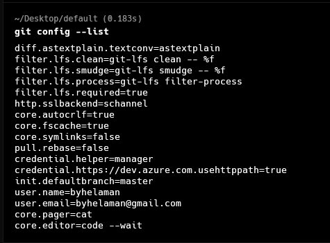
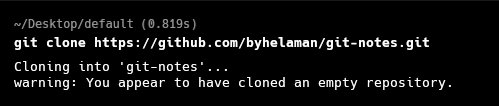
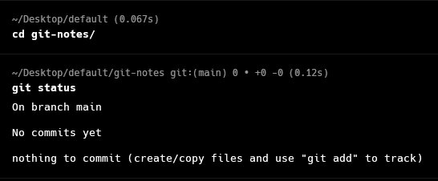
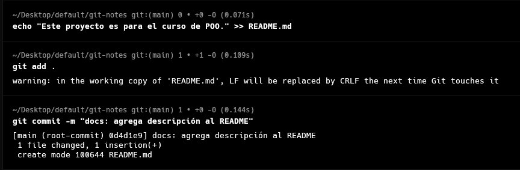
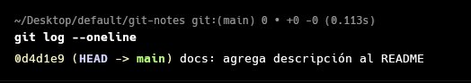

# Trabajo de Campo – S01: Primeros Pasos con Git

## DESARROLLO

### 1. Guía paso a paso con Git

#### 1.1 Instalación y configuración inicial

Antes de comenzar, verificamos que Git esté instalado y configuramos el nombre de usuario y correo que quedarán registrados en cada commit.

```bash
# Verificar versión instalada
git --version

# Configurar identidad global
git config --global user.name "Tu Nombre"
git config --global user.email "tu@correo.com"

# Verificar configuración
git config --list
```

> **¿Por qué?** Git usa estos datos para firmar cada commit. Sin esta configuración, los commits no tendrán autoría correcta.

#### 1.2 Creación de un repositorio local

Un repositorio local es una carpeta rastreada por Git. Se inicializa con `git init`.

```bash
# Crear carpeta del proyecto
mkdir mi-proyecto
cd mi-proyecto

# Inicializar repositorio Git
git init

# Confirmar que el repo fue inicializado
ls -la
```

Esto crea una carpeta oculta `.git/` dentro del directorio. Allí Git almacena todo el historial y la configuración del repositorio.

> **Resultado esperado:** verás la carpeta `.git/` listada.

#### 1.3 Clonar un repositorio de GitHub

Clonar descarga una copia completa de un repositorio remoto (incluyendo su historial) a tu máquina local.

```bash
# Clonar repositorio remoto
git clone https://github.com/usuario/nombre-repositorio.git

# Ingresar a la carpeta clonada
cd nombre-repositorio
```

> **¿Cuándo usar clone vs init?**  
> Usa `clone` cuando el proyecto ya existe en GitHub.  
> Usa `init` cuando empiezas un proyecto nuevo desde cero.

#### 1.4 Navegación básica por el repositorio

```bash
# Ver el estado actual del repositorio
git status

# Listar archivos rastreados
git ls-files

# Ver ramas disponibles
git branch -a
```

| Comando | Descripción |
|---|---|
| `git status` | Muestra archivos modificados, en staging o sin rastrear |
| `git branch` | Lista las ramas locales |
| `git log` | Muestra el historial de commits |

#### 1.5 Primer commit: registrar cambios

El flujo básico de Git siempre sigue estos tres pasos:  
**Modificar → Agregar al staging → Confirmar (commit)**

```bash
# 1. Crear un archivo nuevo
echo "# Mi Proyecto" > README.md

# 2. Verificar que Git detecta el archivo nuevo
git status

# 3. Agregar al área de staging
git add README.md

# Para agregar TODOS los archivos modificados:
git add .

# 4. Confirmar el commit con un mensaje descriptivo
git commit -m "feat: agrega README inicial del proyecto"
```

> **Buena práctica:** escribe mensajes de commit en modo imperativo y de forma consistente. Ejemplo: `"feat: agrega módulo de login"`.

#### 1.6 Realizar cambios en el código y registrarlos

```bash
# Modificar el archivo
echo "Este proyecto es para el curso de POO." >> README.md

# Ver qué cambió exactamente
git diff

# Agregar y commitear
git add README.md
git commit -m "docs: agrega descripción al README"
```

El comando `git diff` muestra línea por línea qué fue añadido (`+`) o eliminado (`-`) antes de hacer el commit.

#### 1.7 Visualizar el historial de commits

```bash
# Historial completo
git log

# Historial compacto (una línea por commit)
git log --oneline

# Historial con gráfico de ramas
git log --oneline --graph --all

# Ver detalles de un commit específico
git show <hash-del-commit>
```

Ejemplo de salida de `git log --oneline`:
```
a3f92bc docs: agrega descripción al README
1d8e047 feat: agrega README inicial del proyecto
```

### 2. Aplicación al Proyecto

#### Paso 1 – Configuración de Git

```bash
git config --list
```



#### Paso 2 – Inicialización o clonación del repositorio

```bash
git init
# o
git clone https://github.com/usuario/repositorio.git
```



#### Paso 3 – Estado inicial del repositorio

```bash
git status
```



#### Paso 4 – Creación o modificación de un archivo del proyecto

Crea o modifica al menos un archivo real del proyecto (una clase, archivo de configuración, etc.).



#### Paso 6 – Historial de commits

```bash
git log --oneline
```



## RESUMEN DE COMANDOS

| Comando | Propósito |
|---|---|
| `git init` | Inicializa un repositorio local |
| `git clone <url>` | Clona un repositorio remoto |
| `git status` | Muestra el estado del repositorio |
| `git add <archivo>` | Agrega archivo al área de staging |
| `git add .` | Agrega todos los cambios al staging |
| `git commit -m "mensaje"` | Confirma los cambios con un mensaje |
| `git log` | Muestra historial completo de commits |
| `git log --oneline` | Historial compacto |
| `git diff` | Muestra diferencias no confirmadas |
| `git config --global` | Configura Git globalmente |

*Universidad Privada del Norte – Facultad de Ingeniería – 2026-1*
