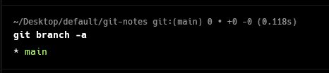
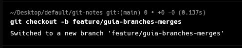
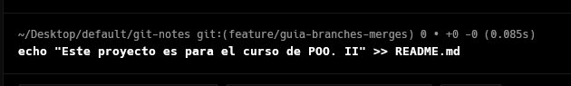
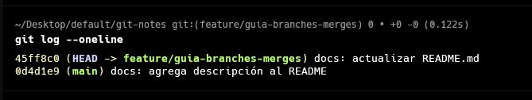
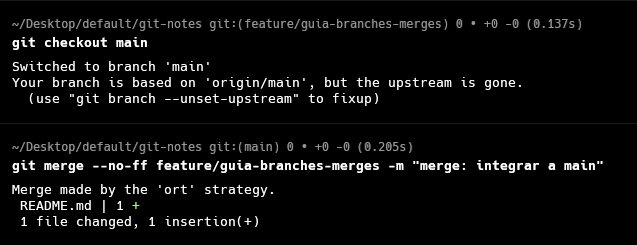
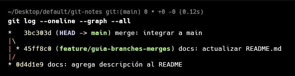

# Trabajo de Campo – S02: Manejo de Branches y Merges

## DESARROLLO

### 1. Guía paso a paso con Git

#### 1.1 ¿Qué es una rama (branch)?

Una rama es una línea de desarrollo independiente. Permite trabajar en nuevas funcionalidades o correcciones sin afectar el código estable en `main`.

```
main       ──●──●──────────────●── (merge)
                  \            /
feature/login      ●──●──●────
```

> **Regla de oro:** nunca trabajes directamente en `main`. Crea una rama para cada funcionalidad o corrección.

#### 1.2 Ver ramas existentes

```bash
# Ver ramas locales
git branch

# Ver ramas locales y remotas
git branch -a

# Ver en qué rama estás actualmente
git branch --show-current
```

La rama activa se muestra con un asterisco `*` en la terminal.

#### 1.3 Crear una nueva rama

```bash
# Crear rama sin moverse a ella
git branch feature/nueva-funcionalidad

# Crear rama Y moverse a ella (recomendado)
git checkout -b feature/nueva-funcionalidad

# Forma moderna equivalente
git switch -c feature/nueva-funcionalidad
```

> **Convención de nombres para ramas:**
> - `feature/nombre` → nueva funcionalidad
> - `fix/nombre` → corrección de bug
> - `hotfix/nombre` → corrección urgente en producción
> - `docs/nombre` → solo documentación

#### 1.4 Cambiar entre ramas

```bash
# Cambiar a una rama existente
git checkout main
git checkout feature/nueva-funcionalidad

# Forma moderna
git switch main
```

> **Importante:** antes de cambiar de rama, asegúrate de haber commiteado o guardado con `git stash` los cambios actuales.

#### 1.5 Trabajar en la rama y hacer commits

```bash
# Asegúrate de estar en la rama correcta
git branch --show-current

# Hacer cambios y commitear normalmente
git add .
git commit -m "feat: implementa módulo de registro de usuario"
```

#### 1.6 Fusionar ramas con git merge

Cuando la funcionalidad está lista, se fusiona de vuelta a `main`.

```bash
# 1. Volver a la rama destino
git checkout main

# 2. Fusionar la rama feature
git merge feature/nueva-funcionalidad

# 3. (Opcional) Eliminar la rama ya fusionada
git branch -d feature/nueva-funcionalidad
```

**Tipos de merge:**

| Tipo | Cuándo ocurre | Descripción |
|---|---|---|
| Fast-forward | `main` no tuvo nuevos commits desde la bifurcación | Git simplemente avanza el puntero |
| Merge commit | Ambas ramas tuvieron commits divergentes | Git crea un commit de fusión |

```bash
# Forzar merge commit aunque sea fast-forward (más trazabilidad)
git merge --no-ff feature/nueva-funcionalidad -m "merge: integra módulo de registro"
```

#### 1.7 Resolución de conflictos

Un conflicto ocurre cuando dos ramas modificaron la **misma línea** de un archivo. Git no puede decidir cuál versión conservar y pide tu ayuda.

**Paso 1 – Git avisa del conflicto:**
```bash
git merge feature/nueva-funcionalidad
# CONFLICT (content): Merge conflict in src/Usuario.java
# Automatic merge failed; fix conflicts and then commit the result.
```

**Paso 2 – Abrir el archivo y ver los marcadores:**
```java
<<<<<<< HEAD
public String getNombre() { return nombre; }
=======
public String getNombre() { return nombre.trim(); }
>>>>>>> feature/nueva-funcionalidad
```

**Paso 3 – Editar el archivo y quedarte con la versión correcta:**
```java
// Eliminas los marcadores <<<, === y >>> y dejas la versión final
public String getNombre() { return nombre.trim(); }
```

**Paso 4 – Marcar como resuelto y confirmar:**
```bash
git add src/Usuario.java
git commit -m "merge: resuelve conflicto en getNombre de Usuario"
```

### 2. Aplicación al Proyecto

#### Paso 1 – Ver ramas actuales del proyecto

```bash
git branch -a
```



#### Paso 2 – Crear una rama para una funcionalidad del proyecto

```bash
git checkout -b feature/nombre-funcionalidad
```



#### Paso 3 – Realizar cambios en la rama

Modifica o crea al menos un archivo en la rama (una clase, método, etc.).



#### Paso 4 – Commit en la rama

```bash
git add .
git commit -m "feat: [describe el cambio realizado]"
git log --oneline
```



#### Paso 5 – Merge a main

```bash
git checkout main
git merge --no-ff feature/nombre-funcionalidad -m "merge: integra [funcionalidad]"
```



#### Paso 6 – Historial con gráfico de ramas

```bash
git log --oneline --graph --all
```



#### Paso 7 – Simulación de conflicto y resolución

En esta práctica el merge se completó sin conflictos. En caso de que ocurra uno, los pasos a seguir son:

1. Git marcará los archivos en conflicto con `CONFLICT` en la salida del merge.
2. Abrir el archivo afectado y localizar los marcadores `<<<<<<<`, `=======` y `>>>>>>>`.
3. Editar el archivo dejando solo la versión correcta y eliminando los marcadores.
4. Ejecutar `git add <archivo>` y `git commit` para cerrar la resolución.

## RESUMEN DE COMANDOS

| Comando | Propósito |
|---|---|
| `git branch` | Lista ramas locales |
| `git branch <nombre>` | Crea una rama nueva |
| `git checkout -b <nombre>` | Crea una rama y se mueve a ella |
| `git checkout <rama>` | Cambia de rama |
| `git merge <rama>` | Fusiona una rama a la actual |
| `git merge --no-ff` | Merge forzando creación de commit de fusión |
| `git branch -d <nombre>` | Elimina una rama ya fusionada |
| `git log --graph --oneline` | Historial con gráfico de ramas |
| `git status` | Muestra archivos en conflicto |

*Universidad Privada del Norte – Facultad de Ingeniería – 2026-1*
