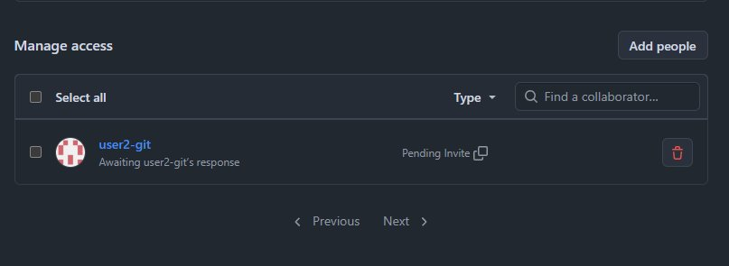
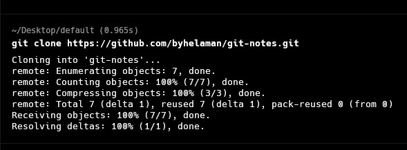
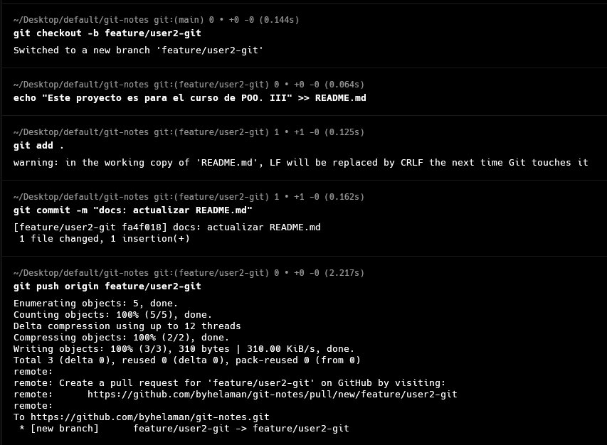
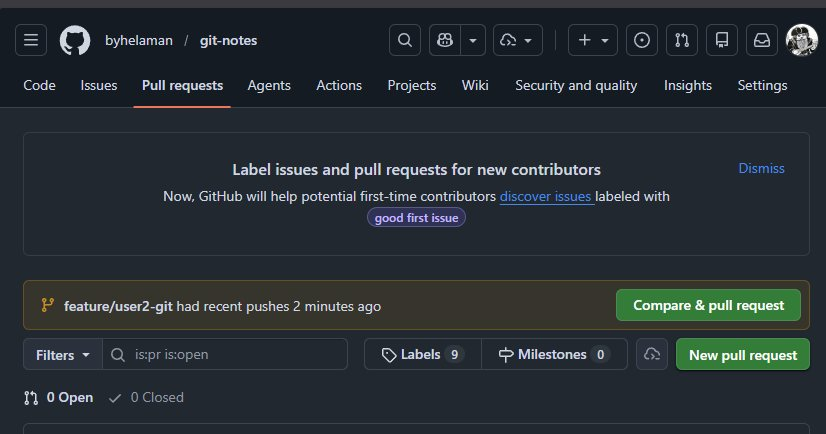
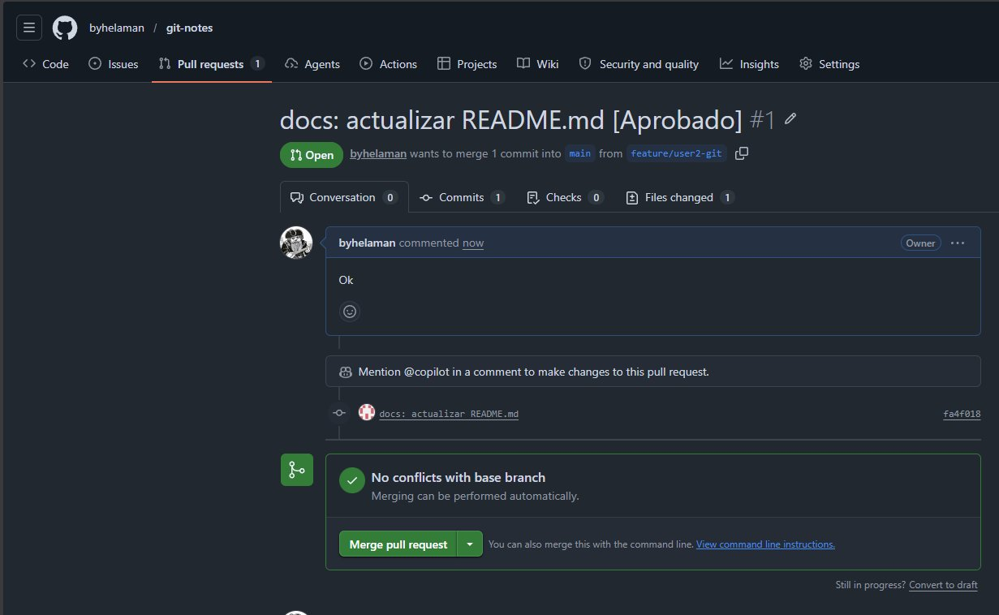
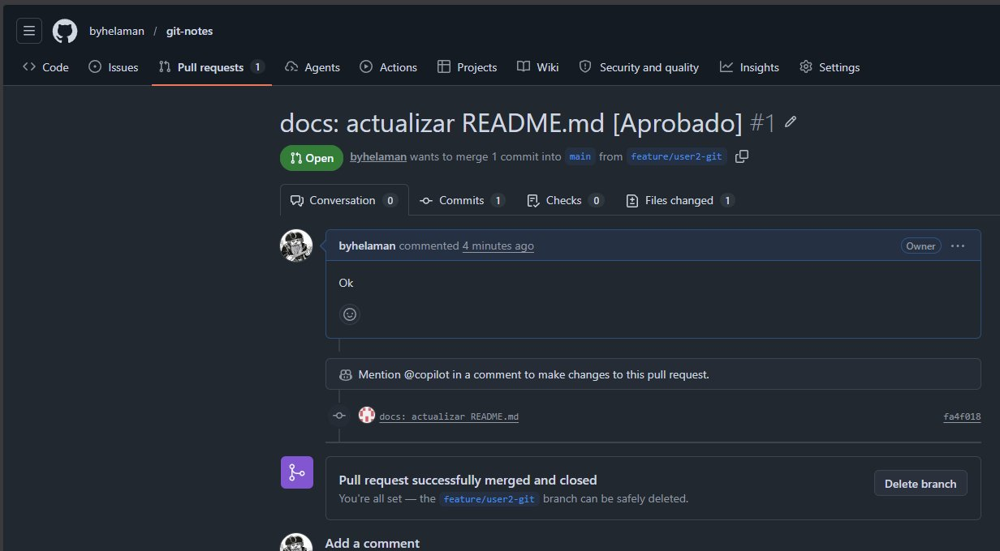
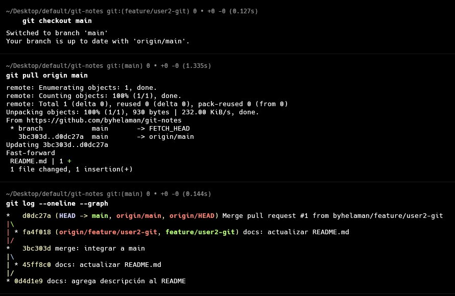

# Trabajo de Campo – S03: Colaboración en GitHub

## DESARROLLO

### 1. Guía paso a paso con Git

#### 1.1 ¿Qué es la colaboración en GitHub?

GitHub permite que múltiples desarrolladores trabajen sobre el mismo repositorio de forma coordinada. El flujo colaborativo estándar es:

```
Clonar repo → Crear rama → Hacer cambios → Push → Pull Request → Code Review → Merge
```

Esto garantiza que nadie suba código directamente a `main` sin revisión.

#### 1.2 Invitar colaboradores al repositorio

**Desde la interfaz web de GitHub:**

1. Ir al repositorio en `github.com/tu-usuario/tu-repositorio`.
2. Hacer clic en **Settings** (pestaña superior derecha del repo).
3. En el menú lateral, seleccionar **Collaborators** (dentro de *Access*).
4. Hacer clic en **Add people**.
5. Buscar al colaborador por su nombre de usuario, nombre o email de GitHub.
6. El colaborador recibirá una invitación por correo que deberá **aceptar**.

> **Roles disponibles:**
> - **Read** – solo puede ver y clonar.
> - **Write** – puede hacer push a ramas.
> - **Admin** – acceso completo al repositorio.

#### 1.3 Conectar el repositorio local con GitHub

Si creaste el repositorio localmente con `git init`, debes vincularlo al repositorio de GitHub:

```bash
# Agregar el repositorio remoto
git remote add origin https://github.com/tu-usuario/tu-repositorio.git

# Verificar que el remote fue agregado correctamente
git remote -v

# Subir rama main por primera vez
git push -u origin main
```

Si clonaste directamente, el remote `origin` ya está configurado automáticamente.

#### 1.4 Clonar el repositorio compartido

Cada colaborador clona el repositorio con:

```bash
git clone https://github.com/usuario-propietario/nombre-repositorio.git
cd nombre-repositorio
```

#### 1.5 Flujo de trabajo colaborativo: rama + push

Cada colaborador trabaja **en su propia rama** para aislar sus cambios:

```bash
# Actualizar el repositorio local antes de empezar
git pull origin main

# Crear rama propia
git checkout -b feature/mi-funcionalidad

# Hacer cambios y commitearlos
git add .
git commit -m "feat: implementa [descripción de la funcionalidad]"

# Subir la rama al repositorio remoto
git push origin feature/mi-funcionalidad
```

#### 1.6 Crear un Pull Request (PR) en GitHub

Un Pull Request es una solicitud formal para integrar los cambios de tu rama a `main`. Permite que otros revisen el código antes de fusionarlo.

**Pasos en GitHub:**

1. Ir al repositorio en GitHub. Aparecerá el banner **"Compare & pull request"** — hacer clic.
2. Seleccionar:
   - **base:** `main` (rama destino)
   - **compare:** `feature/mi-funcionalidad` (tu rama)
3. Escribir un **título descriptivo** y una **descripción** del PR:
   - ¿Qué cambios se hicieron?
   - ¿Por qué se hicieron?
4. Asignar un **Reviewer** (tu compañero de equipo).
5. Hacer clic en **Create Pull Request**.

> **Buena práctica:** un PR debe tener un propósito único y acotado. No mezcles múltiples funcionalidades en un solo PR.

#### 1.7 Revisión de código (Code Review)

El colaborador asignado como Reviewer realiza la revisión:

1. Ir a **Pull Requests** y abrir el PR a revisar.
2. Ir a la pestaña **Files changed** para ver los cambios línea por línea.
3. Hacer clic en el ícono `+` junto a una línea para dejar un **comentario**.
4. Al finalizar, hacer clic en **Review changes**:
   - **Comment** – deja comentarios sin aprobar ni rechazar.
   - **Approve** – aprueba los cambios para hacer merge.
   - **Request changes** – solicita modificaciones antes de aprobar.

El autor del PR realiza los cambios solicitados en la misma rama con nuevos commits. El PR se actualiza automáticamente.

#### 1.8 Hacer merge del Pull Request

Una vez aprobado:

1. En el PR, hacer clic en **Merge pull request**.
2. Confirmar con **Confirm merge**.
3. (Opcional) Eliminar la rama remota con **Delete branch**.

```bash
# Actualizar el repo local después del merge
git checkout main
git pull origin main
```

### 2. Aplicación al Proyecto

#### Paso 1 – Invitación al repositorio



#### Paso 2 – Clonación del repositorio compartido

```bash
git clone https://github.com/usuario/repositorio.git
```



#### Paso 3 – Crear rama y realizar cambios

```bash
git checkout -b feature/nombre-del-colaborador
git add .
git commit -m "feat: [descripción del aporte del colaborador]"
git push origin feature/nombre-del-colaborador
```



#### Paso 4 – Crear el Pull Request en GitHub



#### Paso 5 – Revisión de código



#### Paso 6 – Aprobación del PR



#### Paso 7 – Actualización del repositorio local

```bash
git checkout main
git pull origin main
git log --oneline --graph
```



## RESUMEN DE COMANDOS

| Comando | Propósito |
|---|---|
| `git remote add origin <url>` | Vincula el repo local con GitHub |
| `git remote -v` | Muestra los remotos configurados |
| `git push -u origin main` | Sube la rama main por primera vez |
| `git pull origin main` | Descarga y fusiona cambios del remoto |
| `git push origin <rama>` | Sube una rama local al remoto |
| `git clone <url>` | Clona un repositorio remoto completo |

> Las acciones de **invitar colaboradores**, **crear PR**, **revisar código** y **aprobar/hacer merge** se realizan desde la interfaz web de GitHub.

*Universidad Privada del Norte – Facultad de Ingeniería – 2026-1*
