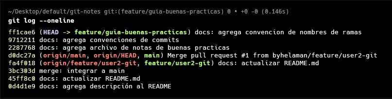
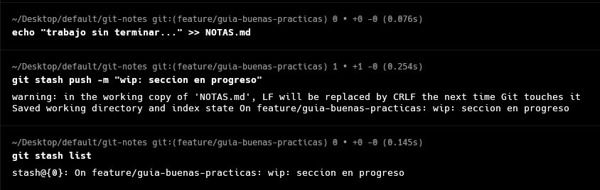
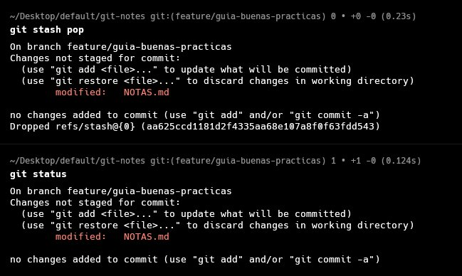
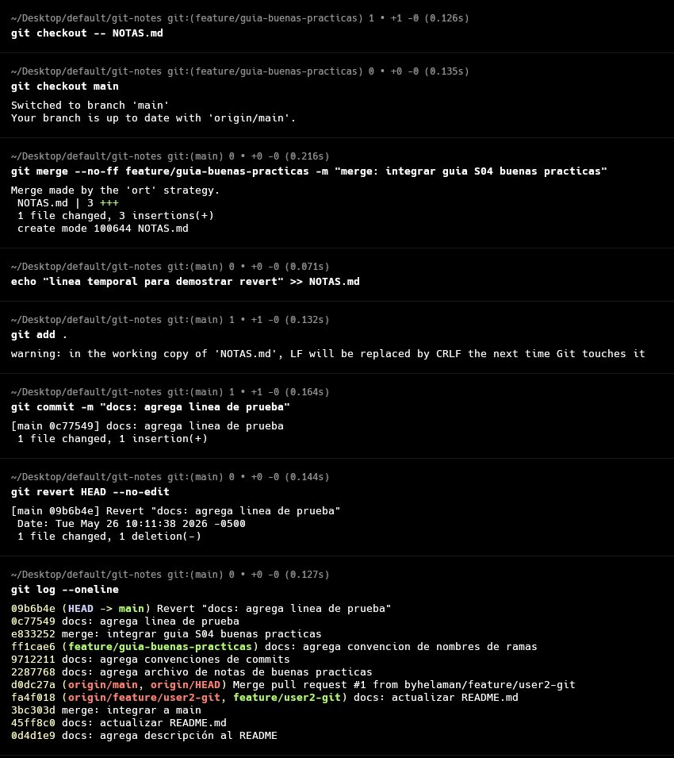
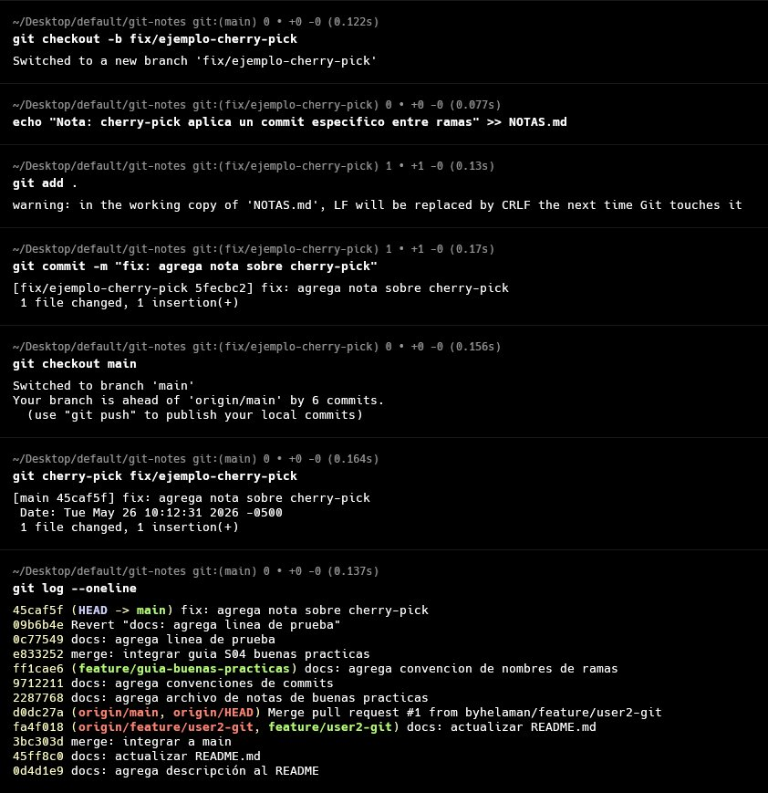
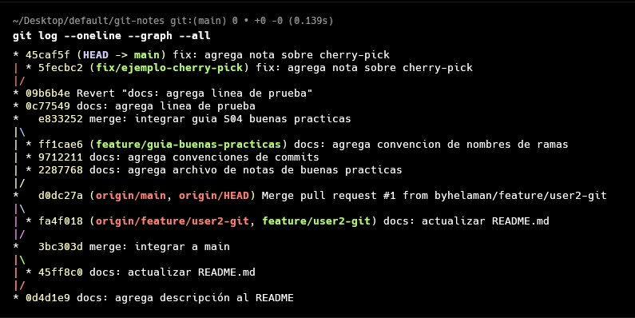

# Trabajo de Campo – S04: Mejores Prácticas y Comandos Avanzados

## DESARROLLO

### 1. Guía paso a paso con Git

#### 1.1 Convención de nombres de ramas

| Prefijo | Uso | Ejemplo |
|---|---|---|
| `feature/` | Nueva funcionalidad | `feature/login-usuario` |
| `fix/` | Corrección de bug no urgente | `fix/error-calculo-total` |
| `hotfix/` | Corrección urgente en producción | `hotfix/vulnerabilidad-auth` |
| `release/` | Preparación de una versión | `release/v1.2.0` |
| `docs/` | Solo documentación | `docs/actualiza-readme` |
| `refactor/` | Mejora interna sin cambio funcional | `refactor/extrae-clase-pago` |
| `test/` | Agrega o corrige pruebas | `test/unitarios-usuario` |

> **Reglas generales:** usar minúsculas y guiones (`-`), nunca espacios ni mayúsculas. Si usan gestión de tareas, incluir el número de ticket: `feature/123-login-usuario`.

#### 1.2 Mensajes de commit claros: Conventional Commits

**Formato:**
```
<tipo>(<ámbito opcional>): <descripción corta>
```

**Tipos principales:**

| Tipo | Cuándo usarlo |
|---|---|
| `feat` | Agrega una nueva funcionalidad |
| `fix` | Corrige un bug |
| `docs` | Cambios solo en documentación |
| `style` | Formato, espacios (sin cambio funcional) |
| `refactor` | Refactorización sin nueva función ni fix |
| `test` | Agrega o corrige pruebas |
| `chore` | Tareas de mantenimiento, dependencias |

**Ejemplos correctos:**
```bash
git commit -m "feat(auth): implementa login con JWT"
git commit -m "fix(carrito): corrige cálculo de descuento para productos en oferta"
git commit -m "docs: agrega instrucciones de instalación al README"
git commit -m "refactor(usuario): extrae lógica de validación a UsuarioValidator"
```

**Ejemplos incorrectos a evitar:**
```bash
git commit -m "cambios"          # No describe nada
git commit -m "arreglé cosas"    # Vago e informal
git commit -m "WIP"              # No commitear trabajo incompleto en main
```

#### 1.3 Importancia de las branches

- **Aislamiento:** los cambios en una rama no afectan `main` hasta el merge.
- **Paralelismo:** varios desarrolladores trabajan simultáneamente sin bloquearse.
- **Revisión:** obliga a un Pull Request y code review antes de integrar código.
- **Rollback fácil:** si una rama tiene problemas, se descarta sin afectar el resto.
- **Trazabilidad:** el historial muestra claramente qué rama introdujo cada cambio.

#### 1.4 Estrategias de ramificación: Git Flow

**Git Flow** define ramas con roles específicos:

```
main ──────────────────────────────────●── v1.0
        \                             /
develop  ●──●──●──●──────────────────●
              \       \             /
feature/A      ●──●───●  feature/B ●──●──●
                                        \
release/v1.0                             ●──●──●
```

| Rama | Rol |
|---|---|
| `main` | Código en producción. Solo recibe merges de `release/` y `hotfix/`. |
| `develop` | Rama de integración. Todas las features se fusionan aquí. |
| `feature/*` | Desarrollo de nuevas funcionalidades. Sale de `develop`. |
| `release/*` | Preparación de versión (QA, ajustes finales). Sale de `develop`. |
| `hotfix/*` | Correcciones urgentes en producción. Sale de `main`. |

```bash
# Iniciar git flow
git flow init

# Crear una feature
git flow feature start login-usuario

# Terminar la feature (hace merge a develop automáticamente)
git flow feature finish login-usuario

# Crear una release
git flow release start v1.0.0
git flow release finish v1.0.0
```

#### 1.5 Comando avanzado: git stash

`git stash` guarda temporalmente los cambios sin commitear para que puedas cambiar de rama o contexto con el working tree limpio.

**Caso de uso:** estás trabajando en `feature/login` y debes ir a corregir un bug en otra rama, pero tus cambios no están listos para un commit.

```bash
# Guardar cambios actuales en el stash
git stash

# Guardar con nombre descriptivo
git stash push -m "trabajo en progreso: validación de email"

# Ver la lista de stashes guardados
git stash list

# Recuperar el último stash (y eliminarlo de la lista)
git stash pop

# Recuperar sin eliminar
git stash apply stash@{0}

# Eliminar un stash específico
git stash drop stash@{0}

# Eliminar todos los stashes
git stash clear
```

**Flujo completo:**
```bash
# 1. Guardas el trabajo en progreso
git stash push -m "formulario a medias"

# 2. Cambias de rama y corriges el bug
git checkout fix/error-calculo
# ... corriges y commiteas ...

# 3. Vuelves y recuperas tu trabajo
git checkout feature/login
git stash pop
```

#### 1.6 Comando avanzado: git revert

`git revert` crea un **nuevo commit** que deshace los cambios de un commit anterior. Es la forma **segura** de deshacer en ramas compartidas porque no reescribe el historial.

```bash
# Ver el historial para identificar el commit a revertir
git log --oneline
# a3f92bc feat: agrega módulo de pago   ← quiero deshacer este

# Revertir (crea un nuevo commit de reversión)
git revert a3f92bc --no-edit
```

> **`git revert` vs `git reset`:**
> - `git revert` → seguro en ramas compartidas/remotas. Crea un commit nuevo.
> - `git reset` → peligroso en ramas compartidas. Reescribe el historial. Solo en ramas locales y privadas.

```bash
# git reset (solo en ramas locales)
git reset --soft HEAD~1   # deshace el commit, mantiene cambios en staging
git reset --hard HEAD~1   # deshace el commit Y descarta todos los cambios ⚠️
```

#### 1.7 Comando avanzado: git cherry-pick

`git cherry-pick` aplica un commit específico de otra rama a la rama actual, sin hacer un merge completo.

**Caso de uso:** en `develop` hay un fix crítico que necesitas en `main` ahora, sin esperar el ciclo de release.

```bash
# Ver el hash del commit que quieres traer
git log --oneline feature/pagos
# b7e2a1f fix: corrige redondeo en cálculo de IGV   ← quiero este

# Desde main, aplicar ese commit específico
git checkout main
git cherry-pick b7e2a1f

# Cherry-pick de varios commits
git cherry-pick b7e2a1f c9d3e2a

# Cherry-pick sin hacer commit automático (para revisar antes)
git cherry-pick b7e2a1f --no-commit
git status
git commit -m "fix: aplica corrección de IGV desde feature/pagos"
```

**Si hay conflicto durante el cherry-pick:**
```bash
git add archivo-resuelto.java
git cherry-pick --continue

# Abortar si decides no continuar
git cherry-pick --abort
```

### 2. Aplicación al Proyecto

#### Paso 1 – Commits con Conventional Commits

Realiza al menos 3 commits en el proyecto usando la convención correcta.

```bash
git log --oneline
```



#### Paso 2 – Uso de git stash (guardar)

Con cambios sin commitear en una rama, guárdalos en el stash.

```bash
git stash push -m "descripción de lo que estabas haciendo"
git stash list
```



#### Paso 3 – Uso de git stash (recuperar)

```bash
git stash pop
git status
```



#### Paso 4 – Uso de git revert

Haz un commit en el proyecto y luego reviértelo.

```bash
git log --oneline
git revert <hash> --no-edit
git log --oneline
```



#### Paso 5 – Uso de git cherry-pick

Desde una rama secundaria, aplica un commit útil a `main`.

```bash
git log --oneline feature/mi-rama
git checkout main
git cherry-pick <hash>
git log --oneline
```



#### Paso 6 – Diagrama del flujo de ramas del proyecto

Documenta con un diagrama (draw.io, texto ASCII o dibujado a mano) el flujo de ramas que usó tu equipo durante el proyecto.



## RESUMEN DE COMANDOS

| Comando | Propósito |
|---|---|
| `git stash` | Guarda cambios sin commitear temporalmente |
| `git stash push -m "msg"` | Guarda stash con descripción |
| `git stash list` | Lista todos los stashes guardados |
| `git stash pop` | Recupera y elimina el último stash |
| `git stash apply` | Recupera stash sin eliminarlo |
| `git stash drop` | Elimina un stash específico |
| `git revert <hash>` | Crea un commit que deshace otro commit |
| `git revert --no-edit` | Revert sin abrir el editor de mensajes |
| `git reset --soft HEAD~1` | Deshace el último commit, conserva cambios |
| `git cherry-pick <hash>` | Aplica un commit específico a la rama actual |
| `git cherry-pick --continue` | Continúa cherry-pick tras resolver conflicto |
| `git cherry-pick --abort` | Cancela el cherry-pick en curso |

## COMPARATIVA: revert vs reset vs cherry-pick

| | `git revert` | `git reset` | `git cherry-pick` |
|---|---|---|---|
| **¿Qué hace?** | Deshace un commit creando uno nuevo | Mueve el puntero HEAD hacia atrás | Copia un commit a otra rama |
| **¿Reescribe historial?** | No | Sí | No |
| **¿Seguro en remoto?** | Sí | No | Sí |
| **Caso de uso** | Deshacer cambio publicado | Limpiar historial local | Traer un fix específico |

*Universidad Privada del Norte – Facultad de Ingeniería – 2026-1*
