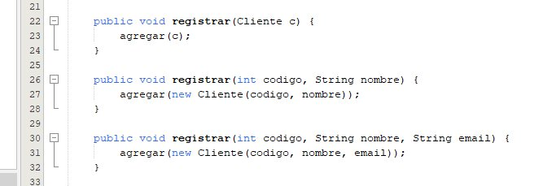
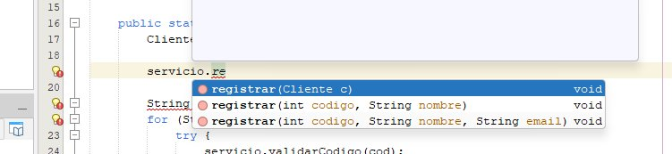
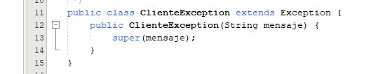
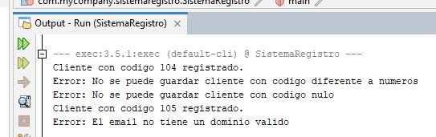
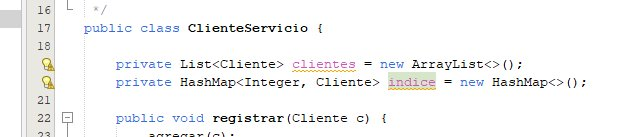
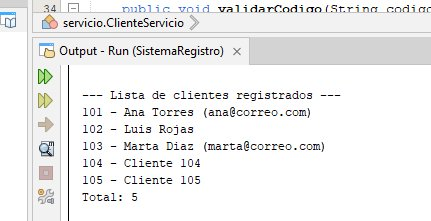
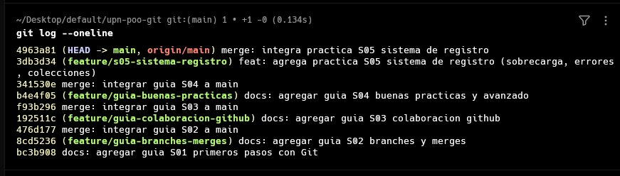
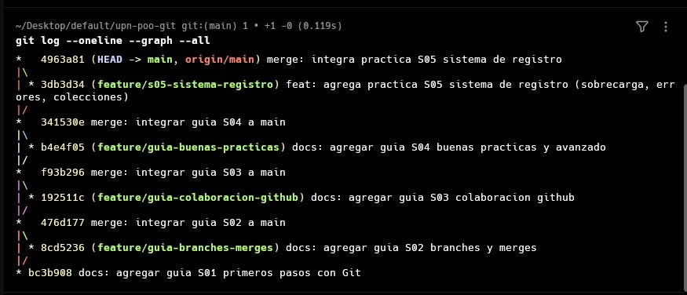

# Trabajo de Campo – S05: Sobrecarga de Métodos, Manejo de Errores y Colecciones

## DESARROLLO

A diferencia de las semanas anteriores, S05 es una práctica de **desarrollo**. Se construye un proyecto Java —un **Sistema de Registro de Clientes**— que demuestra los tres conceptos, y cada validación se documenta en la plantilla de Historias de Usuario. Todo el avance se controla con Git.

### Estructura del proyecto

Proyecto Maven generado con NetBeans (layout estándar `src/main/java`):

```
SistemaRegistro/
├── pom.xml
└── src/
    └── main/
        └── java/
            ├── com/mycompany/sistemaregistro/
            │   └── SistemaRegistro.java   (clase main)
            ├── modelo/
            │   └── Cliente.java
            ├── excepciones/
            │   └── ClienteException.java
            └── servicio/
                └── ClienteServicio.java
```

---

### 1. Sobrecarga de métodos

La sobrecarga (overloading) permite tener varios métodos con el **mismo nombre** pero **distinta firma** (número o tipo de parámetros). El compilador elige cuál ejecutar según los argumentos.

**`modelo/Cliente.java`**
```java
package modelo;

public class Cliente {
    private int codigo;
    private String nombre;
    private String email;
    private boolean activo;

    public Cliente() {}

    public Cliente(int codigo, String nombre) {
        this.codigo = codigo;
        this.nombre = nombre;
        this.activo = true;
    }

    public Cliente(int codigo, String nombre, String email) {
        this(codigo, nombre);
        this.email = email;
    }

    // getters y setters
    public int getCodigo() { return codigo; }
    public void setCodigo(int codigo) { this.codigo = codigo; }
    public String getNombre() { return nombre; }
    public void setNombre(String nombre) { this.nombre = nombre; }
    public String getEmail() { return email; }
    public void setEmail(String email) { this.email = email; }
    public boolean isActivo() { return activo; }
    public void setActivo(boolean activo) { this.activo = activo; }

    @Override
    public String toString() {
        return codigo + " - " + nombre + (email != null ? " (" + email + ")" : "");
    }
}
```

En el servicio definimos el método `registrar` **sobrecargado** con tres firmas distintas:

**`servicio/ClienteServicio.java`** *(fragmento de sobrecarga)*
```java
// Firma 1: registra un objeto Cliente ya construido
public void registrar(Cliente c) {
    clientes.add(c);
}

// Firma 2: registra a partir de código y nombre
public void registrar(int codigo, String nombre) {
    clientes.add(new Cliente(codigo, nombre));
}

// Firma 3: registra con código, nombre y email
public void registrar(int codigo, String nombre, String email) {
    clientes.add(new Cliente(codigo, nombre, email));
}
```

> **Evidencia:** tres métodos `registrar` con la misma intención pero distinta firma. El IDE muestra las 3 opciones al invocarlo.





---

### 2. Manejo de errores

Se usa una **excepción personalizada** y bloques `try-catch` para validar las entradas, evitando que el programa se detenga ante datos inválidos.

**`excepciones/ClienteException.java`**
```java
package excepciones;

public class ClienteException extends Exception {
    public ClienteException(String mensaje) {
        super(mensaje);
    }
}
```

**`servicio/ClienteServicio.java`** *(fragmento de validaciones)*
```java
// Valida que el código no sea nulo/vacío y que sea numérico
public void validarCodigo(String codigo) throws ClienteException {
    if (codigo == null || codigo.trim().isEmpty()) {
        throw new ClienteException("No se puede guardar cliente con código nulo");
    }
    if (!codigo.matches("\\d+")) {
        throw new ClienteException("No se puede guardar cliente con código diferente a números");
    }
}

// Valida formato básico de email
public void validarEmail(String email) throws ClienteException {
    if (email == null || !email.matches("^[\\w.-]+@[\\w.-]+\\.[a-zA-Z]{2,}$")) {
        throw new ClienteException("El email no tiene un dominio válido");
    }
}
```

Uso en `SistemaRegistro` (clase main) con `try-catch`:
```java
try {
    servicio.validarCodigo("abc");
    servicio.registrar(100, "Ana");
} catch (ClienteException e) {
    System.out.println("Error: " + e.getMessage());
}
```

> **Evidencia:** al ingresar un código no numérico o nulo, el sistema captura la excepción y muestra el mensaje sin caerse.





---

### 3. Colecciones

Se usan colecciones para almacenar y consultar los clientes registrados en memoria. `ArrayList` mantiene el orden de inserción; `HashMap` permite búsqueda rápida por código.

**`servicio/ClienteServicio.java`** *(fragmento de colecciones)*
```java
package servicio;

import java.util.ArrayList;
import java.util.HashMap;
import java.util.List;
import modelo.Cliente;
import excepciones.ClienteException;

public class ClienteServicio {
    private List<Cliente> clientes = new ArrayList<>();
    private HashMap<Integer, Cliente> indice = new HashMap<>();

    // ... métodos registrar() y validar() ...

    // Agrega al ArrayList y al índice HashMap
    public void agregar(Cliente c) {
        clientes.add(c);
        indice.put(c.getCodigo(), c);
    }

    // Recorre la colección y lista todos los clientes
    public void listar() {
        if (clientes.isEmpty()) {
            System.out.println("No hay clientes registrados.");
            return;
        }
        for (Cliente c : clientes) {
            System.out.println(c);
        }
    }

    // Búsqueda rápida por código usando el HashMap
    public Cliente buscarPorCodigo(int codigo) {
        return indice.get(codigo);
    }

    public int total() {
        return clientes.size();
    }
}
```

> **Evidencia:** el `ArrayList` almacena los registros y el `HashMap` permite recuperarlos por código. El método `listar()` recorre la colección.





---

### 4. Control con Git

El desarrollo se versiona por funcionalidad, una rama por concepto, siguiendo lo aprendido en S01–S04.

Se agrega toda la carpeta de la semana en un solo `git add`, lo que incluye el `.md`, las capturas y el proyecto Java completo.

```bash
# Rama para la práctica de S05
git checkout -b feature/s05-sistema-registro

# Agregar y confirmar toda la práctica
git add S05-Sobrecarga-Errores-Colecciones/
git commit -m "feat: agrega practica S05 sistema de registro (sobrecarga, errores, colecciones)"

# Integrar a main
git checkout main
git merge --no-ff feature/s05-sistema-registro -m "merge: integra practica S05 sistema de registro"
git push origin main
```





---

### Documentación en la plantilla de Historias de Usuario

Cada validación implementada se registra en la hoja **Historias de Usuario** del Excel, completando las columnas de la derecha:

| Columna | Qué colocar |
|---|---|
| Se implementó el requerimiento | Si / No |
| Clase donde realizó la validación | ej. `ClienteServicio` |
| Control y evento | ej. `registrar / validarCodigo` |
| Parámetros de entrada | ej. `"abc"` |
| Resultado evidenciado | ej. `Mensaje: "código diferente a números"` |


---

## RESUMEN DE CONCEPTOS

| Concepto | Implementación | Clase |
|---|---|---|
| Sobrecarga de métodos | 3 firmas de `registrar()` + constructores | `Cliente`, `ClienteServicio` |
| Manejo de errores | `ClienteException` + `try-catch` + validaciones | `ClienteException`, `ClienteServicio` |
| Colecciones | `ArrayList` y `HashMap` | `ClienteServicio` |
| Control con Git | rama por práctica + commit por concepto | — |

---

*Universidad Privada del Norte – Facultad de Ingeniería – 2026-1*
