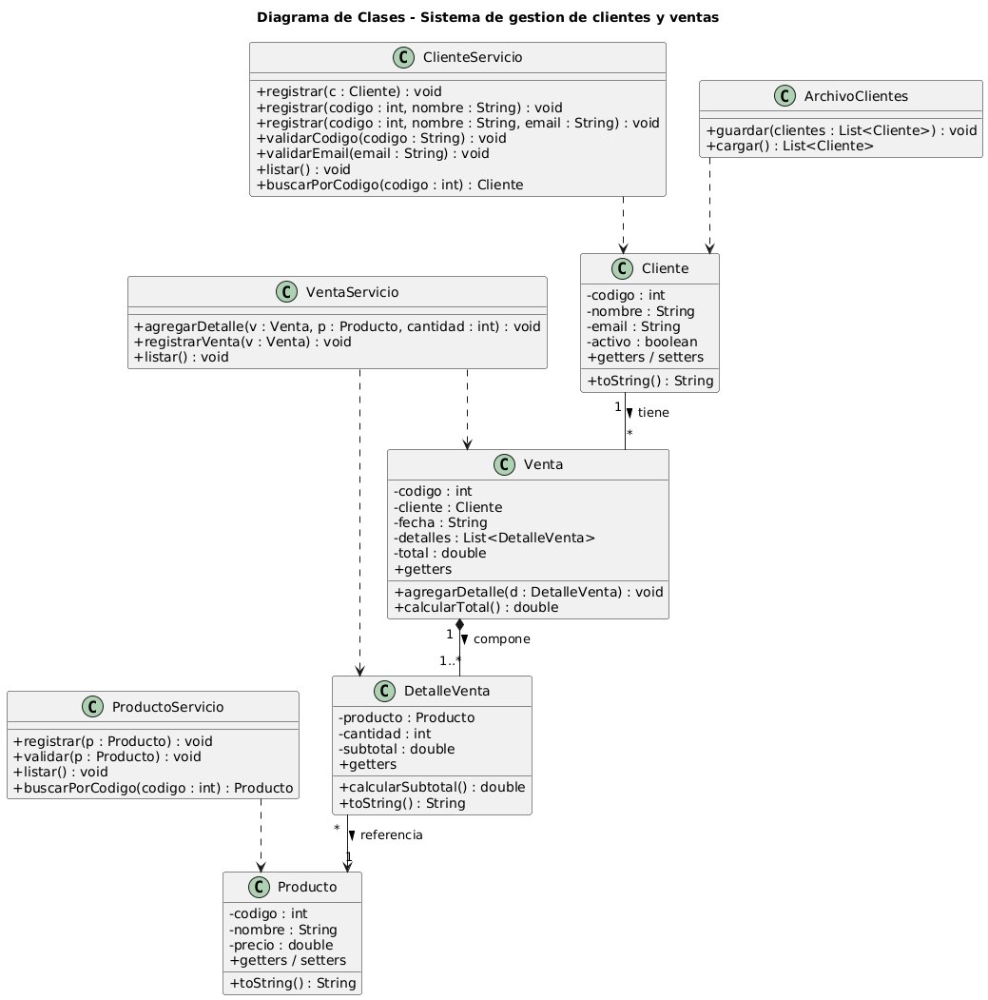

# Trabajo de Campo – S09: Diagrama de Clases y Manejo de Archivos

## DESARROLLO

En esta semana se implementa el modelo completo del **Sistema de gestión de clientes y ventas** (`Cliente`, `Producto`, `Venta`, `DetalleVenta`), se documenta su diagrama de clases, se agrega el manejo de archivos y se controla el estado de los requerimientos funcionales.

### 1. Diagrama de clases del proyecto

El diagrama representa las cuatro entidades del modelo, la capa de servicios y la clase de persistencia.



**Relaciones del modelo:**

| Relación | Tipo | Significado |
|---|---|---|
| Cliente — Venta | Asociación (1 a *) | Un cliente puede tener muchas ventas |
| Venta — DetalleVenta | Composición (1 a 1..*) | Una venta se compone de uno o más detalles; si se elimina la venta, sus detalles desaparecen |
| DetalleVenta — Producto | Asociación (* a 1) | Cada detalle referencia un producto |

> **Captura opcional:** si tu docente pide el diagrama generado desde una herramienta (NetBeans, StarUML, draw.io), reemplaza esta imagen por tu propia exportación.

---

### 2. Relación del diagrama con la programación implementada

Cada clase del diagrama corresponde a una clase real del proyecto:

| Clase del diagrama | Archivo Java | Rol |
|---|---|---|
| `Cliente` | `modelo/Cliente.java` | Entidad con código, nombre y email |
| `Producto` | `modelo/Producto.java` | Entidad con código, nombre y precio |
| `DetalleVenta` | `modelo/DetalleVenta.java` | Línea de venta; calcula subtotal = precio × cantidad |
| `Venta` | `modelo/Venta.java` | Cabecera; contiene `List<DetalleVenta>` y calcula el total |
| `ClienteServicio` | `servicio/ClienteServicio.java` | Registro y validación de clientes |
| `ProductoServicio` | `servicio/ProductoServicio.java` | Registro y validación de productos |
| `VentaServicio` | `servicio/VentaServicio.java` | Registro de ventas y agregado de detalles |
| `ArchivoClientes` | `persistencia/ArchivoClientes.java` | Lectura y escritura de clientes en archivo |

La **composición** Venta–DetalleVenta se ve en el código: la clase `Venta` declara `private List<DetalleVenta> detalles` y el método `agregarDetalle()`. El cálculo del total recorre esa lista sumando los subtotales.

**CAPTURA 1:** código de las clases del modelo (`Venta` y `DetalleVenta`) abierto en el IDE.

**CAPTURA 2:** ejecución mostrando la venta con sus detalles y el total calculado.

---

### 3. Implementación de la gestión de archivos

El manejo de archivos se implementa en `ArchivoClientes`, que guarda y lee los clientes en un archivo de texto (`clientes.txt`) usando `FileWriter` y `BufferedReader`. Cada cliente se almacena como una línea con sus campos separados por punto y coma.

```java
// Guardar
try (BufferedWriter bw = new BufferedWriter(new FileWriter(ARCHIVO))) {
    for (Cliente c : clientes) {
        String email = (c.getEmail() == null) ? "" : c.getEmail();
        bw.write(c.getCodigo() + ";" + c.getNombre() + ";" + email);
        bw.newLine();
    }
}

// Leer
try (BufferedReader br = new BufferedReader(new FileReader(ARCHIVO))) {
    String linea;
    while ((linea = br.readLine()) != null) {
        String[] datos = linea.split(";");
        // reconstruye cada Cliente a partir de la linea
    }
}
```

Contenido generado en `clientes.txt`:
```
101;Ana Torres;ana@correo.com
102;Luis Rojas;
```

**CAPTURA 3:** código de la clase `ArchivoClientes`.

**CAPTURA 4:** ejecución mostrando "Clientes guardados" y los clientes leídos desde el archivo.

**CAPTURA 5:** el archivo `clientes.txt` abierto, mostrando los datos guardados.

---

### 4. Control de estado de los requerimientos funcionales

Matriz de trazabilidad entre los requerimientos funcionales (S08), su historia de usuario y su estado de implementación.

| RF | Descripción breve | Historia | Estado |
|---|---|---|---|
| RF-01 | Registrar cliente | HU-0001 | Implementado |
| RF-02 | Validar código numérico | HU-0001 | Implementado |
| RF-03 | Validar código no nulo | HU-0001 | Implementado |
| RF-04 | Validar email | HU-0001 | Implementado |
| RF-06 | Listar clientes | HU-0001 | Implementado |
| RF-07 | Buscar cliente por código | HU-0001 | Implementado |
| RF-11 | Registrar producto | HU-0002 | Implementado |
| RF-12 | Validar nombre de producto | HU-0002 | Implementado |
| RF-13 | Validar precio mayor que cero | HU-0002 | Implementado |
| RF-15 | Impedir producto duplicado | HU-0002 | Implementado |
| RF-16 | Listar productos | HU-0002 | Implementado |
| RF-17 | Buscar producto por código | HU-0002 | Implementado |
| RF-21 | Registrar venta con cliente | HU-0003 | Implementado |
| RF-22 | Validar cliente de la venta | HU-0003 | Implementado |
| RF-23 | Registrar fecha de la venta | HU-0003 | Implementado |
| RF-24 | Agregar detalles a la venta | HU-0003 | Implementado |
| RF-25 | Validar producto del detalle | HU-0003 | Implementado |
| RF-26 | Validar cantidad mayor que cero | HU-0003 | Implementado |
| RF-27 | Calcular subtotal del detalle | HU-0003 | Implementado |
| RF-28 | Calcular total de la venta | HU-0003 | Implementado |
| RF-29 | Validar venta con al menos un detalle | HU-0003 | Implementado |
| RF-31 | Listar ventas | HU-0003 | Implementado |
| RF-05 / RF-08 / RF-09 | Código único, actualizar, eliminar cliente | HU-0001 | Pendiente |
| RF-18 / RF-19 | Actualizar, eliminar producto | HU-0002 | Pendiente |
| RF-32 / RF-33 / RF-34 | Buscar venta, ver detalle, ventas por cliente | HU-0003 | Pendiente |
| RF-35 a RF-40 | Menú, mensajes y salida controlada (interfaz) | — | Pendiente |

**CAPTURA 6:** `git log --oneline` de los commits del proyecto en esta etapa.

---

## Nota sobre el código

Las clases nuevas están en la carpeta `codigo/`, organizadas por paquete. Se copian dentro del proyecto `SistemaRegistro` existente (en `src/main/java/<paquete>`), junto a las clases de S05. La clase principal `SistemaRegistro.java` se actualiza para ejercitar productos, ventas y archivos.

---

*Universidad Privada del Norte – Facultad de Ingeniería – 2026-1*
