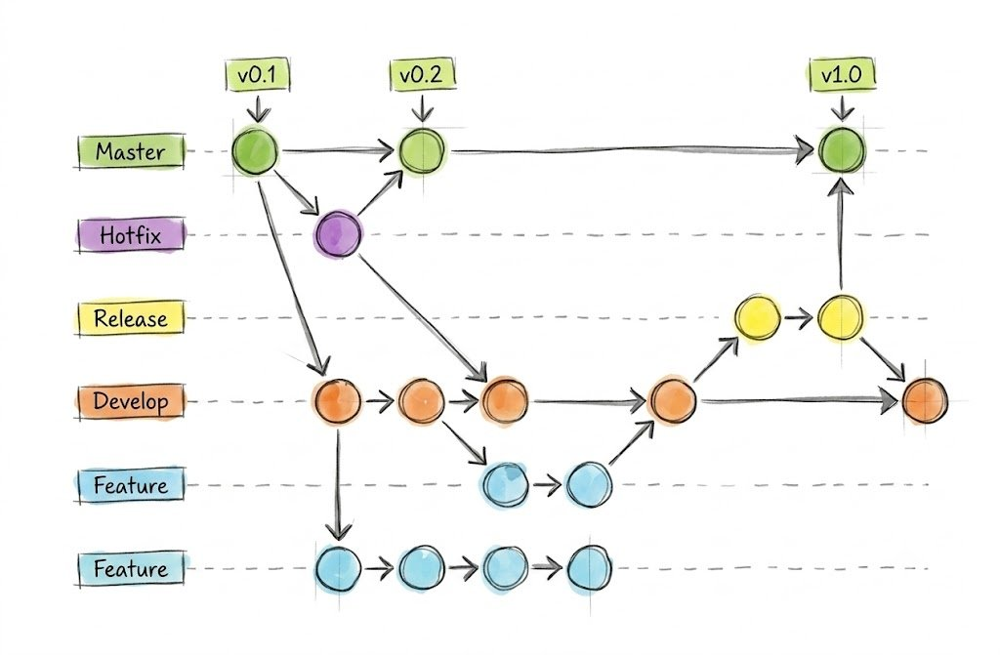

# Trabajo de Campo – S13: Implementaciones, Criterios de Aceptación y Git Flow

## DESARROLLO

### 1. Tabla de control de las implementaciones realizadas

| Requerimiento | Historia de usuario | Archivo(s) Java | Criterio de aceptación | Estado actual |
|---|---|---|---|---|
| RF-01 Registrar cliente | HU-0001 | `ClienteServicio.java`, `Cliente.java` | Dado un cliente con datos válidos, el sistema lo agrega y lo muestra en el listado | Implementado |
| RF-02 Validar código numérico | HU-0001 | `ClienteServicio.java` | Si el código contiene caracteres no numéricos, el sistema rechaza el registro | Implementado |
| RF-03 Validar código no nulo | HU-0001 | `ClienteServicio.java` | Si el código es nulo o vacío, el sistema rechaza el registro | Implementado |
| RF-04 Validar email | HU-0001 | `ClienteServicio.java` | Si el email no contiene "@" y ".", el sistema lo rechaza | Implementado |
| RF-07 Buscar cliente por código | HU-0001 | `ClienteServicio.java` | Dado un código existente, el sistema retorna el cliente correspondiente | Implementado |
| RF-11 Registrar producto | HU-0002 | `ProductoServicio.java`, `Producto.java` | Dado un producto válido, el sistema lo agrega al catálogo | Implementado |
| RF-12 Validar nombre de producto | HU-0002 | `ProductoServicio.java` | Si el nombre está vacío, el sistema rechaza el registro | Implementado |
| RF-13 Validar precio | HU-0002 | `ProductoServicio.java` | Si el precio es cero o negativo, el sistema rechaza el registro | Implementado |
| RF-15 Código de producto único | HU-0002 | `ProductoServicio.java` | Si el código de producto ya existe, el sistema no permite el duplicado | Implementado |
| RF-17 Buscar producto por código | HU-0002 | `ProductoServicio.java` | Dado un código existente, el sistema retorna el producto | Implementado |
| RF-21 Registrar venta | HU-0003 | `VentaServicio.java`, `Venta.java` | Dada una venta con cliente y al menos un detalle, el sistema la registra | Implementado |
| RF-24 Agregar detalle a la venta | HU-0003 | `VentaServicio.java`, `DetalleVenta.java` | El sistema permite agregar productos con su cantidad a la venta | Implementado |
| RF-27 Calcular subtotal | HU-0003 | `DetalleVenta.java` | Cada detalle calcula su subtotal como precio × cantidad | Implementado |
| RF-28 Calcular total de la venta | HU-0003 | `Venta.java` | El total de la venta es la suma de los subtotales de sus detalles | Implementado |
| RF-29 Validar venta con detalle | HU-0003 | `VentaServicio.java` | Si la venta no tiene al menos un detalle, el sistema la rechaza | Implementado |

Se implementaron 15 requerimientos (más de los 10 solicitados), todos con su criterio de aceptación cumplido y evidenciado en la ejecución del sistema.

---

### 2. Git Flow del proceso de desarrollo

El proyecto se versionó en Git siguiendo un flujo de trabajo basado en **Git Flow**, que organiza el desarrollo en ramas con propósitos definidos.



**Ramas del modelo Git Flow:**

| Rama | Propósito |
|---|---|
| `main` (master) | Contiene únicamente versiones estables y publicables. Cada versión se etiqueta (v0.1, v0.2, v1.0). |
| `develop` | Rama de integración donde se reúnen las funcionalidades antes de una versión. |
| `feature/*` | Una por cada funcionalidad nueva. Nace de `develop` y se integra de vuelta en `develop`. |
| `release/*` | Prepara una versión para publicarse; se integra en `main` y en `develop`. |
| `hotfix/*` | Corrige errores urgentes en producción; nace de `main` y se integra en `main` y `develop`. |

**Flujo aplicado en este proyecto.** Por tratarse de un proyecto académico individual, se aplicó una versión simplificada de Git Flow: se trabajó cada entregable en su propia rama `feature/sNN-tema`, que luego se integró a `main` mediante un merge sin avance rápido (`--no-ff`) para conservar la trazabilidad de cada integración. Las ramas `release` y `hotfix` corresponden a escenarios de equipos más grandes y se documentan aquí como parte del modelo.

Comandos usados en cada semana:
```bash
git checkout -b feature/sNN-tema
git add -A
git commit -m "feat|docs: ... SNN"
git checkout main
git merge --no-ff feature/sNN-tema -m "merge: integra SNN a main"
git push origin main
```

---

### 3. Anexos de las actividades realizadas

**ANEXO 1:** ejecución del sistema evidenciando el cumplimiento de los criterios de aceptación (validaciones de cliente y producto, registro de venta y cálculo automático del total).

**ANEXO 2:** historial de commits del repositorio (`git log --oneline --graph --all`), mostrando las ramas de funcionalidad y sus merges a `main`.

**ANEXO 3:** vista del repositorio en GitHub (pestaña de commits o red/network del repositorio).

---

*Universidad Privada del Norte – Facultad de Ingeniería – 2026-1*
